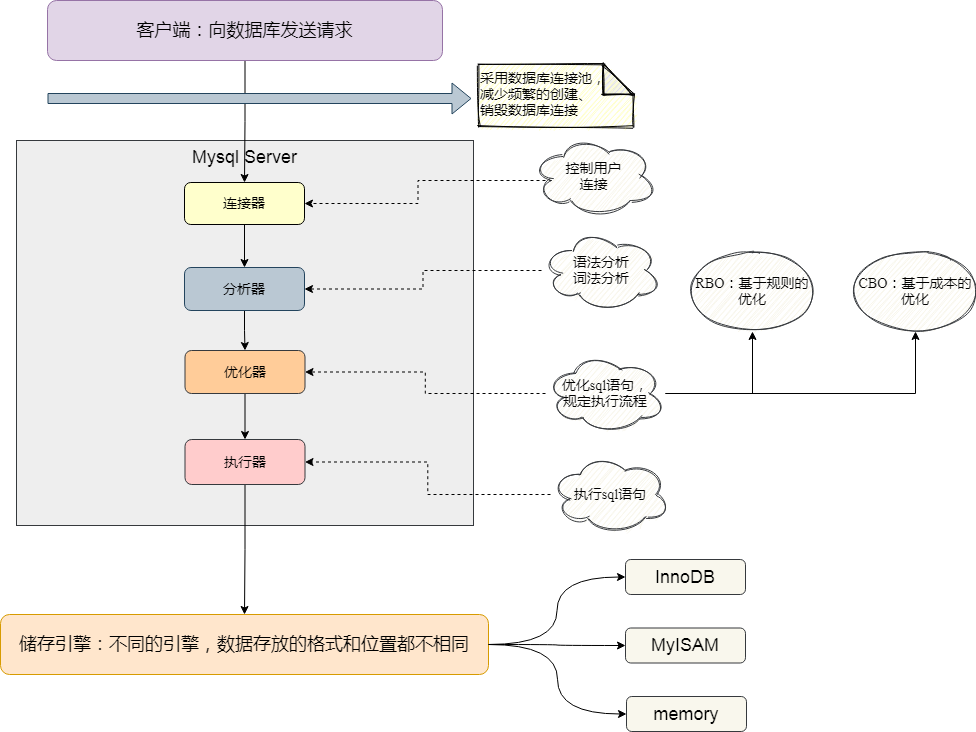
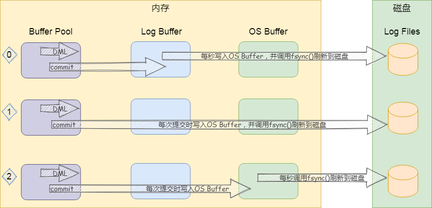
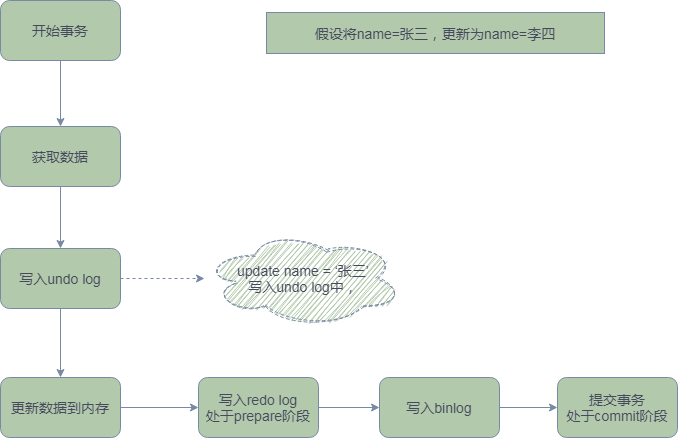
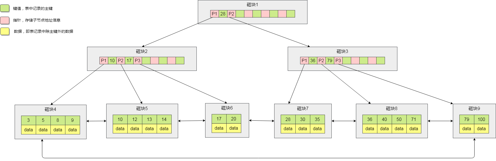

# Mysql调优

## 整体介绍

### MySQL架构图



### 存储引擎：InnoDB与MyISAM的区别

|              | InnoDB                               | MyISAM                                         |
| :----------- | ------------------------------------ | ---------------------------------------------- |
| 存储方式     | .frm(存储表定义) 和 .ibd(数据和索引) | .frm(存储表定义) .MYD(存储数据) .MYI(存储索引) |
| 索引类型     | 聚簇索引                             | 非聚簇索引                                     |
| 事务支持     | 是                                   | 否                                             |
| 支持表锁     | 是                                   | 是                                             |
| 支持行所     | 是                                   | 否                                             |
| 支持外键     | 是                                   | 否                                             |
| 支持全文索引 | 是(5.6以后)                          | 是                                             |
| 适用场景     | 大量insert、update、delete           | 大量select                                     |

### Mysql日志

#### 二进制日志—Binlog

Binlog是记录所有**数据库表结构变更以及表数据修改**的二进制日志。Binlog不会记录select和show这类操作的日志，因为这类操作并没有修改数据。

Binlog日志包含两类文件：

+ 二进制索引文件
+ 二进制日志文件

从上面的Mysql架构图来看，Binlog位于Mysql Server阶段，**线上环境一定要开启binlog**。

#### 事务日志—Redo Log、undo Log

Redo Log和undo Log，从Mysql架构图来看，属于存储引擎，只有InnoDB 存储引擎才有。

##### Redo Log

Redo Log指的是在事务中对任何数据的操作，都将最新的数据写到Redo log日志文件中，是为了**实现事务的持久性**而出现的产物。

Redo Log是固定大小的，是循环写的过程；当系统崩溃重启后，可以根据Redo Log的内容，将所有数据恢复到最新状态。

数据写入流程如下：



上图实际展示了三种写入策略，可以通过设置**innodb_flush_log_at_trx_commit**参数来调整，InnoDB中默认innodb_flush_log_at_trx_commit=1

**<span style="color:#FF0033">Redo Log的两阶段提交</span>**

数据更新流程：



为什么Redo Log会有两阶段提交？

<span style="color:#FF0033">保证数据的一致性</span>

+ 先写redo log后写binlog

  假设在redo log写完， binlog还没有写完的时候， MySQL进程
  异常重启。由于我们前面说过的， redo log写完之后，系统即使崩溃，仍然能够把数据恢复
  回来，所以恢复后这一行c的值是1。但是由于binlog没写完就crash了，这时候binlog里面
  就没有记录这个语句。因此，之后备份日志的时候，存起来的binlog里面就没有这条语句。
  然后你会发现，如果需要用这个binlog来恢复临时库的话，由于这个语句的binlog丢失，这
  个临时库就会少了这一次更新，恢复出来的这一行c的值就是0，与原库的值不同。

+ 先写binlog后写redo log

  如果在binlog写完之后crash，由于redo log还没写，崩溃恢复
  以后这个事务无效，所以这一行c的值是0。但是binlog里面已经记录了“把c从0改成1”这个
  日志。所以，在之后用binlog来恢复的时候就多了一个事务出来，恢复出来的这一行c的值
  就是1，与原库的值不同。

##### undo Log

undo Log指的是事务开始前，在操作任何数据之前，首先将要操作的数据备份到undo Log中，是为了**实现事务的原子性**（也叫做回滚日志），在InnoDB中undo Log还用来实现多版本并发控制（简称：MVCC）。

**undo Log是逻辑日志，可以理解为：**

+ 当delete一条数据时，undo Log中会记录一条对应的insert语句记录
+ 当insert一条数据时，undo Log中会记录一条对应的delete语句
+ 当update一条数据时，undo Log中会记录一条相反的update记录

### ACID

+ 原子性（Atomicity）

  在一个事务中的所有操作，作为一个整体不可分割，要么全部执行成功，要么全部失败，<span style="color:red">通过undo Log实现</span>。

+ 一致性(Consistency)

  事务的执行结果必须是数据库从一个一致性状态到另一个一致性状态，比如A账户给B账户转账，两个账户的总金额应该保持不变。

+ 隔离性(Isolation)

  并发执行的事务不会相互影响，对数据库的影响和他们串行执行时一样，<span style="color:red">通过锁机制保障</span>

+ 持久性(Durability)

  事务一旦提交，其对数据库的更新就是持久的，<span style="color:red">通过Redo Log实现</span>。

### mysql事务隔离级别

事务具有隔离性，理论上来说事务之间的执行不应该相互影响，其对数据库的影响应该和串行执行时一样。

完全的隔离性会导致系统并发性能很低，降低对资源的利用率，因而实际上对隔离性的要求会有所放宽，这也会一定程度上造成数据库一致性的降低、

具体的隔离级别，从低到高依次是：

+ 读未提交（READ UNCOMMITTED） 对事物的读取没有任何限制，<span >不推荐</span>
+ 读已提交（READ COMMITTED）
+ 可重复读（REPEATABLE READ）
+ 串行化（SERIALIZABLE） 性能最低

mysql默认使用的是可重复读，oracle默认使用的是读已提交

对于不同的事务级别，会导致不同的问题

+ 脏读：读取到其他事务还没有commit的数据
+ 不可重复读：在一个事务中，对一组数据多次读取，读取的结果不相同（读取到了其他事务commit的数据）
+ 幻读：和不可重复读类上，只是角度不同，在插入数据时，读到其他事务commit的数据

对应情况如下表：

| 事务隔离级别                 | 脏读 | 不可重复读 | 幻读 |
| ---------------------------- | ---- | ---------- | ---- |
| 读未提交（READ UNCOMMITTED） | √    | √          | √    |
| 读已提交（REDA COMMITTED）   |      | √          | √    |
| 可重复读（REPEATABLE READ）  |      |            | √    |
| 串行化（SERIALIZABLE）       |      |            |      |

**如何设置事务级别：**

```mysql
set session transaction isolation level read uncommitted;
```

session：指定设置的作用域为当前会话

global：全局设置

### 数据库范式

+ 1NF：字段不可分
+ 2NF：有主键，非主键字段依赖主键
+ 3NF：非主键字段不能相互依赖

### 一些命令

+ show variables like '%%'

  查看一下参数

+ SHOW PROFILES;

  可以查看每条命令执行的时间

+ SHOW PROFILE for QUERY queryId;

  查询某一条sql执行的各个阶段消耗的时间，queryId为SHOW PROFILES;查询结果中的Query_id；

> The [`SHOW PROFILE`](https://dev.mysql.com/doc/refman/8.0/en/show-profile.html) and [`SHOW PROFILES`](https://dev.mysql.com/doc/refman/8.0/en/show-profiles.html) statements are deprecated; expect them to be removed in a future MySQL release. Use the [Performance Schema](https://dev.mysql.com/doc/refman/8.0/en/performance-schema.html) instead; see [Section 27.19.1, “Query Profiling Using Performance Schema”](https://dev.mysql.com/doc/refman/8.0/en/performance-schema-query-profiling.html).

命令文档：https://dev.mysql.com/doc/refman/8.0/en/show-profile.html

+ Performance Schema

  另外单开记录
  
+ show processlist;

  查看有多少客户端链接了mysql

### 数据库连接池

https://github.com/alibaba/druid/wiki/%E5%B8%B8%E8%A7%81%E9%97%AE%E9%A2%98

## schema与数据类型优化

### 数据类型优化

#### 更小的通常更好

应该尽量使用可以正常存储数据的<span style="color:red">最小数据类型</span>，更小的数据类型通常更快，因为他们占用更少的磁盘，内存和CPU缓存，并且处理时需要的CPU周期更少。

#### 简单就好

简单数据类型的操作通常需要更少的CPU周期，eg：

+ 整型比字符型操作代价更低，因为字符串的校对规则比整型更复杂

+ 使用Mysql自建类型而不是字符串来储存日期和时间

  测试情况：

  ```mysql
  CREATE TABLE `typetest1` (
    `id` int(11) NOT NULL AUTO_INCREMENT,
    `querytime` datetime DEFAULT NULL,
    PRIMARY KEY (`id`)
  ) ENGINE=InnoDB AUTO_INCREMENT=25 DEFAULT CHARSET=latin1;
  CREATE TABLE `typetest2` (
    `id` int(11) NOT NULL AUTO_INCREMENT,
    `querytime` varchar(20) DEFAULT NULL,
    PRIMARY KEY (`id`)
  ) ENGINE=InnoDB AUTO_INCREMENT=25 DEFAULT CHARSET=latin1;
  SET PROFILE = 1;
  SELECT * from typetest1;
  SHOW PROFILES;
  SELECT * from typetest2;
  SHOW PROFILES;
  ```

  最后得到的结果是：`0.000328`、`0.00036225 `，如果加上时间条件得到的结果是：`0.0004685`，`0.00035375  `,由此看来查询所耗时间差距还是特别大的。

#### 用整型存储IP地址

mysql提供了ip与整型相互转换的函数，如下：

```mysql
SELECT INET_ATON('192.168.11.125');
SELECT INET_NTOA(3232238461);
```

#### 尽量避免null

如果查询中包含为NULL的列，对于mysql来说很难优化，因为可为null的列，使得索引、索引统计和值的比较都更加复杂。

坦白来说，通常情况下null的列改为not null到来的性能提升比较小，所以没有必要将所有的schema进行修改，但是应该尽量避免设计成null的列。

#### 优化细则

##### 整数类型

可以使用的几种数据类型：TINYINT(8)、SMALLINT(16)、MEDIUMINT(24)、INT(32)、BIGINT(64)；尽量使用满足需求的最小数据类型。

##### 字符和字符串类型

+ varchar

1. 可变长度，根据数据长度决定磁盘占用空间
2. varchar(n)，n小于等于255，额外使用一个字节保存长度，如果大于255，额外使用两个字节保存长度。
3. varchar(5)和varchar(255)，保存相同的内容，硬盘存储空间相同，但内存占用空间是指定的大小(不相同)。
4. varchar在5.6之前变更长度，或者从255变更到255以上的时候，都会导致锁表。
5. 应用场景
   + 存储数据波动较大的数据
   + 字符串很少更新的场景，每次更新后都会重新算，并使用额外空间来保存字符串长度
   + 适合保存多字节字符，如：汉字、特殊字符等

+ char

1. 固定长度的字符串，最大长度：255
2. 会自动删除末尾的空格
3. 检索效率、写效率会比varchar高，以空间换时间
4. 应用场景
   + 存储长度波动不大的数据，如：MD5摘要
   + 存储短字符串，经常更新的字符串

##### BLOB和TEXT类型

mysql把每个BLOB和TEXT值当作一个独立的对象处理，两者都是为了存储很大数据而设计的，分别采用二进制和字符串方式存储。

实际中不建议使用，当遇到数据很大的时候可以存文件，数据库里面记录文件地址。

##### 日期时间类型

mysql中对于时间类型有：date、time、datetime、timestamp等类型。在实际使用中，不要使用字符串类型来存储日期时间数据，另外使用int存储日期时间不如使用timestamp类型。<span style="color:red">因为日期时间类型占用的存储空间更小，mysql本身还提供了丰富处理函数，能够方便的对日期进行比较和计算</span>。

| 类型      | 占用空间 | 存储范围                                                     | 时区支持             |
| --------- | -------- | ------------------------------------------------------------ | -------------------- |
| datetime  | 8个字节  | 可精确到毫秒(范围大)                                         | 与时区无关           |
| timestamp | 4个字节  | 时间范围：1970-01-01到2038-01-19，可精确到秒，采用整型存储   | 依赖数据库设置的时区 |
| date      | 3个字节  | 保存1000-01-01到9999-12-31之间的日期，精确到日，mysql提供大量日期函数 |                      |

##### 使用枚举代替字符串类型

有时候可以使用枚举代替常用的字符串类型，mysql存储枚举类型非常紧凑，会根据列表值得数据压缩到一两个字节中，mysql内部会将每个值在列表中的位置保存为整数，且在表的.frm文件中保存“数字-字符串”的映射关系。

### 字符集的选择

对于mysql字符集的选择，这儿主要针对UTF-8做下补充，标准的UTF-8字符集编码是可以用1-4个字节去编码21位字符，只支持Unicode中 [基本多文本平面](https://zh.wikipedia.org/wiki/Unicode字符平面映射)（U 0000至U FFFF），有部分内容不支持。

mysql 5.5.3之后，增加了utf8mb4,是utf8的超集，能够使用4个字节存储更多的字符。参考，https://blog.csdn.net/qq_17555933/article/details/101445526

## 执行计划

[单独文件，点击查看详情](./mysql执行计划.md)

## 索引优化

### 索引简介

通过给字段添加索引可以提高数据的读取速度，提高项目的并发能力和抗压能力，

合理使用索引有如下优点：

+ 大大减少服务器需要扫描的数据
+ 帮助服务器避免排序和临时表
+ 将随机io变成顺序io

下面了解mysql中索引的结构。

InnoDB中，索引为什么不使用hash表？

+ 利用hash存储的话，需要将所有的数据文件添加到内存中，比较消耗内存空间
+ 如果所有的查询都是等值查询，那么hash表确实会比较快，但是实际工作中有许多范围查找，而不是等值查询，这时候hash就不适合了

为什么是B+tree，而不是二叉树或者平衡二叉树、红黑树

+ 二叉树可能出现长短腿，导致树很深

+ 平衡二叉树

  AVL树是一颗严格意义上的平衡树，最高子树和最低子树高度差不能超过1，因此在进行元素插入时，会进行1到N次的旋转操作，严重影响插入的性能，同时也会导致树很深

+ 红黑树

  红黑树是基于AVL树的一个升级，损失部分查询的性能，来提升插入的性能，在红黑树中最低子树和最高子树之差小于2倍即可，在插入的时候不需要进行N多次的旋转操作，而且加入变色的特性，来满足插入和查询性能的平衡，同时也会导致树很深

总结：<span style="color:red;">二叉树及其N多变种都不能支撑索引，原因是树的深度无法控制或者插入数据的性能比较低</span>

### B+Tree

B+Tree是在BTree的基础上做的一种优化，变化如下：

+ B+Tree每个节点可以包含更多的节点，这样做的原因有两个：
  + 降低树的高度
  + 将数据范围变为多个区间，区间越多，数据检索速度越快
+ 非叶子节点存储Key，叶子节点存储key和数据
+ 叶子节点两两指针相互连接（符合磁盘的预读特性），顺序查询性能更高

B+Tree结构如下：



**说明：**

在B+Tree上有两个头指针，一个指向根节点，另一个指向关键字最小的叶子节点，而且所有叶子节点之间，是一种环形链式结构，因此可以对B+Tree进行两种查找运算：

+ 对于主键的范围查找和分页查找
+ 另一种是从根节点开始进行随机查找

**总结：**

+ InnoDB是通过B+Tree结构对主键创建索引，然后叶子节点中存储数据，如果没有主键会选择唯一键，如果没有唯一键，那么会生成一个6位的row_id来作为主键（row_id不可见）
+ 如果创建索引的键是其他字段，那么在叶子节点中存放是的该数据的主键，然后再通过主键索引找到对应的记录，这个叫做<span style="color:#FF0033">回表</span>

### hash索引

基于哈希表的实现，只有精确匹配索引所有列的查询才有效，在mysql中只有memory存储引擎显示支持哈市索引。哈希索引自身只需存储对应的hash值，所以索引的结构十分紧凑，这让哈希索引查找的速度非常快。

哈希索引的限制：

+ 哈希索引只包含哈希值和指针，而存储数据，所以必须要读取行
+ 哈希索引数据并不是按照索引值得属性存储的，所以无法进行排序
+ 哈希索引不支持部分列匹配查找，哈希索引是使用索引的全部内容来计算哈希值的
+ 哈希索引支持等值比较查询，不支持任何返回查询和模糊查询
+ 访问哈希索引的数据非常快，除非有很多哈希冲突（哈希冲突会采用链表的方式来解决，存储引擎需要遍历链表）
+ 哈希冲突比较多的话，维护的代价也很高

### 索引分类

+ 主键索引

  主键索引是一种唯一性索引，但它必须指定为PRIMARY KEY，每个表只能有一个主键索引。主键建议采用<span style="color:red">自增的数据类型</span>，这样在插入数据的时候只需要在B+Tree上追加数据。如果采用UUID等乱序的字符串作为主键，会导致一些问题：<span style="color:#FF0033">页分裂</span>、<span style="color:#FF0033">页合并</span>、<span style="color:#FF0033">空间浪费</span>等。

+ 唯一索引

  索引列必须唯一，可以为空；将一个字段设置为唯一,mysql会自动帮忙建一个唯一性索引

  ```mysql
`username` varchar(18) NOT NULL unique,
  ```
  
  强调：

  + <span style="color:#FF0033">当字段没有设置为唯一，但是业务上是唯一时，在建索引时，需要考虑是建一个唯一索引，还是普通索引</span>
+ <span style="color:#FF0033">唯一性索引不会有回表操作</span>,经过操作证明是这样的，但是我在navcat中修改索引类型却不起作用
  
+ 普通索引

  基本的索引类型，值可以为空，没有唯一性的限制（<span style="color:#FF0033">覆盖索引</span>）

  什么是覆盖索引？

  覆盖索引是对普通索引一个常见的优化，当使用普通索引查询数据时，会有回表操作，会遍历两个索引数（先通过name索引树找到id，然后通过主键索引树找到具体的数据），如下sql：

  ```mysql
  select * from use where usename='张三';
  ```

  如果具体业务上，只需要id字段的数据，那么查询sql可以修改为：

  ```mysql
  select id from use where usename='张三';
  ```

  这种情况下，如果只查询索引列，就只会遍历name的索引树，只会遍历一个索引树，效率会有所提高，这就是覆盖索引。

+ 全文索引

  全文索引的类型为FULLTEXT，全文索引可以在varchar、char、text类型上创建

+ 组合索引

  多列值组成一个索引，专门用于组合搜索，在建组合索引的时候顺序很重要（<span style="color:#FF0033">最左匹配原则-最左前缀、索引下推</span>）

  索引下推（5.6+），组合索引（name+age）

  ```mysql
  select * from user where name='张三' and age = 10
  ```

  在第一次遍历索引树的时候就会把age条件一起过滤了，最后返回的主键就是满足条件的

### 索引匹配方式

+ 全值匹配

全值匹配指的是和索引中的所有列进行匹配，如下：

```mysql
-- 创建表
CREATE TABLE staffs (
	id INT(11) not NULL AUTO_INCREMENT,
	`name` varchar(50) NOT NULL COMMENT '姓名',
	`age` INT(11) NOT NULL COMMENT '年龄',
	`pos` VARCHAR(20) NOT NULL COMMENT '职位',
	`add_time` TIMESTAMP DEFAULT CURRENT_TIMESTAMP COMMENT '入职时间',
	PRIMARY KEY (`id`)
)ENGINE=InnoDB AUTO_INCREMENT=1 DEFAULT CHARSET=utf8mb4 COMMENT '员工记录表';
-- 创建组合索引
ALTER table staffs ADD INDEX idx_nap(`name`,`age`,`pos`);
-- 插入数据
INSERT INTO `staffs` (`id`, `name`, `age`, `pos`, `add_time`) VALUES ('1', '张三', '26', 'java开发', '2021-01-12 17:10:41');
INSERT INTO `staffs` (`id`, `name`, `age`, `pos`, `add_time`) VALUES ('2', '李四', '28', 'java架构师', '2021-01-12 17:11:01');
-- 查看执行计划
explain select * from staffs where name = '张三' and age = '26' and pos = 'java开发';
```

查看执行计划得到的结果如下：

| id   | select_type | table  | type | possible_keys | key     | key_len | ref               | rows | Extra                 |
| ---- | ----------- | ------ | ---- | ------------- | ------- | ------- | ----------------- | ---- | --------------------- |
| 1    | SIMPLE      | staffs | ref  | idx_nap       | idx_nap | 288     | const,const,const | 1    | Using index condition |

说明：Extra的值是Using index condition，意思是查询使用了索引，但是使用了回表查询数据

+ 最左匹配

```mysql
explain select * from staffs where name = '张三';
```

这种情况下也是能使用到组合索引idx_nap的，执行结果如下：

| id   | select_type | table  | type | possible_keys | key     | key_len | ref   | rows | Extra                 |
| ---- | ----------- | ------ | ---- | ------------- | ------- | ------- | ----- | ---- | --------------------- |
| 1    | SIMPLE      | staffs | ref  | idx_nap       | idx_nap | 202     | const | 1    | Using index condition |

这种情况就没法使用索引

```mysql
explain select * from staffs where  age = '26' and pos = 'java开发';
```

+ 匹配列前缀

```mysql
explain select * from staffs where name like '张%';
```

这种情况也是会使用索引的，运行结果如下：

| id   | select_type | table  | type  | possible_keys | key     | key_len | ref  | rows | Extra                 |
| ---- | ----------- | ------ | ----- | ------------- | ------- | ------- | ---- | ---- | --------------------- |
| 1    | SIMPLE      | staffs | range | idx_nap       | idx_nap | 202     | null | 1    | Using index condition |

索引失效的情况，

```mysql
explain select * from staffs where name like '%张%';
```

+ 匹配范围值

```mysql
explain select * from staffs where name > '张三';
```

这种情况也会使用索引，使用范围判断后面的判断的索引都会失效

+ 精确匹配一列，范围匹配另一列

```mysql
explain select * from staffs where name = '张三' and age >10;
```

这种情况也会使用索引，非组合索引也是一样的

+ 只访问索引的查询

查询的时候只需要访问索引，不需要访问其他数据行，本质上就是覆盖索引

### 优化小细节

+ 当使用索引列进行查询的时候尽量不要使用表达式，把计算放到业务层而不是数据库层

+ 尽量使用主键查询，而不是其他索引，因为主键查询不会触发回表操作

+ 使用前缀索引(索引选择性)

  如果一个字段比较大（内容比较多），可以通过使用前几个字符来建立索引

+ <span style="color:#FF0033">使用索引扫描来排序</span>

+ union all、in、or都能够使用索引，<span style="color:#FF0033">但是推荐使用in</span>

+ 范围列可以用到索引

  范围条件是：<、<=、>、>=、between，<span style="color:#FF0033">索引最多用于一个范围列，后面的列都无法用到索引</span>

+ <span style="color:#FF0033">强制类型转换会导致全表扫描</span>

+ 更新十分频繁，数据区分度不高的字段上不宜建索引

+ <span style="color:#FF0033">创建索引的列，不允许null</span>，不然可能会得到不符合预期的结果

+ 当需要进行表连接查询的时候，<span style="color:#FF0033">最好不要超过三张表，join的字段，数据类型必须一致</span>

+ 能使用limit的时候，<span style="color:#FF0033">尽量使用limit</span>

+ 单表索引建议控制在5个以内

+ 单个组合索引，字段数不允许超过5个

+ 创建索引的时候应该避免以下错误概念：

  + 索引越多越好
  + 过早优化，在不了解系统的情况下进行优化

+ <span style="color:#FF0033">使用函数索引会失效</span>,比如：where month(t_modified)=7 ，数据库引擎必须的把每列都month过后才能判断是否等于7

  