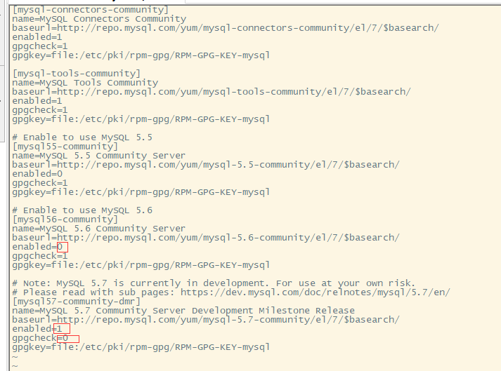
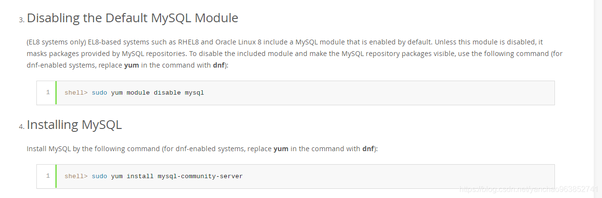

# centos8安装mysql5.7

## 准备工作

### 更换yum源

1、打开 mirrors.aliyun.com，选择centos的系统，点击帮助

2、执行命令：yum install wget -y

3、改变某些文件的名称

> mv /etc/yum.repos.d/CentOS-Base.repo /etc/yum.repos.d/CentOS-Base.repo.backup

4、执行更换yum源的命令

> wget -O /etc/yum.repos.d/CentOS-Base.repo http://mirrors.aliyun.com/repo/Centos-8.repo

5、更新本地缓存

> yum clean all
>
> yum makecache

### 卸载已经安装的mysql

> yum list installed | grep mysql
> yum -y remove mysql*

### 安装wget命令

> yum install wget -y 

### 给CentOS添加rpm源，并且选择较新的源

> wget http://dev.mysql.com/get/mysql-community-release-el7-5.noarch.rpm
> rpm -ivh mysql-community-release-el7-5.noarch.rpm

### 修改mysql-community.repo文件

位于/etc/yum.repos.d/目录下，

有些只用修改第一处和第二处，我因为在centos8下搞了一两次导致/etc/pki/rpm-gpg/RPM-GPG-KEY-mysql文件没了，也下载不了，所以把gpgcheck设置为0，表示不进行校验。

### 解决没有任何匹配: mysql-community-server

在centos8上安装时，需要进行一个设置，不然会提示没有任何匹配: mysql-community-server

## 安装mysql 5.7

### 使用yum安装mysql

> yum install mysql-community-server -y

### 启动mysql服务并设置开机启动

> #启动之前需要生成临时密码，需要用到证书，可能证书过期，需要进行更新操作
> yum update -y
> #启动mysql服务
> service mysqld start
> #设置mysql开机启动
> chkconfig mysqld on

## mysql设置

### 密码设置

+ 获取mysql的临时密码

  > grep "password" /var/log/mysqld.log

+ 使用临时密码登录

  > mysql -uroot -p
  > #输入密码

+ 修改密码

  > set global validate_password_policy=0;
  > set global validate_password_length=1;
  > ALTER USER 'root'@'localhost' IDENTIFIED BY '123456';

### 修改远程访问权限

> grant all privileges on *.* to 'root'@'%' identified by '123456' with grant option;
> flush privileges;

### 设置字符集为utf-8

> #在[mysqld]部分添加：
> character-set-server=utf8
> #在文件末尾新增[client]段，并在[client]段添加：
> default-character-set=utf8