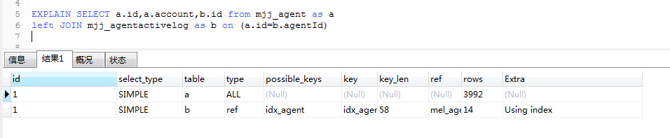

# mysql-join优化过程

先记录一条跑不动的SQL，如下：

```mysql
select a.channel,a.id as agentId,a.createdOn,COUNT(DISTINCT b.id) as inAppCount,
COUNT(DISTINCT c.id)  as inActivityCount,COUNT(DISTINCT d.id)  as shareVisitCount
from (select id,channel,createdOn from mjj_agent where status = 'VLD' ) as a
LEFT JOIN (select id,agentId from mjj_agentactivelog where createdOn like '2020-12-28%') as b on (b.agentId = a.id)
LEFT JOIN (select createdBy,id from mjj_activity_fission_in_log where createdOn like '2020-12-28%')  as c on (c.createdBy = a.id)
LEFT JOIN (select inviterId,id from mjj_in_regist_log where createdOn like '2020-12-28%') as d on (d.inviterId = a.id)
GROUP BY a.id,a.createdOn,a.channel
```

我也不知道自己写的是个什么鬼，下面先熟悉一下join的一些情况，最后再来优化这个SQL语句。

## JOIN

### 简介

JOIN，连接两张表，大致分为内连接，外连接，右连接，左连接，自然连接等，下面盗用一张图看下各种join的情况，如下：


### JOIN原理

#### Nested Loop Join(NLJ)算法

嵌套循环算法，循环外层是驱动表，循环内层是被驱动表，伪代码如下：

```java
foreach row1 from t1
    foreach row2 from t2
    	if row2 match row1 //row2与row1匹配，满足连接条件
        	join row1 and row2 into result //连接row1和row2加入结果集
```

#### Block Nested Loop Join(BNLJ)算法

块嵌套循环算法，可以看作NLJ的优化,大致思想就是建立一个缓存区，一次从驱动表中取多条记录，然后扫描被驱动表，被驱动表的每一条记录都尝试与缓冲区中的多条记录匹配，如果匹配则连接并加入结果集。缓冲区越大，驱动表一次取出的记录就越多。这个算法的优化思路就是<span style="color:#FF0033">减少内循环的次数从而提高表连接效率</span>。

#### 影响性能的点

+ 小表驱动大表能够减少内循环的次数从而提高联接效率
+ 设置合理的缓冲区大小
+ 在被驱动表建立索引
+ 优先选择驱动表属性进行排序

## JOIN使用

```mysql
SELECT a.id,a.account,COUNT(b.id) from mjj_agent as a
LEFT JOIN mjj_agentactivelog as b on (a.id=b.agentId)
GROUP BY a.id,a.account;
```

以上SQL查询用了130多秒，接下来进行逐步的优化

### 数据准备

数据直接从线上导一份出来（所以就不对外提供了），在各种测试、尝试的过程中主要使用到两张表

+ mjj_agent（4000多条数据）
+ mjj_agentactivelog(60000多条数据)

需求是：查询mjj_agent的id，account字段，统计mjj_agentactivelog中每个agent id出现的次数，关联字段是agentId

### 原始情况

```mysql
SELECT a.id,a.account,b.id from mjj_agent as a
LEFT JOIN mjj_agentactivelog as b on (a.id=b.agentId);
```

发现要执行很久，结果如下：


可以看到68000多条数据，执行了30多秒，这个不用想，实际情况肯定是接收不了的，

那么看下执行计划情况，如下：

```mysql
EXPLAIN SELECT a.id,a.account,b.id from mjj_agent as a
LEFT JOIN mjj_agentactivelog as b on (a.id=b.agentId);
```

结果如下：


这儿稍微改动一点，就会出现另外一种情况，将LEFT JOIN改为JOIN查看执行计划，SQL如下：

```mysql
EXPLAIN SELECT a.id,a.account,b.id from mjj_agent as a
JOIN mjj_agentactivelog as b on (a.id=b.agentId)
GROUP BY a.id,a.account;
```

结果如下：


left join和join的执行计划结果，对比会发现：驱动表变了，使用JOIN时并不是小表驱动大表，使用JOIN时，查询mjj_agent表时使用了主键索引，并不是两个全表扫描了。

为什么会出现以上的变化与不同，我理解的是：数据库对驱动表的选择做了优化，存储引擎在执行JOIN时，如果依然按照顺序或者小表驱动大表的情况，那么同样是两个全表扫描（All），而采用大表作为驱动表，那么在联接mjj_agent查询时就可以使用其主键索引，如其执行计划结果那样，性能肯定会得到很大的提升。

这其实需要根据具体的业务来做取舍，有些情况下是必须使用Left JOIN，接下来还是继续看如何优化的问题，建索引。

### agentId上建立索引

```mysql
ALTER TABLE `mjj_agentactivelog` ADD INDEX idx_agent(`agentId`); 
```

查看索引情况：

```mysql
SHOW INDEX from mjj_agentactivelog;
```


可以看到索引已经建好了，结果中的Cardinality是基数的意思，涉及Hyperloglog算法，另外说明。现在再看下执行计划，结果如下：


依然没有使用索引，为什么呢？这是遇到索引失效的问题了，这个sql很简单，没有其他的操作，接下来看下为什么索引会失效。

### 查看字段信息

+ mjj_agent  id

  ```mysql
  SHOW FULL COLUMNS FROM mjj_agent WHERE Field = 'id';
  ```

  结果如下：

  

+ mjj_agentactivelog agentId

  ```mysql
  SHOW FULL COLUMNS FROM mjj_agentactivelog WHERE Field = 'agentId';
  ```

  结果如下：

  

  两个结果一对比就知道问题在那儿了吧，字段的类型(type)一个是char，一个是varchar，另外Collation也不相同（Collation大体意思是指定字符比较时使用字符编码格式），这就会导致索引失效。这在实际开发过程中真的是存在的，不同的开发人员做不同的模块，基本都是自己建自己模块的数据库的。

### 修改字段类型

+ 修改类型

  ```mysql
  ALTER TABLE mjj_agentactivelog MODIFY COLUMN agentId char(19);
  ```

+ 修改编码格式

  ```mysql
  ALTER TABLE mjj_agentactivelog convert to CHARACTER SET utf8 COLLATE utf8_bin;
  ```

### 优化结果

通过上面的建索引，将关联字段的类型和编码修改为一样的后，我们再来看下其执行计划，结果如下：



现在我们能看到，查询mjj_agent还是全表扫描，查询mjj_agentactivelog已经使用了索引，数据查询结果如下：


不去做SQL优化，都不知道性能能够提升到什么程度，从30多秒经过优化后不到0.1秒，只是加了一个索引。（当然在实际情况查询的字段这些会多些，有时候也会复杂许多可能没这么搞的提升）。

从上面的执行计划可以看出还有一个表使用了全表扫描，这种情况下，我们可以尝试优化下，但是数据量不大，可能效果不明显。

### 对account添加索引

```mysql
ALTER TABLE mjj_agent ADD INDEX idx_accout(account); 
```

再看下执行计划，如下：


这样两张表的查询都使用索引了，不过优化效果不是很明显，（应该是数据量小的原因）

不使用LEFT JOIN，使用JOIN的情况如下：


可以看到执行计划已经和使用LEFT JOIN一样了,和前面没有索引时的JOIN有所不同，都添加索引后就是按照小表驱动大表来执行的。在这儿是为了强调一点：<span style="color:#FF0033">小表驱动大表没错，但是需要结合场景来分析，并不是所有情况都更优</span>。

## 统计SQL优化

前面有贴出来一个执行了130多秒的SQL，当时没截图，现在把两个索引（idx_account和idx_agent）删除后，再跑一边，得到如下结果：


只有30多秒，两次唯一的不同是mjj_agentactivelog表的agentId字段，我将varhcar改为了char，COLLATE改为了utf8_bin（与mjj_agent的id字段保持一致），这就说明了，<span style="color:#FF0033">做联接的字段的类型不同，甚至是比较方式的不同，对查询效率的影响是多么的大</span>。

本来再试一下是为了截图贴出来，没想到类型的影响也很大。继续讨论加索引过后我们，再看下执行计划，如下：


可以看到现在两张联接的表也都是使用了索引的，性能方面也应该没有多少问题，查询结果如下：


可以看到优化效果是很明显的。

其实其中还有一个优化点，就是Using filesort，官方文档翻译过来的意思是：

> MySQL必须额外进行一遍，以找出如何按排序顺序检索行。通过根据联接类型遍历所有行并存储与该`WHERE`子句匹配的所有行的排序键和指向该行的指针来完成排序。然后对键进行排序，并按排序顺序检索行。

将group by调整后，执行计划如下：


查询结果如下：


相比结果而言，提高了0.1秒，这个数据量，这个时间，也是很大的，这儿对应的知识点是：<span style="color:#FF0033">在排序中合理的使用索引</span>。

## 总结

关于JOIN的优化目前就这么多了，关键在于具体的业务场景中合理的运用。

这儿补充一个东西-collate ：

+ utf8_bin是 以二进制值比较，也就是区分大小写，collate是核对的意思

+ uft-8_general_ci  一般比较，不区分大小写

