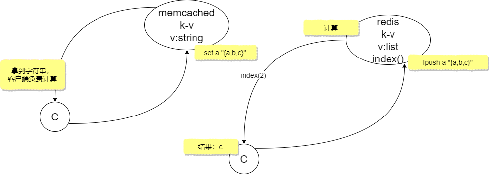
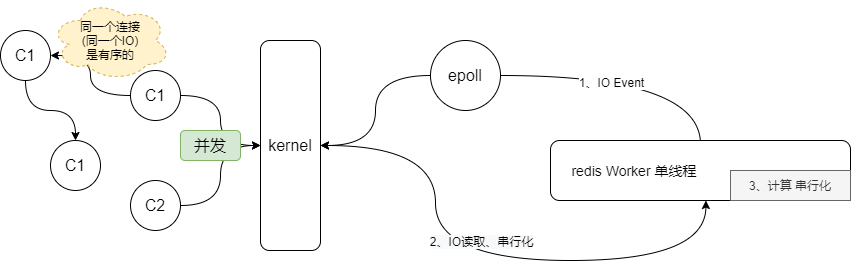
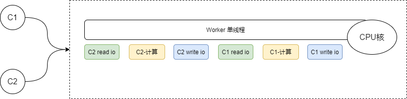
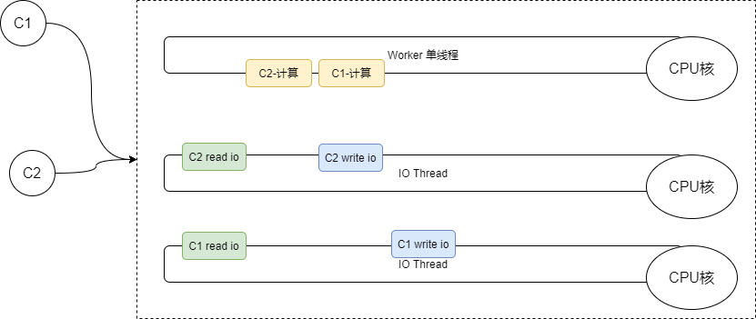
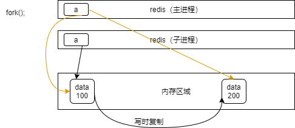

## redis笔记

### 安装

一、解压

　　tar -zxvf redis-6.0.8.tar.gz

　　安装

　　cd redis-6.0.8

　　make && make install PREFIX=/usr/local/redis

二、配置

　　mkdir /usr/local/redis/conf.d

　　复制示例配置

　　cp redis.conf /usr/local/redis/conf.d

　　建立数据、日志存储目录

　　mkdir -p /var/redis/data

　　mkdir /var/redis/log

　　修改

　　vim /usr/local/redis/conf.d/redis.conf

　　daemonize yes 　　　　　　　　行225
　　supervised systemd 　　　　　　行236
　　修改存储规则 　　　　　　　　　行~307
　　dir /var/redis/data/ 　　　　　　　　　　 数据文件存储目录 　　 行~365
　　logfile "/var/redis/log/redis.log" 　　　　　日志存储文件 行 　　　　~260

　　建立service文件，以便systemctl控制

　　cd /etc/systemd/system

　　touch redis.service

　　vim redis.service

```
[Unit]
Description=RedisService
After=network.target

[Service]
Type=forking
PIDFile=/var/run/redis_6379.pid
ExecStart=/usr/local/redis/bin/redis-server /usr/local/redis/conf.d/redis.conf
ExecReload=/bin/kill -s HUP $MAINPID
ExecStop=/bin/kill -s QUIT $MAINPID
PrivateTmp=true

[Install]
WantedBy=multi-user.target
```

三、启动

　　systemctl enable redis

　　systemctl start redis

　　查看启动情况

　　systemctl status redis

### redis特点

+ 存储在内存中，**速度快**
+ Key-Value
+ 单线程Worker，6.x过后支持iothread并发
+ 连接多，通过epoll(IO多路复用)实现
+ Value支持5种数据类型
+ 本地方法：计算向数据移动，IO优化
+ 串行化/原子操作：并行 VS 串行

### redis与memcached的区别

如下图所示：



memcached的value值只能是String类型（很对类型或者对象可以通过json转换成字符串），当需要取一个list中的某个值时，只能将整个内容取出到客户端进行操作。

redis支持list等数据类型，可以通过redis的本地方法进行计算，如图中所示，可以直接通过下标进行取值。

### redis部分理论

**redis的串行化结构，如下：**



**6.x之前串行执行流程图:**



**6.x之后引入IOThread，结构如下：**



IO Thread的引入是为了提高服务器只跑redis服务时对CPU的利用率的，IO Thread默认是关闭的，需要手动开启，开启方式：

```
io-threads 4
io-threads-do-reads yes
```

io-threads的值：如果你的server有4个核心，尝试把这个值设置为3,如果有8个核心,尝试把这个值设置为6,但这个值不建议超过8。

### redis数据类型

+ String

  + 字符类型
  + 数值类型
  + bitmaps

+ hashes

+ lists

+ sets

+ sorted set

  sorted set底层数据结构 skiplist跳表

### redis基础操作

**连接redis：**

进入`/usr/local/redis/bin`目录，执行./redis-cli

**退出**

`exit`

**查看帮助文档**

./redis-cli -h

**DB操作**

redis中默认16个db，可以通过-n来指定连接那个db

./redis-cli -n 8      连接下标为8的DB

在redis命令行中执行：select 0，连接下标为0的db

### String 字符串操作

通过`help @string`查看相关的帮助文档

**set/get:**

```
set key value
```

```
get key
```

 `SET key value [EX seconds|PX milliseconds|KEEPTTL] [NX|XX]`

+ NX：只能新建，即key不存在时才能设置成功，可用于分布式锁等场景
+ EX：只能更新，即key存在时才能设置成功

批量操作：`mset`、`mget` 

+ MSETNX ：key不存在才设置，这是个原子操作
+ 

字符串操作：` GETRANGE key start end`、`SETRANGE key offset value`

字符串追加：`APPEND key value`

查看key对应value的类型：`type key`

查看value值得类型：` OBJECT subcommand [arguments [arguments ...]]`,eg:`OBJECT encoding k1`

加一：`INCR key`                            减一：`DECR key`

加N：`INCRBY key n`                     减N：`DECRBY key n`

二进制安全，只取字节流

### 二进制安全

字节流

### 缓存穿透

解决办法：

+ 布隆过滤器 是一个module（bitmap、bloom.so）
+ 客户端自己实现bloom算法，自己承载bitmap

### redis作为缓存

+ 缓存热点数据
+ 根据业务逻辑设置key的过期时间，访问并不能延长过期时间，写会剔除过期时间
+ redis内存有限，随着访问的变化应该淘汰掉冷数据，LFU（碰了多少次），LRU多久没碰了

### redis如何淘汰过期key

+ 主动-周期轮训判断
+ 被动-访问时判定
+ 定期删除+访问时判断

牺牲一点内存，保证redis的性能。（全部轮训太耗费性能）

### redis持久化机制

+ RDB

  redis DB，时点性，手动触发（save，bgsave）

  + save 明确操作，比如关机维护等

  + bgsave：调用操作系统fork创建子进程（常规情况进程间数据是隔离的，可以通过explort设置环境变量，子进程修改数据不会影响父进程，父进程修改也不会影响子进程），通过子进程去备份写文件，配置文件中给出bgsave的规则，save这个标识

    copy on write，写时复制，创建子进程时不进行复制，这样创建进程快了，（因为一般情况下不会把所有数据改一遍）

    

    

  关闭RDB 配置文件设置：save “”

  缺点：

  + 不支持拉链，只有一个dump.rdb
  + 丢失数据相对较多，时点间的窗口期数据容易丢失

  优点：

  ​	类似java中的序列化，恢复的速度相对快些

+ AOF

  redis的写操作记录到文件中，默认是关闭的，开启配置：appendonly yes

  优点：

  + 丢失的数据少

  RDB和AOF可以同时开启，如果开启了AOF，只会使用AOF进行恢复（4.0以后，AOF中包含RDB全量）

  缺点：

  + 相对慢一点
  + 体量无限变大
  + 恢复慢

  三个级别：

  + always：来一个写一个
  + everysec(每秒)，默认值
  + no：redis不调flush，buffer满了操作系统自己刷到磁盘

### AKF理论

### 主从复制

采用的是异步复制，其特点是低延迟和高性能

### 哨兵模式 Sentinel

+ 监控
+ 提醒
+ 自动故障迁移

sentinel如何知道其他的哨兵，使用的是redis自带的发布订阅功能

### 问题：

#### redis运行了10年，开启了AOF，然后挂了

+ AOF文件多大？很大 
+ 恢复需要多久
+ 恢复时会不会溢出

解决方案：如何保证AOF足够小

+ 4.0以前：重写（删除抵消的命令，合并重复的命令，最终得到一个纯指令的文件）
+ 4.0以后：重写，将老的数据通过RDB写到AOF文件中，再将增量的数据以指令的方式append到AOF中，利用了RDB的快和AOF的全量

#### 单机、单节点问题

+ 单点故障

+ 容量有限

  sharding-分片（hash取模），弊端：取模的数必须固定，%3，%4,%10,值是一样的，影响分布式下的扩展性

+ 压力

解决方案：集群、哨兵 

#### 击穿

前置条件高并发情况下，redis做缓存，key有过期时间或被淘汰（LRU、LFU），过期后，请求该数据时，需要查询数据库，

解决办法：阻止并发达到DB，因为redis是单进程单实例的，如果发现没有数据，就通过setnx()获得一把锁，获取锁的去访问DB,其他的阻塞

解决方案存在的问题：

+ 获得锁的线程可能挂了（设置锁的过期时间）
+ 没挂，但是锁超时了，单开一个线程监控，刷新锁超时时间

#### 穿透

用户请求查询的数据是数据库不存在的，缓存和数据库都没有数据

解决方案：

布隆过滤器，客户端包含过滤算法，或者bitmap在redis中或者redis集成布隆，布隆过滤器存在的问题是只能新增不能删除

#### 雪崩

类似击穿，大量的key同时失效，间接造成大量访问到达DB

解决方案：

+ 随机过期时间
+ 强依赖击穿解决方案
+ 业务系统在失效时间做系统延时

#### 分布式锁

redis中使用setnx，过期时间，多线程去维护过期时间，redisson

zookeeper做分布式锁