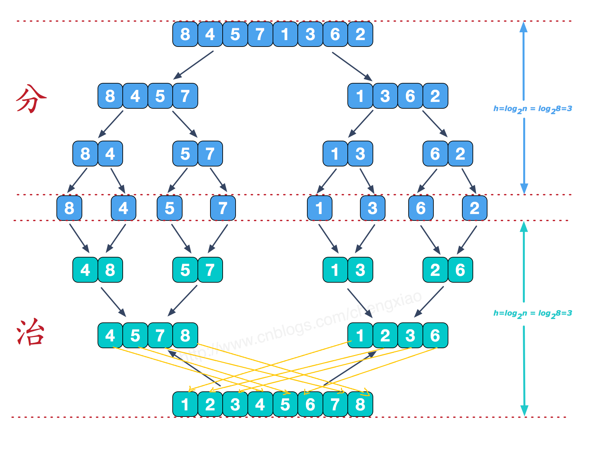

## 基础概率

算法优劣测算维度：

+ 时间测算
+ 空间测算

Big O  时间复杂度

随着数据规模的变大，是需要的时间的变化规律，一般指的是最差的情况

eg：

+ 访问链表某个位置的值，复杂度为O(n)
+ 求一个数组的平均数 复杂度为：O(n)

写算法的程序：

+ 由简单到复杂

  + 写一步验证一步
  + 多打印中间结果

+ 先局部后整体

  没思路时先细分

+ 先粗糙后精细

  + 变量更名
  + 语句合并
  + 边界处理

验证算法的正确性：

+ 肉眼观察
+ 产生足够多的随机样本
+ 用确定正确的算法计算样本结果
+ 对比被验证算法的结果

## 排序算法


### 选择排序

最简单、最没用、不稳定的排序算法

不稳定：两个相等的数据，排序完后可能位置会变

思想：

​	每次找最小的值与起点位置的数据交换位置

优化：

​	每次可以找最小的和最大的，最小的放在前面，最大的放在最后

### 冒泡排序

核心思想：

​	两两相比，大的往后移动，基本不用，太慢了（两两比较，两两交换）


核心代码：

```java
private static void sort(int[] a){
    for (int i = 0; i < a.length-1; i++) {
        for (int j = 0; j < a.length-1-i; j++) {
            if(a[j]>a[j+1]) swap(a,j,j+1);
        }
    }
}
```

时间复杂度是O(n的平方)，稳定的，最后的时间复杂度是O(n)，代码优化结果如下：

```java
private static void sort(int[] a){
    for (int i = 0; i < a.length-1; i++) {
        boolean flag = true;
        for (int j = 0; j < a.length-1-i; j++) {
            if(a[j]>a[j+1]) {
                swap(a,j,j+1);
                flag = false;
            }
            System.out.println("内循环：i="+i+",j="+j);
        }
        if (flag) {
            break;
        }
    }
}
```

### 插入排序

对于基本有序的数组最好用，速度比冒泡快，稳定，时间复杂度n的2次方，最有是n

样本小且基本有序时效率很高


核心代码：

```java
private static void sort(int[] a){
    for (int i = 1; i < a.length; i++) {
        for (int j = i; j > 0; j--) {
            if(a[j] < a[j-1]){
                swap(a,j,j-1);
            }
        }
    }
}
```

优化后结果：

```java
private static void sort(int[] a){
    for (int i = 1; i < a.length; i++) {
        for (int j = i; j > 0; j--) {
            System.out.println("内层循环");
            if(a[j] < a[j-1]){
                swap(a,j,j-1);
            }else {
                break;
            }
        }
        System.out.println("外层循环");
    }
}
```

添加了一个break，因为是往左边比较，如果当前数比左边的一个数都还大，就不用和前面的比较了，因为前边的比越来越小

### 希尔排序


group = 4，取4个数出来作为一组，先一组一组排，一步一步缩小范围，最后一定要排group=1的情况，基于插入排序来的 

```java
private static void sort(int[] a){
    for (int gap = a.length >> 1; gap > 0 ; gap/=2) {
        for (int i = gap; i < a.length; i++) {
            for (int j = i; j > gap-1; j-=gap) {
                if(a[j] < a[j-gap]){
                    swap(a,j,j-gap);
                }
            }
        }
    }
}
```

```java
private static void sort(int[] a){
    int h = 1;
    while(h <= a.length/3) {
        h = h*3+1;
    }
    for (int gap = h; gap > 0 ; gap=(gap-1)/3) {
        for (int i = gap; i < a.length; i++) {
            for (int j = i; j > gap-1; j-=gap) {
                if(a[j] < a[j-gap]){
                    swap(a,j,j-gap);
                }
            }
        }
    }
}
```

### 归并排序

​	采用的是分而治之的思想,是稳定的



Arrays.sort,对对象的排序采用的就是归并排序，jdk8优化后使用的是Timsort，jdk14做了一点调整优化为ComparableTimSort（不在通过显示比较器）

Arrays.sort有些方法使用的是DualPivotQuicksort（双轴快排）

### 快速排序

#### 单轴快排

pivot 轴，

+ 把轴左边的，比轴大的数移到轴右边
+ 把轴右边的，比轴小的数移到轴左边
+ 依次分下去


如何分区，确定轴

#### 双轴快排

