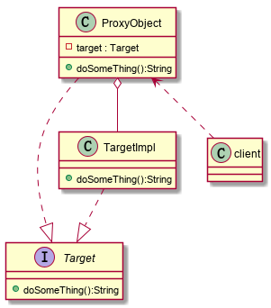
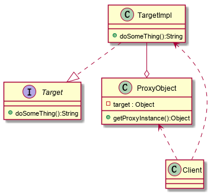
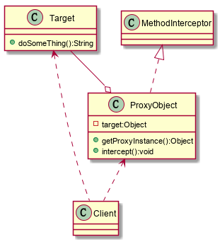

### 代理模式

为一个对象提供一个代理对象，以控制对这个对象的访问。可以在目标对象实现的基础上增加额外的功能，实现对目标对象的扩展。

**分类：**

+ 静态代理模式
+ 动态代理模式
  + JDK代理 目标对象需要有实现的接口
  + Cglib代理 不需要实现接口

#### 静态代理模式

​	静态代理在使用时需要定义接口或者父类，被代理对象与代理对象一起实现相同的接口或继承相同的父类，

**结构示意图：**



+ Target：抽象目标对象
+ TargetImpl：目标对象
+ ProxyObject：代理对象
+ Client：客户端

**优缺点：**

+ 优点：简单易于理解，在不修改目标对象的前提下，能通过代理对象对目标对象功能进行扩展
+ 缺点：需要实现和目标对象相同的接口
  + 会有很多代理类
  + 接口增加方法，目标对象和代理对象都需要维护

**Demo：**

```java
public interface Target {
    String doSomeThing();
}

/**
 * 目标对象
 */
public class TargetImpl implements Target {

    @Override
    public String doSomeThing() {
        System.out.println("say hello ");
        return "hello";
    }
}

/**
 * 代理对象
 */
public class ProxyObject implements Target {

    private Target target;

    public ProxyObject(Target target) {
        this.target = target;
    }

    @Override
    public String doSomeThing() {
        System.out.println("开始代理 完成某些操作......");
        String res = target.doSomeThing();
        System.out.println("代理结束 ..... ");
        return res;
    }
}

public class Client {
    public static void main(String[] args) {
        Target target = new TargetImpl();
        Target proxy = new ProxyObject(target);
        System.out.println("main---代理对象执行结果：" + proxy.doSomeThing());
    }
}
```

#### 动态代理之JDK代理

**基本介绍：**

+ 目标对象同样需要实现接口，否则不能用JDK动态代理
+ 代理对象不需要实现接口，代理对象的生成是通过JDK的API，动态的在内存中构建的
+ 动态代理的API位于java.lang.reflect.Proxy包下，具体通过newProxyInstance方法实现

**结构示意图：**



**Demo：**

```java
public interface Target {
    String doSomeThing();
}

/**
 * 目标对象
 */
public class TargetImpl implements Target {

    @Override
    public String doSomeThing() {
        System.out.println("say hello ");
        return "hello";
    }
}

import java.lang.reflect.InvocationHandler;
import java.lang.reflect.Method;
import java.lang.reflect.Proxy;

/**
 * 代理对象
 */
public class ProxyObject {
    private Object target;

    public ProxyObject(Target target) {
        this.target = target;
    }

    public Object getProxyInstance(){
        return Proxy.newProxyInstance(target.getClass().getClassLoader(),
                target.getClass().getInterfaces(),
                new InvocationHandler() {
                    @Override
                    public Object invoke(Object proxy, Method method, Object[] args) 
                        throws Throwable {
                        System.out.println("JDK代理开始。。。。。。");
                        Object result = method.invoke(target, args);
                        System.out.println("JDK代理结束。。。。。。");
                        return result;
                    }
                });
    }
}

public class Client {
    public static void main(String[] args) {
        Target target = new TargetImpl();
        Target proxy = (Target) new ProxyObject(target).getProxyInstance();
        System.out.println("main---代理对象执行结果：" + proxy.doSomeThing());
    }
}
```

#### 动态代理之Cglib代理

**基本介绍：**

+ 目标对象和代理对象都不需要实现接口或继承其他的类
+ 通过Cglib包提供的功能，在内存中动态的构建一个子类对象，从而实现对目标对象的扩展
+ Cglib包的底层是通过使用字节码框架ASM来转换字节码并生成新的类
+ 注意点，代理类不能为final，否则报错；目标对象的方法如果为final/static,那么久不会被拦截（即不会执行目标对象额外的业务方法）

**结构示意图：**



## Demo：

```java
/**
 * 目标对象
 */
public class Target {
    public String doSomeThing() {
        System.out.println("say hello ");
        return "hello";
    }
}
/**
 * 目标对象2
 */
public class TargetOther {
    public String sayHello() {
        System.out.println("说中文");
        return "你好";
    }
}


import net.sf.cglib.proxy.Enhancer;
import net.sf.cglib.proxy.MethodInterceptor;
import net.sf.cglib.proxy.MethodProxy;

import java.lang.reflect.Method;

/**
 * 代理对象
 */
public class ProxyObject implements MethodInterceptor {
    private Object target;

    public ProxyObject(Object target) {
        this.target = target;
    }

    public Object getProxyInstance(){
        // 创建一个工具类
        Enhancer enhancer = new Enhancer();
        // 设置父类
        enhancer.setSuperclass(target.getClass());
        // 设置回调函数
        enhancer.setCallback(this);
        // 创建代理对象（子类对象）
        return enhancer.create();
    }

    @Override
    public Object intercept(Object o, Method method, Object[] args, MethodProxy methodProxy) 			throws Throwable {
        System.out.println("Cglib代理开始。。。。。");
        Object result = method.invoke(target, args);
        System.out.println("Cglib代理结束。。。。。");
        return result;
    }
}

public class Client {
    public static void main(String[] args) {
        Target target = new Target();
        Target proxyInstance = (Target) new ProxyObject(target).getProxyInstance();
        String s = proxyInstance.doSomeThing();
        System.out.println("执行结果："+s);
        System.out.println("======================");
        TargetOther targetOther = new TargetOther();
        TargetOther targetOtherPro = (TargetOther)new 	ProxyObject(targetOther)
            .getProxyInstance();
        String s1 = targetOtherPro.sayHello();
        System.out.println("执行结果："+s1);
    }
}

```

