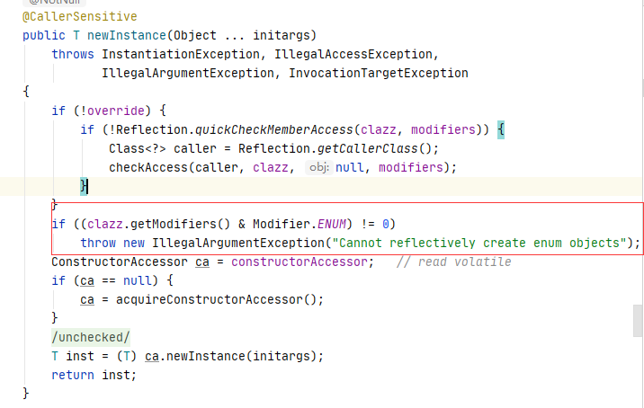

### 单列模式

保证一个类只有一个实例，并且提供一个全局访问点

#### 常见的创建方式

+ 饿汉式：类初始化时会立即加载该对象，线程天生安全，调用效率高，缺点是在不使用的情况下占用内存
+ 懒汉式：类初始化时不会初始化该对象，真正需要使用的时候才会创建该对象，具备延迟加载功能，缺点：非线程安全，需要手动去处理同步
+ 静态内部方式：结合了懒汉式和饿汉式各自的有点，真正需要对象的时候才会加载，并且是线程安全的
+ 枚举单例：使用枚举实现单例模式，优点：实现简单，调用效率高，枚举本身就是单列，由jvm从根本上提供保障，避免通过反射和反序列化的漏洞，缺点：没有延迟加载
+ 双重检测方式，需要加上volatile，推荐使用；如果不加volatile，则不推荐使用，因为jvm本质，重排序的原因，可能会初始化多次，

#### 饿汉式

```java
// 饿汉模式
public class Singleton_1 {
    // 类初始化时会立即加载该对象，线程天生安全，调用效率高
    private static Singleton_1 singleton_1 = new Singleton_1();

    private Singleton_1(){}

    public static Singleton_1 getInstance() {
        return singleton_1;
    }
}
```

#### 懒汉式

```java
// 懒汉式
public class Singleton_2 {
    // 类初始化时不会初始化该对象，真正需要使用时才会创建该对象
    private static Singleton_2 singleton2;
    private Singleton_2 () {
    }
    public synchronized static Singleton_2 getInstance(){
        if (singleton2 == null) {
            singleton2 = new Singleton_2();
        }
        return singleton2;
    }
}
```

#### 内部静态类

```java
// 内部静态类的方式
public class Singleton3 {
    private Singleton3 () {
    }
    private static  class SingletonClassInstance {
        private static final Singleton3 singleton3 = new Singleton3();
    }

    public static Singleton3 getInstance(){
        return SingletonClassInstance.singleton3;
    }
}
```

内部静态类方式创建的升级版，有防止反射和反序列化

```java
// 内部静态类的方式
public class Singleton3 implements Serializable {
    private Singleton3 () {
        if(null!=SingletonClassInstance.singleton3){
            throw new RuntimeException("该类只允许有一个实例");
        }
    }
    private static  class SingletonClassInstance {
        private static final Singleton3 singleton3 = new Singleton3();
    }

    // 没有同步，调用效率高
    public static Singleton3 getInstance(){
        return SingletonClassInstance.singleton3;
    }

    // 防止反序列化获取多个对象的漏洞
    private Object readResolve() throws ObjectStreamException {
        return SingletonClassInstance.singleton3;
    }
}
```

#### 枚举实现单例模式

```java
// 使用枚举实现单例模式 
// 优点:实现简单、枚举本身就是单例，由jvm从根本上提供保障!避免通过反射和反序列化的漏洞 缺点没有延迟加载
public enum Singleton_enum {
    INSTANCE;
    public void printn(){
        System.out.println("aaaaaa");
    }
}
```

#### 双重检测锁

```java
public class SingletonDemo04 {
	private volatile static SingletonDemo04 singletonDemo04;
	private SingletonDemo04() {
	}

	public static SingletonDemo04 getInstance() {
		if (singletonDemo04 == null) {
			synchronized (this) {
				if (singletonDemo04 == null) {
					singletonDemo04 = new SingletonDemo04();
				}
			}
		}
		return singletonDemo04;
	}
}
```

#### 总结：

1. 对于双重检测锁实现方式一定要加`volatile` 关键字修饰，具体原因如下：

   ```java
   public class ObjInstall {
       public static void main(String[] args) {
           D d = new D();
       }
   }
   
   class D {
       int m = 10;
   }
   ```

   以上代码中main方法对应字节码如下：

   ```java
   0 new #2 <com/zjk/hy/se/thread/sync/D>
   3 dup
   4 invokespecial #3 <com/zjk/hy/se/thread/sync/D.<init>>
   7 astore_1
   8 return
   ```

   **new：** 在堆中为对象D分配内存空间，创建对象

   **invokespecial：**初始化对象

   **astore_1：**将堆中对象D的地址赋值给栈中的变量d

   以上三步为一个对象创建的基本过程，**如果在高并发情况下，同时发生了invokespecial和store_1重排序的情况，另外一个线程就可能拿到一个还没有初始化的对象去使用**。

2. 通过反射实例化对象

   通过反射我们是能够调用私有方法和操作私有属性的，如果可以通过反射来实例化对象的，这样就不是单列了，针对这个问题有一下几种情况：

   + 饿汉式、静态内部类的方式

   ```java
    private Singleton () {
        if(null!=singleton){
            throw new RuntimeException("该类只允许有一个实例");
        }
    }
   ```

   可以通过以上方式解决，因为饿汉式、静态内部类的方式都是随着类的加载而实例化的，所以执行`null!=singleton`的时候，singleton一定是有值的。

   + 懒汉式

     懒汉式没有方法能够阻止反射的攻击，当通过反射调用构造方法在调用getInstance方法之前，那么获取到的两个对象是不相同的。

   + 枚举

     枚举的方式是JDK层面做了限制不能通过反射的方式实例化对象，对应于`Constructor.newInstance`方法中，如下图：

     

   3. 序列化问题

      + 非枚举实现方式

        需要通过一定的处理才能保证序列化过后再反序列回来的对象是同一个对象，具体的处理方式如下：

        ```java
        // 防止反序列化获取多个对象的漏洞
        private Object readResolve() throws ObjectStreamException {
            return SingletonClassInstance.singleton;
        }
        ```

      + 枚举方式

        自动支持序列号和反序列化后是同一个对象