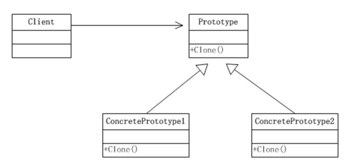

### 原型模式

用于创建重复的对象，同时又能保证性能。

关键代码：实现克隆操作，JAVA通过继承 Cloneable，重写 clone()（需要注意深浅拷贝）

优点： 

+ 性能提高

+ 逃避构造函数的约束。

缺点：

+ 必须实现 Cloneable 接口
+ 对于已有的类不一定很容易，特别当一个类引用不支持串行化的间接对象，或者引用含有循环结构的时候

类图：

+ Prototype：原型类，声明一个克隆自己的接口
+ ConcretePrototype:具体的原型类，实现了一个克隆自己的操作
+ Client：客户端