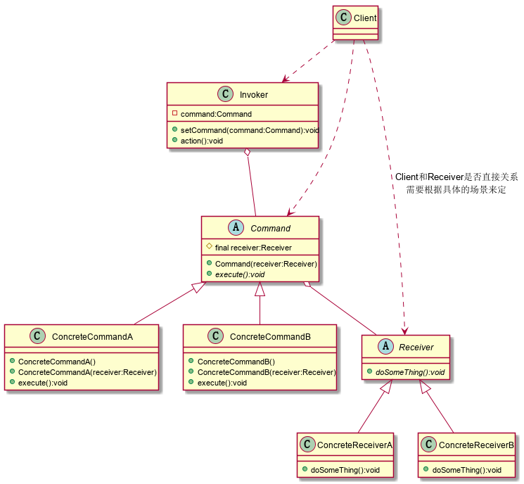

### 命令模式

将一个请求封装成一个对象，从而让你使用不同的请求把客户端参数化，使得请求发送者和请求接收者消除彼此之间的耦合。如果对请求排队或者记录请求日志，可以提供命令的撤销和恢复功能。

**结构示意图：**



**角色说明：**

+ Receiver 命令接收者，命令传递到这儿是应该被执行的
+ Command 命令角色，需要执行的所有命令
+ Invoker 调用者角色，收到命令，并执行命令

**Demo：**

```java
/**
 * 命令接收者
 */
public abstract class Receiver {
    public abstract void doSomeThing();
}
/**
 * 具体的命令接收者A
 */
public class ConcreteReceiverA extends Receiver {
    @Override
    public void doSomeThing() {
        System.out.println("ConcreteReceiverA接到命令，做了一些事情");
    }
}
/**
 * 具体的命令接收者B
 */
public class ConcreteReceiverB extends Receiver {
    @Override
    public void doSomeThing() {
        System.out.println("ConcreteReceiverB接到命令，做了一些事情");
    }
}
/**
 * 命令角色
 */
public abstract class Command {
    protected final Receiver receiver;
    // 实现类必须定义一个接收者
    public Command(Receiver receiver){
        this.receiver = receiver;
    }
    // 每个命令类都要有一个执行命令的方法
    public abstract void execute();
}
/**
 * 具体的命令
 */
public class ConcreteCommandA extends Command {
    public ConcreteCommandA(){
        // 默认给一个接收者
        super(new ConcreteReceiverA());
    }
    // 通过构造函数传入一个接收者
    public ConcreteCommandA(Receiver receiver) {
        super(receiver);
    }

    @Override
    public void execute() {
        // 收到命令做某些操作
        receiver.doSomeThing();
    }
}
/**
 * 具体的命令
 */
public class ConcreteCommandB extends Command {
    public ConcreteCommandB(){
        // 默认给一个接收者
        super(new ConcreteReceiverB());
    }
    // 通过构造函数传入一个接收者
    public ConcreteCommandB(Receiver receiver) {
        super(receiver);
    }

    @Override
    public void execute() {
        // 收到命令做某些操作
        receiver.doSomeThing();
    }
}
/**
 * 客户端
 */
public class Client {
    public static void main(String[] args) {
        Command commandA = new ConcreteCommandA();
        Command commandB = new ConcreteCommandB();
        Invoker invoker = new Invoker(commandA);
        invoker.action();
        invoker = new Invoker(commandB);
        invoker.action();
        commandA = new ConcreteCommandA(new ConcreteReceiverB());
        invoker = new Invoker(commandA);
        invoker.action();
    }
}
```

**有点：**

+ 类间解耦
+ 可扩展性
+ 结合其他模式会更优秀

**缺点：**

+ 使用不当会造成类膨胀

**使用场景：**

​	只要认为是命令的地方就可以采用命令模式

