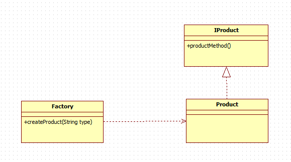
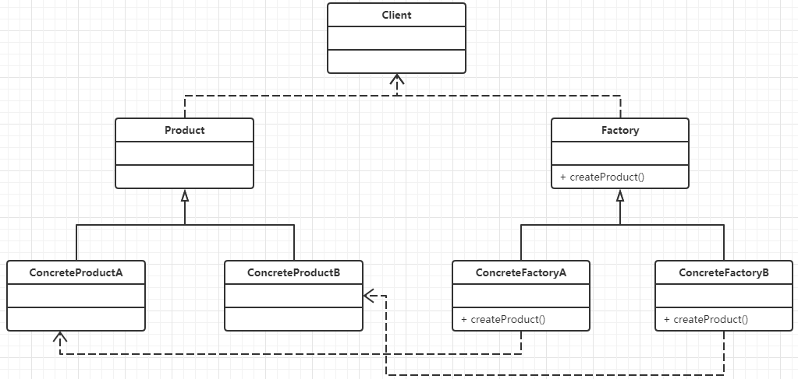
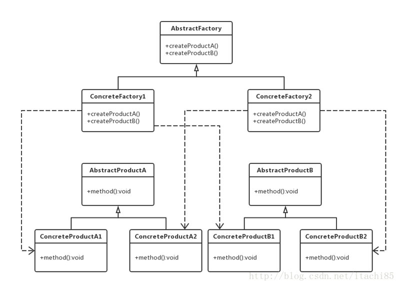

#### 简单工厂方法



核心内容：

+ Factory：工厂类，简单工厂模式的核心，负责实现创建所有实例的内部逻辑，工厂类中创建产品类的方法可以被外部直接调用。
+ IProduct：抽象产品类（或接口），简单工厂所创建的所有对象的父类（或实现的接口），他负责描述所有实例所共有的公共接口。
+ Product：具体产品类，简单工厂模式的创建目标。


#### 工厂方法模式



+ Factory(抽象工厂类)：申明了工厂方法，用于返回一个产品
+ ConcreteFactory（具体工厂类）：实现了Factory中定义的工厂方法
+ Product(抽象产品类)
+ ConcreteProduct（产品实现类）

#### 抽象工厂方法




+ AbstractFactory：抽象工厂，它声明了用来创建不同产品的方法。
+ ConcreteFactory：具体工厂，实现抽象工厂中定义的创建产品的方法。
+ AbstractProduct：抽象产品，为每种产品声明业务方法。比如上图的AbstractProductA和 AbstractProductB。
+ ConcreteProduct：具体产品，定义具体工厂生产的具体产品，并实现抽象产品中定义的业务方法。

**简单来说：**工厂方法模式的工厂是创建出**一种**产品，而抽象工厂是创建出**一类**产品

#### 工厂模式在JDK中的实例：

JDK中的Calendar类使用了简单工厂模式

```java
private static Calendar createCalendar(TimeZone zone,Locale aLocale)
{
    CalendarProvider provider =
        LocaleProviderAdapter.getAdapter(CalendarProvider.class, aLocale)
        .getCalendarProvider();
    if (provider != null) {
        try {
            return provider.getInstance(zone, aLocale);
        } catch (IllegalArgumentException iae) {
            // fall back to the default instantiation
        }
    }

    Calendar cal = null;
    /*根据不同的地区来创建不同的日历对象，就好比日历这个工厂，生产着世界上各地区的日历，
    我需要这个地区日历，我只需要传参数告诉工厂即可，不需要知道日历制作过程和实例的过程*/
    if (aLocale.hasExtensions()) {
        String caltype = aLocale.getUnicodeLocaleType("ca");
        if (caltype != null) {
            switch (caltype) {
                case "buddhist":
                    cal = new BuddhistCalendar(zone, aLocale);
                    break;
                case "japanese":
                    cal = new JapaneseImperialCalendar(zone, aLocale);
                    break;
                case "gregory":
                    cal = new GregorianCalendar(zone, aLocale);
                    break;
            }
        }
    }
    if (cal == null) {
        // If no known calendar type is explicitly specified,
        // perform the traditional way to create a Calendar:
        // create a BuddhistCalendar for th_TH locale,
        // a JapaneseImperialCalendar for ja_JP_JP locale, or
        // a GregorianCalendar for any other locales.
        // NOTE: The language, country and variant strings are interned.
        if (aLocale.getLanguage() == "th" && aLocale.getCountry() == "TH") {
            cal = new BuddhistCalendar(zone, aLocale);
        } else if (aLocale.getVariant() == "JP" && aLocale.getLanguage() == "ja"
                   && aLocale.getCountry() == "JP") {
            cal = new JapaneseImperialCalendar(zone, aLocale);
        } else {
            cal = new GregorianCalendar(zone, aLocale);
        }
    }
    return cal;
}
```

