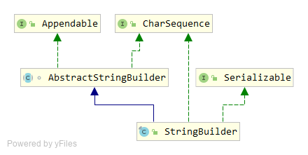

### 建造者模式

​	将一个复杂对象的构建与他的表现分离，使得同样的构建过程可以创建不同的表示。对象的一些属性是按照顺序进行赋值的，在某些属性没有完成赋值之前对象无法作为一个完整的产品使用。

#### 涉及角色

#### 优点

+ 降低代码耦合度。在建造者模式中，客户端不需要知道产品内部是如何实现的，我们只需得到产品的对象。并且使用导演者和建造者分离组装过程和组件具体构造过程，具有灵活的扩展性。 
+ 优秀的扩展性。具体建造者相互独立，方便扩展，符合开闭原则。 

#### 缺点

+ 一定的使用范围限制。建造者模式的产品的组件基本相同，如果产品的差异性较大，建造者模式就不适用了。 

#### **跟工厂方法模式对比** 

​	建造者模式和工厂模式同样是创建一个产品，工厂模式就是一个方法，而建造者模式有多个方法，并且建造者模式是有**顺序**的执行方法。就是说建造者模式强调的是顺序，而工厂模式没有顺序一说。 

#### 建造者模式在JDK中的应用

+ Appendable为抽象建造者，该接口定义了多个append方法。
+ AbstractStringBuilder实现了Appendable接口，AbstractStringBuilder其实已经是建造者，只是AbstractStringBuilder为抽象类，无法实例化
+ StringBuilder继承自AbstractStringBuilder，同时充当了指挥者和建造者

