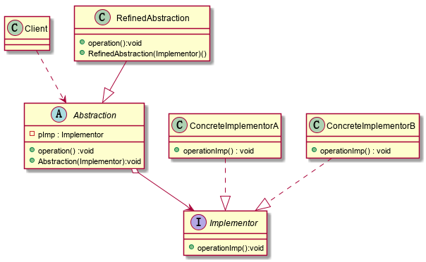

### 桥接模式-Bridge

​	桥接模式是一种结构型设计模式，基于类的最小设计原则，通过使用封装、聚合以及继承等行为，让不同的类承担不同的职责。他的主要特点是把抽象与行为实现分离，从而可以保持各部分的独立性以及他们的功能扩展。

**说明：**

+ Client类：桥接模式的调用者
+ 抽象类-Abstraction：通过聚合维护了Implementor，Abstraction充当桥梁
+ RefinedAbstraction：Abstraction的子类
+ ConcreteImplementorA/B：行为的具体实现类

**注意事项、细节：**

+ 实现了抽象和实现部分的分离，极大的提高了系统的灵活性，让抽象部分和实现部分独立开来，这有助于系统进行分层设计
+ 对于系统的高层部分，只需要知道抽象部分和实现部分的接口就可以了，其他的部分由具体业务来完成
+ 桥接模式代替多层继承方案，可以减少子类的个数，降低系统的管理和维护成本
+ 桥接模式的引入增加了系统的理解和设计的难度，由于聚合关联关系建立在抽象层，要求开发者针对抽象进行设计和编程
+ 桥接模式要求正确识别出系统中两个独立变化的纬度，因此其使用范围有一定的局限性

