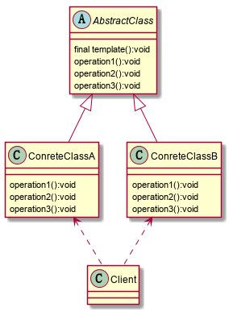

### 模板方法模式

​	定义一个操作中的算法骨架，将一些步骤延迟到子类中去实现，使得子类可以不改变一个算法的结构，就可以重新定义该算法的某些特定步骤。实现了最大化代码复用，模板方法一般会加上final防止子类重写，由于每个不同的实现都需要子类来实现，这样会导致类的个数增加。

**结构示意图：**

**说明：**

+ AbstractClass抽象类：实现了模板方法template(final)，定义了算法的骨架，operation1、2、3需要子类去实现
+ ConcreteClass子类：继承自AbstractClass，实现了operation1、2、3方法

