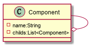

### 组合模式

​	又叫作部分-整体模式，是一种将对象组合成树状的层次结构的模式，用来表示“部分-整体”的关系。

​	组合模式使得客户端可以一致的处理单个对象和组合对象，无须关心自己处理的是单个对象还是组合对象，这简化了客户端代码。

**结构图：**

**关键：**树枝内部组合该接口，并且含有内部属性 List，里面放 Component 

**使用场景**：部分、整体场景，如树形菜单，文件、文件夹的管理。 

**优点**： 1、高层模块调用简单。 2、节点自由增加。

 **缺点**：在使用组合模式时，其叶子和树枝的声明都是实现类，而不是接口，违反了依赖倒置原则。 

