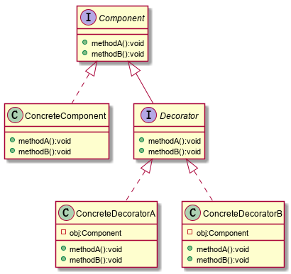
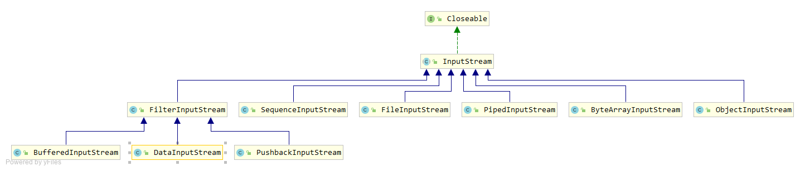

### 装饰者模式

动态的将新功能附加到对象上，在对象功能扩展方面，他比继承更有弹性，同时也体现了开闭原则（ocp）

**说明：**

+ 抽象构件-Component：被装饰者的抽象接口或抽象类
+ 具体构件-ConcreteComponent：被装饰者具体的实现类
+ 抽象装饰-Decorator：装饰者接口或抽象类，所有装饰者需要实现的接口（抽象类）
+ 具体装饰-ConcreteDecorator：装饰者具体的实现类

**应用场景：**

+ 需要扩展一个类的功能，或者需要给一个类添加附加职责
+ 需要给一个对象动态的添加功能，这些功能可以再动态的撤销
+ 当不能采用生成子类的方法进行扩充时。可能有大量独立的扩展，为支持每一种组合将产生大量的子类，使得子类数目呈爆炸性增长 
+ 需要增加由一些基本功能的排列组合而产生的非常大量的功能，从而使继承关系变的不现实 

**总结：**

+ 装饰者与被装饰者有相同的超类型（Component）
+ 可以使用一个或多个装饰对象包装一个对象
+ 因为装饰者与被装饰者具有相同的超类型，所以在任何需要原始对象的情况下，都可以用装饰过的对象去替代
+ 装饰者可以在所委托被装饰者的行为之前与之后，加上自己的行为，以达到特定的目的
+ 对象可以在任何时候被装饰，

**JDK中的装饰者模式java I/O:**

Java I/O中大量使用了装饰者模式，此处指列出InputStream

+ InputStream为抽象构件
+ FileInputStream、PipedInputStream、ByteArrayInputStream、ObjectInputStream等为具体的构建
+ FilterInputStream为抽象装饰者
+ BufferedInputStream、DataInputStream、PushbackInputStream为具体的装饰者

**优缺点：**

+ 比继承更加灵活、扩展性更好，装饰者和被装饰者的不同组合能够展现出不同的行为
+ 更灵活意味着更加的复杂，
+ 如果过度使用会造成小类很多（Java I/O），程序会变得很复杂，而且整体是针对构建（接口或抽象类）编程的