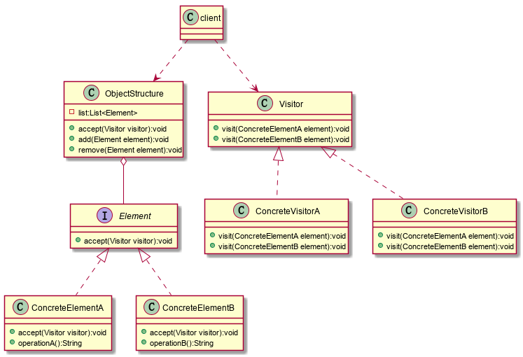

### 访问者模式

封装一些作用于某种数据结构中的各种元素的操作，它可以在不改变数据结构的前提下定义作用于这些元素的新的操作。

**结构示意图：**



**说明：**

- 抽象访问者（Visitor）角色：定义一个访问具体元素的接口，为每个具体元素类对应一个访问操作 visit() ，该操作中的参数类型标识了被访问的具体元素。
- 具体访问者（ConcreteVisitor）角色：实现抽象访问者角色中声明的各个访问操作，确定访问者访问一个元素时该做什么。
- 抽象元素（Element）角色：声明一个包含接受操作 accept() 的接口，被接受的访问者对象作为 accept() 方法的参数。
- 具体元素（ConcreteElement）角色：实现抽象元素角色提供的 accept() 操作，其方法体通常都是 visitor.visit(this) ，另外具体元素中可能还包含本身业务逻辑的相关操作。
- 对象结构（Object Structure）角色：是一个包含元素角色的容器，提供让访问者对象遍历容器中的所有元素的方法，通常由 List、Set、Map 等聚合类实现。

**使用场景：**

业务规则要求遍历多个不同的对象

+ 一个对象结构包含很多类对象，他们有不同的接口，而你想对这些对象实施一些依赖于具体类的操作，，也就是说，用迭代器模式已经不能胜任的情景
+ 需要对一个对象结构中的对象进行很多不同且并不相关的操作，而你想避免让这些操作污染这些对象类

**优点：**

+ 符合单一职责原则

  具体元素类和访问者类两个不同的职责非常明确的分离开来，各自演绎变化

+ 优秀的扩展性

  在不修改对象结构的情况下，能很方便的为对象中现有元素添加新的功能

+ 灵活性非常高

**缺点：**

+ 添加新的元素类很困难

  每增加一个新的元素类，都要在每个具体的访问者类中增加相应的具体的操作，违背了**开闭原则**

+ 破坏封装

  具体元素对访问者公布细节，破坏了对象的封装性

+ 违反了依赖倒置原则

  访问者模式中依赖了具体类，而没有依赖抽象类

**Demo：**

```java
/**
 * 抽象元素类
 */
public interface Element {
    void accept(Visitor visitor);
}

/**
 * 具体元素A类
 */
public class ConcreteElementA implements Element {
    @Override
    public void accept(Visitor visitor) {
        visitor.visit(this);
    }

    public String operationA() {
        return "具体元素A的操作。";
    }
}

/**
 * 具体元素B类
 */
public class ConcreteElementB implements Element {
    @Override
    public void accept(Visitor visitor) {
        visitor.visit(this);
    }

    public String operationB() {
        return "具体元素B的操作。";
    }
}
/**
 * 抽象访问者
 */
public interface Visitor {
    void visit(ConcreteElementA element);
    void visit(ConcreteElementB element);
}

/**
 * 具体的访问者A
 */
public class ConcreteVisitorA implements Visitor {
    public void visit(ConcreteElementA element) {
        System.out.println("具体访问者A访问-->" + element.operationA());
    }

    public void visit(ConcreteElementB element) {
        System.out.println("具体访问者A访问-->" + element.operationB());
    }
}
/**
 * 具体的访问者B
 */
public class ConcreteVisitorB implements Visitor {
    public void visit(ConcreteElementA element) {
        System.out.println("具体访问者B访问-->" + element.operationA());
    }

    public void visit(ConcreteElementB element) {
        System.out.println("具体访问者B访问-->" + element.operationB());
    }
}

import java.util.ArrayList;
import java.util.Iterator;
import java.util.List;

/**
 * 对象结构角色
 */
public class ObjectStructure {
    private List<Element> list = new ArrayList<Element>();

    public void accept(Visitor visitor) {
        Iterator<Element> i = list.iterator();
        while (i.hasNext()) {
            ((Element) i.next()).accept(visitor);
        }
    }

    public void add(Element element) {
        list.add(element);
    }

    public void remove(Element element) {
        list.remove(element);
    }
}

public class Client {
    public static void main(String[] args) {
        ObjectStructure os = new ObjectStructure();
        os.add(new ConcreteElementA());
        os.add(new ConcreteElementB());
        Visitor visitor = new ConcreteVisitorA();
        os.accept(visitor);
        System.out.println("------------------------");
        visitor = new ConcreteVisitorB();
        os.accept(visitor);
    }
}

```

