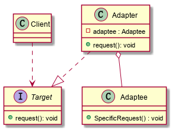
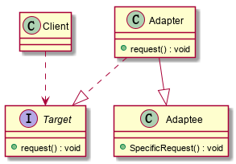

### 适配器模式

将一个接口转换成希望的另一个接口，使因不兼容而不能一起工作的类，能够一起工作。

**结构：**

+ Target 目标抽象类
+ Adapter 适配器类
+ Adaptee 适配者类
+ Client 客户端

#### 对象适配器模式

适配器-Adapter类继承自目标接口-Target，在Adapter类中通过成员变量的方式聚合了Adaptee类，最后重写了request方法，在request方法中调用adaptee对象的specificRequest方法来实现适配的功能。

#### 类适配器模式

适配器-Adapter类实现了目标接口类-Target，同时继承自Adaptee类，在Adapter类中实现request方法，通过在request方法中调用specificRequest方法来实现适配的功能。

