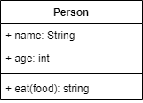

### 类图

**基本结构：**

#### 符号表示：

+ -表示private
+ #表示protected
+ ~表示default，也就是包权限
+ _下划线表示static
+ 斜体表示抽象

#### 类与类之间关系:

在UML类图中，常见的有一下几种关系：泛化（Genneralization）、实现(Realization)、关联(Association)、聚合(Aggregation)、组合（Composition）、依赖(Dependency)

**泛化**

表示类与类之间的继承关系，接口与接口之间的继承关系，或类对接口的实现

+ 继承 ：使用**空心三角形+实线**表示
+ 实现：使用**空心三角形+虚线**表示

