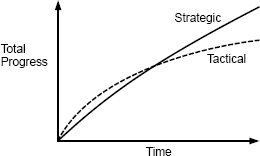

# 软件设计

https://www.bookstack.cn/read/A-Philosophy-of-Software-Design-zh/spilt.3.docs-ch2.md

## 概述

**所有编程都需要具有创造力的头脑和组织思维的能力**

意味着编写软件的最大限制是我们了解/理解所创建系统的能力，

随着程序不断发展和丰富，复杂性不断累积，系统开发和维护难度加大，

+ 通过代码更简单和更明显来消除复杂性
+ 封装，模块化设计

**软件设计是一个贯穿软件系统整个生命周期的连续过程**

在构建任何东西之前，不可能充分可视化大型软件系统的设计，初始设计将有许多问题。在实施良好之前，问题不会变得明显，开发人员尝试在不改变整体设计的情况下解决问题。这导致复杂性的爆炸式增长。

当今大多数软件开发项目都使用诸如敏捷开发之类的增量方法，增量方法适用于软件，因为软件具有足够的延展性，可以在实施过程中进行重大的设计更改

增量开发意味着永远不会完成软件设计。设计在系统的整个生命周期中不断发生：开发人员应始终在思考设计问题

+ 设计
+ 改进设计

降低复杂性是软件设计中最重要的要素，在软件开发过程中使用的技术，以最大程度地减少复杂性

改善设计技能的最好方法之一就是学会识别危险信号，不要轻易放弃：解决问题之前尝试的替代方法越多，您就会学到更多。随着时间的流逝，您会发现代码中的危险信号越来越少，并且您的设计越来越清晰

每条规则都有例外，每条原则都有其局限性。如果您将任何设计创意都发挥到极致，那么您可能会陷入困境。精美的设计反映了相互竞争的思想和方法之间的平衡

识别复杂性的能力是至关重要的设计技能

复杂性取决于最常见的活动。如果系统中有一些非常复杂的部分，但是几乎不需要触摸这些部分，那么它们对系统的整体复杂性不会有太大影响

复杂性的征兆/症状：

+ 变更放大：变更很小，需要变更的地方特别多

  一个网站，多个网页，需要修改每个页面的背景色，如果页面很多，可以把背景色配置成一个中心值

+ 认知负荷：C 需要手动释放内存，Java不需要，所以针对C的开发人员来说就增加了认知负荷

  所以代码不一定越简洁，越高级越好，需要考虑认知负荷

+ 未知的未知：必须修改哪些代码才能完成任务，开发人员必须获得哪些信息才能成功地执行任务，都不知道

  比如网站背景色设置为中心值，但是对于个性化自定义的页面，开发人员不太可能意识到这一点

 unknown unknowns ，是最糟糕的一点，因为你不知道怎么做，不知道需要怎么去获取哪些信息，而针对变更放大和认知负荷，我们都是知道怎么做的，去慢慢改完，去认真学习然后完成相应的工作就能保证整个系统的正确

良好设计的最重要的目标之一：使系统显而易见

+ 开发人员可以快速了解现有代码的工作方式以及进行更改所需要的内容
+ 开发人员可以在不费力思考的情况下快速猜测出要做什么，同时又可以确信该猜测是正确的

引起复杂性的原因：

+ 依赖性：**导致变化放大和高认知负荷**

  当无法孤立或单独的修改给定的一段代码时，便存在依赖关系，eg：修改一个页面颜色会修改所有页面，修改一个被多个地方调用的一个公共方法，修改对接协议

  依赖关系是软件的基本组成部分，不能完全消除

+ 模糊性：**产生未知的未知数，增加认知负担**

  当重要信息不明显时，就会发生模糊，在许多情况下，由于文档不足而导致模糊不清

  如果系统设计简洁明了，则所需的文档将更少。对大量文档的需求通常是一个警告，即设计不正确。减少模糊性的最佳方法是简化系统设计

**找到最小化依赖关系和模糊性的设计技术，那么我们就可以降低软件的复杂性**

复杂度是递增的

复杂性来自于依赖性和模糊性的积累。随着复杂性的增加，它会导致变化放大，高认知负荷和未知的未知数。结果，需要更多的代码修改才能实现每个新功能。此外，开发人员花费更多时间获取足够的信息以安全地进行更改，在最坏的情况下，他们甚至找不到所需的所有信息。最重要的是，复杂性使得修改现有代码库变得困难且冒险。

## 工作代码是不够的

+ 战术编程

  短视的

+ 战略编程

投资时间：总开发时间的 10％到 20％用于投资，因此初始项目将比纯战术方法花费 10-20％的时间

公司环境、状况、业务

总结：好的设计不是免费的，它必须是不断投资的东西，这样小问题才不会累积成大问题。

始终如一地运用战略方法并将投资视为今天而不是明天要做的事情至关重要

## 模块化设计

软件系统被分解为相对独立的模块，模块的形式可能是：类、子系统、服务

模块化设计的目标是最大程度地减少模块之间的依赖性

接口和实现

有些复杂性对于模块用户而言是不可见的

最好的模块是那些其接口比其实现简单得多的模块

一个简单的接口可以将模块强加于系统其余部分的复杂性降至最低。其次，如果以不更改其接口的方式修改了一个模块，则该修改不会影响其他模块

模块的接口包含两种信息：

+ 正式信息
+ 非正式信息

在抽象的定义中，“无关紧要”一词至关重要。从抽象中忽略的不重要的细节越多越好，抽象可以通过两种方式出错：

+ 它可以包含并非真正重要的细节

  当这种情况发生时，它会使抽象变得不必要的复杂，从而增加了使用抽象的开发人员的认知负担。

+ 第二个错误是抽象忽略了真正重要的细节

  这导致模糊不清：仅查看抽象的开发人员将不会获得正确使用抽象所需的全部信息。忽略重要细节的抽象是错误的抽象：它可能看起来很简单，但实际上并非如此

总体而言就是抽象不合理

最好的模块是那些提供强大功能但具有简单接口的模块，

深度模块：它们在简单的接口后隐藏了许多功能，实现深层模块最重要的技术是信息隐藏

浅层模块是一个接口相对于其提供的功能而言复杂的模块

总结：

通过将模块的接口与其实现分开，我们可以将实现的复杂性从系统的其余部分中隐藏出来。模块的用户只需要了解其接口提供的抽象。设计类和其他模块时，最重要的问题是使它们更深，以使它们具有适用于常见用例的简单接口，但仍提供重要的功能。这使隐藏的复杂性最大化。

信息隐藏在两个方面降低了复杂性：

+ 它将接口简化为模块
+ 信息隐藏使系统更容易演化

设计新模块时，应仔细考虑可以在该模块中隐藏哪些信息，信息隐藏的最佳形式是将信息完全隐藏在模块中，从而使该信息对模块的用户无关且不可见

信息隐藏的反面是信息泄漏