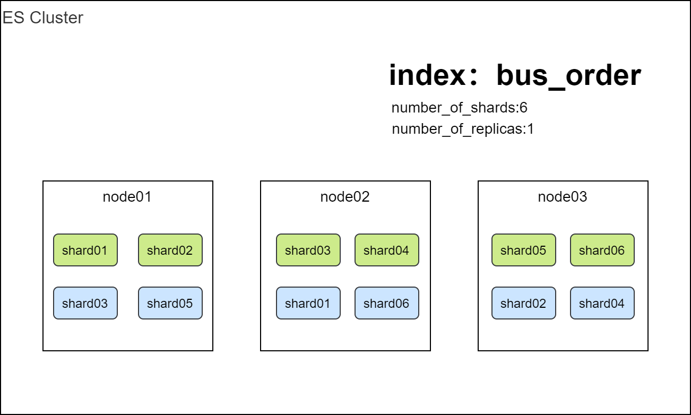
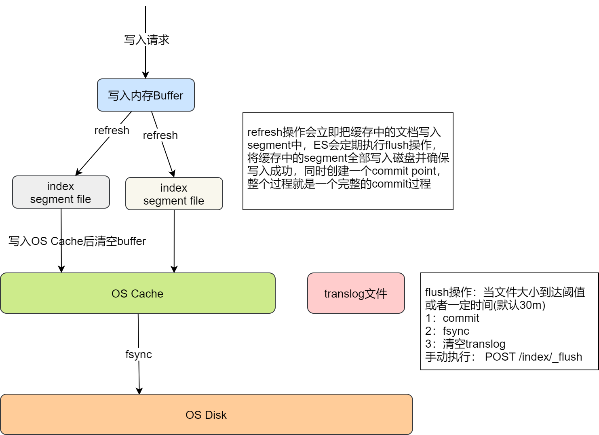
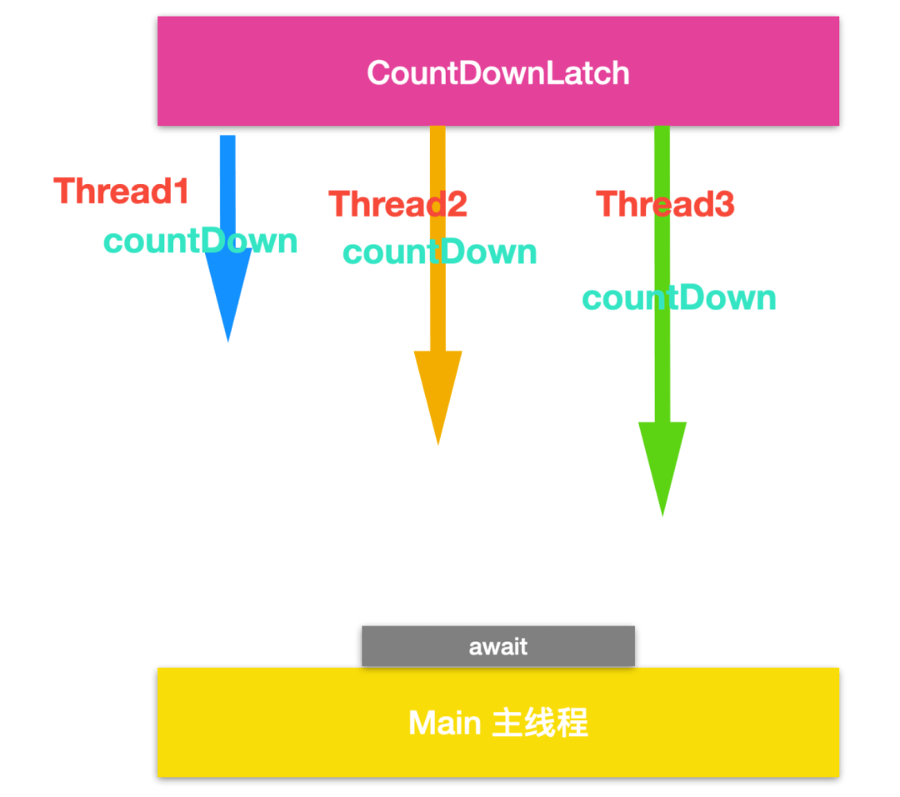

# ES基础

## ES概述

### 简介

分布式的**搜索，存储**和**数据分析**引擎，特点：**分布式、高性能、高可用、可伸缩、易维护** 

优点：

+ 面向开发者友好，屏蔽了Lucene的复杂特性，集群自动发现（cluster discovery）
+ 自动维护数据在多个节点上的建立
+ 会帮我做搜索请求的负载均衡
+ 自动维护冗余副本，保证了部分节点宕机的情况下仍然不会有任何数据丢失
+ ES基于Lucene提供了很多高级功能：复合查询、聚合分析、基于地理位置等
+ 对于大公司，可以构建几百台服务器的大型分布式集群，处理PB级别数据；对于小公司，开箱即用，门槛低上手简单
+ 相遇传统数据库，提供了全文检索，同义词处理（美丽的cls>漂亮的cls），相关度排名。聚合分析以及海量数据的近实时（NTR）处理，这些传统数据库完全做不到

### ES核心概念

+ cluster（集群）：每个集群至少包含两个节点
+ node(节点)：集群中的每个节点，一个节点不代表一台服务器
+ index(索引)：类比mysql中的表
+ document：_doc,索引中的一条数据，json格式
+ Shard(分片)：一个index包含多个Shard
+ replicas(副本)：一个index按照shard的备份



## ES 常用命令

ES版本：7.7.0

测试环境kibana：http://192.168.0.152:5601/

文档地址：

### Index基本操作

+ 查询集群所有索引：GET _cat/indices?v
+ 查询指定索引：GET _cat/indices/{index}?v
+ 查询索引分片情况：GET _cat/shards/{index}?v

+ 创建索引：PUT indexName

  ```json
  PUT es_st_test
  {
    "mappings": {
      "dynamic": "true",
      "properties" : {
          "accountId" : {
            "type" : "keyword"
          },
          "userId" : {
            "type" : "keyword"
          },
          "age":{
            "type": "long"
          },
          "ym" : {
            "type" : "long"
          }
        }
    },
    "settings": {
      "index": {
        "number_of_shards": "3",
        "number_of_replicas": "0"
      }
    }
  }
  ```
  
+ 删除索引：DELETE /{index}?pretty

+ 插入数据：

  ```json
  PUT /index/_doc/{id}
  {
      json格式
  }
  ```

  ```json
  PUT es_st_test/_doc/1
  {
    "accountId":"account_1",
    "userId":"1",
    "age":20,
    "ym":202108
  }
  ```

+ 查询mapping结构：GET {index}/_mapping

+ 查询索引配置信息：GET {index}/_settings

+ 设置settings：

  ```json
  PUT /es_st_test/_settings
  {
    "refresh_interval": "5s",
    "translog.durability": "request",
    "translog.flush_threshold_size": "512mb"
  }
  ```

### cat常用命令

/_cat/allocation    #查看单节点的shard分配整体情况

/_cat/shards     #查看各shard的详细情况

/_cat/shards/{index}   #查看指定分片的详细情况

/_cat/master     #查看master节点信息

/_cat/nodes      #查看所有节点信息

/_cat/indices     #查看集群中所有index的详细信息

/_cat/indices/{index}   #查看集群中指定index的详细信息

/_cat/segments    #查看各index的segment详细信息,包括segment名, 所属shard, 内存(磁盘)占用大小, 是否刷盘

/_cat/segments/{index}#查看指定index的segment详细信息

/_cat/count      #查看当前集群的doc数量

/_cat/count/{index}  #查看指定索引的doc数量

/_cat/recovery     #查看集群内每个shard的recovery过程.调整replica。

/_cat/recovery/{index}#查看指定索引shard的recovery过程

/_cat/health     #查看集群当前状态：红、黄、绿

/_cat/pending_tasks  #查看当前集群的pending task

/_cat/aliases     #查看集群中所有alias信息,路由配置等

/_cat/aliases/{alias} #查看指定索引的alias信息

/_cat/thread_pool   #查看集群各节点内部不同类型的threadpool的统计信息,

/_cat/plugins     #查看集群各个节点上的plugin信息

/_cat/fielddata    #查看当前集群各个节点的fielddata内存使用情况

/_cat/fielddata/{fields}   #查看指定field的内存使用情况,里面传field属性对应的值

/_cat/nodeattrs       #查看单节点的自定义属性

/_cat/repositories      #输出集群中注册快照存储库

/_cat/templates       #输出当前正在存在的模板信息

### ES常用查询

#### Query_string

有兴趣的可以自己网上了解

#### Query DSL

+ match_all：匹配所有

  ```json
  GET es_st_test/_search
  {
    "query": {
      "match_all": {}
    }
  }
  ```

+ match：模糊匹配

  ```json
  GET es_st_test/_search
  {
    "query": {
      "match": {
        "remark": "成都"
      }
    }
  }
  ```

+ term：精准匹配

  ```json
  GET es_st_test/_search
  {
    "query": {
      "term": {
        "remark": "成都"
      }
    }
  }
  ```

  ```json
  GET es_st_test/_search
  {
    "query": {
      "term": {
        "userId": "1231saadasd"
      }
    }
  }
  ```

+ terms：类似sql的in查询，有性能问题

  ```json
  GET es_st_test/_search
  {
    "query": {
      "terms": {
        "accountId": [
          "id_33333333333333",
          "id_11212"
        ]
      }
    }
  }
  ```

+ range：范围查询

  ```json
  GET es_st_test/_search
  {
    "query": {
      "range": {
        "ym": {
          "gte": 202108,
          "lte": 202109
        }
      }
    }
  }
  ```

+ sort：排序

  ```json
  GET es_st_test/_search
  {
    "query": {
      "terms": {
        "accountId": [
          "id_444",
          "id_11212"
        ]
      }
    },
    "sort": [
      {
        "ym": {
          "order": "desc"
        }
      }
    ]
  }
  ```

+ _source：指定要查询的字段

  ```json
  GET es_st_test/_search
  {
    "_source": ["userId","remark","ym"], 
    "query": {
      "terms": {
        "accountId": [
          "id_444",
          "id_11212"
        ]
      }
    },
    "sort": [
      {
        "ym": {
          "order": "desc"
        }
      }
    ]
  }
  ```

+ size：指定返回的条数

  ```json
  GET es_st_test/_search
  {
    "size": 2, 
    "query": {
      "match_all": {}
    }
  }
  ```

#### bool查询

可以组合多个查询条件

+ must：必须满足，要计算得分

  ```json
  GET es_st_test/_search
  {
    "query": {
      "bool": {
        "must": [
          {
            "match": {
              "userId": "1231saadasd"
            }
          },{
            "term": {
              "accountId": {
                "value": "id_11212"
              }
            }
          }
        ]
      }
    }
  }
  ```

+ filter：过滤器，不计算得分

  ```json
  GET es_st_test/_search
  {
    "query": {
      "bool": {
        "filter": [
          {
            "match": {
              "userId": "1231saadasd"
            }
          },{
            "term": {
              "accountId": {
                "value": "id_11212"
              }
            }
          }
        ]
      }
    }
  }
  ```

+ should：可能满足 or

  ```json
  GET es_st_test/_search
  {
    "query": {
      "bool": {
        "should": [
          {
            "match": {
              "userId": "1231saadasd"
            }
          },{
            "term": {
              "accountId": {
                "value": "id_11212"
              }
            }
          }
        ]
      }
    }
  }
  ```

+ must_not：必须不满足，不计算得分 not

  ```json
  GET es_st_test/_search
  {
    "query": {
      "bool": {
        "must_not": [
          {
            "match": {
              "userId": "1231saadasd"
            }
          },{
            "term": {
              "accountId": {
                "value": "id_11212"
              }
            }
          }
        ]
      }
    }
  }
  ```

+ minimum_should_match：最小匹配度

#### 聚合查询

+ Bucket Aggegation

  一系列满足条件的文档，类似于 SQL中的 GROUP by brand

+ Metric

  Metric 会给予数据集计算结果， 除了支持在字段上进行计算，同样也支持在脚本 （painless script） 产生的结果上进行计算

  大多数 Metric 是数学计算，仅输出一个值：`min / max / sun / avg / cardinality`

  部分 metric 支持输出多个数值：`stats / percentiles / percentile_ranks`

+ Pipeline Aggregation 

  对其他的聚合结果进行二次聚合

+ Matrix Aggregation

  支持对多个字段的操作并提供一个结果矩阵

语法格式：

```json
"aggregations" : {
    "<aggregation_name>" : {                  <!--聚合的名字 -->
        "<aggregation_type>" : {              <!--聚合的类型 -->
            <aggregation_body>                <!--聚合体：对哪些字段进行聚合 -->
        }
        [,"meta" : {  [<meta_data_body>] } ]?               <!--元 -->
        [,"aggregations" : { [<sub_aggregation>]+ } ]?   <!--在聚合里面在定义子聚合 -->
    }
    [,"<aggregation_name_2>" : { ... } ]*                     <!--聚合的名字 -->
}
```

说明：**aggregations 也可简写为 aggs**

示例：

+ 根据某个字段分组统计文档数  // ym.keyword

  ```json
  GET es_st_test/_search
  {
    "size": 0,
    "aggs": {
      "group_by_ym": {
        "terms": {
          "field": "ym"
        }
      }
    }
  }
  ```

+ 获取最大值

  ```json
  GET es_st_test/_search
  {
    "size": 0,
    "aggs": {
      "max_age": {
        "max": {
          "field": "age"
        }
      }
    }
  }
  ```

+ 嵌套聚合

  ```json
  GET es_st_test/_search
  {
    "size": 0,
    "aggs": {
      "group_by_ym": {
        "terms": {
          "field": "ym"
        },
        "aggs": {
          "max_age": {
            "max": {
              "field": "age"
            }
          }
        }
      }
    }
  }
  ```

## ES数据写入原理




## ES Java Client教程

文档地址：https://www.elastic.co/guide/en/elasticsearch/client/java-rest/7.7/java-rest-high.html

根据文档简单介绍下document apis、index apis和search apis

## 综合案列

查询语句：

```json
GET superpark_bus_order/_search
{
  "size": 0,
  "query": {
    "bool": {
      "must": [
        {
          "range": {
            "payTime": {
              "from": 1625414400000,
              "to": null
            }
          }
        },
        {
          "term": {
            "tradeState": {
              "value": "00"
            }
          }
        }
      ]
    }
  },
  "track_total_hits": 2147483647,
  "aggregations": {
    "countLotId": {
      "terms": {
        "field": "lotId",
        "size": 1000000,
        "min_doc_count": 1,
        "shard_min_doc_count": 0,
        "show_term_doc_count_error": false,
        "order": [
          {
            "_count": "desc"
          },
          {
            "_key": "asc"
          }
        ]
      },
      "aggregations": {
        "sumLotCashFee": {
          "sum": {
            "field": "cashFee"
          }
        }
      }
    },
    "countPaymentMethod": {
      "terms": {
        "field": "paymentMethod",
        "size": 1000000,
        "min_doc_count": 1,
        "shard_min_doc_count": 0,
        "show_term_doc_count_error": false,
        "order": [
          {
            "_count": "desc"
          },
          {
            "_key": "asc"
          }
        ]
      }
    },
    "countOrderCategory": {
      "terms": {
        "field": "orderCategory",
        "size": 1000000,
        "min_doc_count": 1,
        "shard_min_doc_count": 0,
        "show_term_doc_count_error": false,
        "order": [
          {
            "_count": "desc"
          },
          {
            "_key": "asc"
          }
        ]
      }
    },
    "sumAllLotCashFee": {
      "sum_bucket": {  // pipeline 聚合，求所有桶中sumLotCashFee的和
        "buckets_path": [
          "countLotId>sumLotCashFee"
        ],
        "gap_policy": "skip"
      }
    }
  }
}
```

对应java代码：

```java
SearchSourceBuilder sourceBuilder = new SearchSourceBuilder().trackTotalHits(true).size(0);
//当日已支付成功数据
long todayStartTime = new DateTime().millisOfDay().withMinimumValue().getMillis();
BoolQueryBuilder boolQueryBuilder = getPaySuccessBoolQueryBuilder(todayStartTime);
sourceBuilder.query(boolQueryBuilder);
//lotId分组
TermsAggregationBuilder lotIdTermsAggregationBuilder = AggregationBuilders.terms("countLotId").field("lotId").size(1000000).order(BucketOrder.count(false));
SumAggregationBuilder cashFeeAggregationBuilder = AggregationBuilders.sum("sumLotCashFee").field("cashFee");
lotIdTermsAggregationBuilder.subAggregation(cashFeeAggregationBuilder);
sourceBuilder.aggregation(lotIdTermsAggregationBuilder);
//paymentMethod分组
TermsAggregationBuilder paymentMethodTermsAggregationBuilder = AggregationBuilders.terms("countPaymentMethod").field("paymentMethod").size(1000000).order(BucketOrder.count(false));
sourceBuilder.aggregation(paymentMethodTermsAggregationBuilder);
//orderCategory分组
TermsAggregationBuilder orderCategoryTermsAggregationBuilder = AggregationBuilders.terms("countOrderCategory").field("orderCategory").size(1000000).order(BucketOrder.count(false));
sourceBuilder.aggregation(orderCategoryTermsAggregationBuilder);
//交易总额
SumBucketPipelineAggregationBuilder allLotCashFeeAggregationBuilder = new SumBucketPipelineAggregationBuilder("sumAllLotCashFee", "countLotId>sumLotCashFee");
sourceBuilder.aggregation(allLotCashFeeAggregationBuilder);
long time1 = System.currentTimeMillis();
SearchRequest searchRequest = new SearchRequest("superpark_bus_order");
searchRequest.source(sourceBuilder);
SearchResponse searchResponse = null;
try {
    searchResponse = highLevelClient.search(searchRequest, RequestOptions.DEFAULT);
} catch (IOException e) {
    e.printStackTrace();
}
```

## 基于CountDownLatch对terms的优化

terms性能问题：https://zhuanlan.zhihu.com/p/338879496

CountDownLatch：



## ES 深度分页问题

elasticsearch默认采用的分页方式是from+size的形式，但是在深度分页的情况下，这种使用方式的效率是非常低的，

比如from=5000,size=10，es需要在各个分片上匹配排序并得到5000*10条有效数据，然后在结果集中取最后10条数据返回。除了会遇到效率上的问题，还有一个无法解决的问题是es目前支持最大的skip值是max_result_window默认为10000，也就是说当from+size > max_result_window时，es将返回错误

```json
GET es_st_test/_search
{
  "from": 1,
  "size": 2
}
```

分页替代方式：**scroll**

为了满足深度分页的场景，es提供了scroll的方式进行分页读取。原理上是对某次查询生成一个游标scroll_id，后续的查询只需要根据这个游标去取数据，知道结果集中返回的hits字段为空，就表示遍历结束。Scroll的作用不是用于实时查询数据，因为它会对es做多次请求，不肯能做到实时查询。它的主要作用是用来查询大量数据或全部数据。

使用scroll，每次只能获取一页的内容，然后会返回一个scroll_id。根据返回的这个scroll_id可以不断地获取下一页的内容，所以scroll并不适用于有跳页的情景

```json
GET es_st_test/_search?scroll=1m
{
  "size": 2, 
  "query": {
    "match_all": {}
  }
}

POST  /_search/scroll
{
    "scroll" : "1m", 
    "scroll_id" : "FGluY2x1ZGVfY29udGV4dF91dWlkDnF1ZXJ5VGhlbkZldGNoAxRERFgtZTNzQmV1SGhHbnRPNUctbAAAAAAADd8bFng3TTBpbWJYUW1xXzVFUUxoR3pIWEEURFRYLWUzc0JldUhoR250TzVHLWwAAAAAAA3fHBZ4N00waW1iWFFtcV81RVFMaEd6SFhBFERqWC1lM3NCZXVIaEdudE81Ry1sAAAAAAAN3x0WeDdNMGltYlhRbXFfNUVRTGhHekhYQQ==" 
}
```

