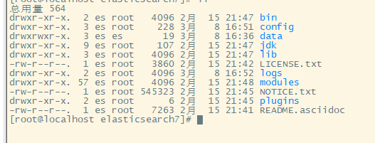

# Elastic Search简介

## 简介

分布式的搜索，存储，数据分析引擎，ES!=搜索引擎

优点：

+ 面向开发者友好，屏蔽了lucene的复杂特性，集群自动发现(cluster discovery)
+ 自动维护数据在多个节点上的建立
+ 自动完成搜索请求的负载均衡
+ 自动维护冗余副本，保证了部分节点宕机的情况下任然不会有任何数据丢失
+ ES基于Lucene提供了很多高级功能：复合查询，聚合分析，基于地理位置
+ 对于大公司，可以构建几百台服务器的大型分布式集群，处理PB级别数据；对于小公司开箱即用，门槛低上手简单
+ 相比传统数据库，提供了全文检索，同义词处理，相关度排名，聚合分析以及海量数据的近实时（NTR）处理，

应用领域：

+ 搜索引擎，全文检索，高亮、搜索推荐
+ 用户行为日志，用户行为分析
+ BI 商业智能，数据分析：数据挖掘统计
+ ELK：Elasticsearch，Logstash（日志采集），Kibana（可视化）

## ES cluster Node

+ Master：主节点

  每个集群都有且只有一个，应该尽量避免将Master节点设置为数据节点（ES默认node.data=true）

+ voting：投票节点

  node.voting_only=true，仅投票节点，即使配置了data.master=true，也不会参与选举，但仍然会作为数据节点

+ coordinating：协调节点

  每一个节点都是一个协调节点，如果同时设置了node.master=false和node.data=false,那么该节点仅是协调节点

+ Master-eligible node：候选节点

+ date node：数据节点

+ Ingest node：

+ Machine learning node：机器学习节点

## node.master和node.data配置

+ node.master=true,node.data=true

  这是ES节点默认配置，既作为候选节点，也作为数据节点，这样的节点一旦被选举为Master，压力是比较大的，通常来说Master节点应该只承担较为轻量级的任务，比如创建/删除索引，分片、负载均衡等

+ node.master=true,node.data=false

  只作为候选节点，不作为数据节点，可参选Master节点，当选后称为Master节点

+ node.master=false,node.data=false

  既不作为候选节点，也不作为数据节点，仅作为协调节点，负责负载均衡

+ node.master=false,node.data=true

  不作为候选节点，但是作为数据节点，这样的节点主要负责数据的存储和查询服务，也是协调节点

## 集群健康

### 健康检查

+ _cat/health
+ _cluster/health

### 健康值状态

+ <font color="green">Green</font>：所有Primary和Replica均为active，集群健康
+ <font color="yellow">Yellow</font>：至少一个Replica不可用，但是所有的Primary均为active，数据任然是可以保证完整性的
+ <font color="red">Red</font>：至少一个primary为不可用状态，数据不完整，集群不可用

## ES容错机制

+ 第一步：Master选举（假如宕机节点是Master）

  + 脑裂：可能产生多个Master节点
  + 解决方法：设置discovery.zen.minimum_master_nodes=N/2+1

+ 第二步：Replica容错，新的（或者原有）Master节点将会丢失的

  Primary对应的是某个副本提升为Primary

+ 第三步：Master节点会尝试重启故障机

+ 第四步：数据同步，Master会将宕机期间丢失的数据同步到重启机器对应的分片上去

## Centos安装ES7.11

+ 需要JDK11，可以直接安装JDK14

+ 下载elasticsearch-7.11.1-linux-x86_64.tar.gz，上传，并解压

  

+ 没办法通过root账户启动，需要新建一个账户，并赋权限

  ```sh
  # 1、创建新的用户
  adduser es
  # 2、设置用户密码
  passwd es
  # 3、授权给新建用户es文件夹的权限
  chown -R es /具体目录
  # 4、切换用户
  su es
  ```

+ 修改配置文件config/elasticsearch.yml

  ```yaml
  node.name: node-1
  network.host: 0.0.0.0
  cluster.initial_master_nodes: ["node-1"]
  
  ```

+ 系统设置（以Root用户身份进行修改）

  vi /etc/sysctl.conf

  具体内容：vm.max_map_count=262144

  sysctl -p

+ 启动

   ./bin/elasticsearch

+ 验证结果

  http://192.168.211.128:9200/

  ```json
  {
    "name" : "node-1",
    "cluster_name" : "elasticsearch",
    "cluster_uuid" : "UKs3Xi7ITDiJE1vPXQt70w",
    "version" : {
      "number" : "7.11.1",
      "build_flavor" : "default",
      "build_type" : "tar",
      "build_hash" : "ff17057114c2199c9c1bbecc727003a907c0db7a",
      "build_date" : "2021-02-15T13:44:09.394032Z",
      "build_snapshot" : false,
      "lucene_version" : "8.7.0",
      "minimum_wire_compatibility_version" : "6.8.0",
      "minimum_index_compatibility_version" : "6.0.0-beta1"
    },
    "tagline" : "You Know, for Search"
  }
  ```


## 安装Kibana

安装过es过后，Kibana的安装就比较简单了，下载、解压、修改配置、启动等

## 安装elasticsearch-head

run npm start

```java
#allow origin
http.cors.enabled: true
http.cors.allow-origin: "*"
```

## ES基础CRUD

+ 创建索引：PUT /product?pretty

+ 查询索引：GET _cat/indices?v

+ 删除索引：DELETE /product?pretty

+ 插入数据：

  ```java
  PUT /index/_doc/id
  {
      json数据
  }
  ```

+ 查询数据

  ```java
  GET /product/_doc/id
  GET /product/_doc/_search    
  ```

+ 更新数据

  + 全量替换

  + 指定字段更新

    ```json
    POST /product/_update/1
    {
      "doc":{
        "age":101
      }
    }
    ```

    

+ 删除数据：DELETE /index/type/id


## ES常用查询

### Query_String

+ 查询所有

  > GET /product/_search

+ 带参数

  > GET /product/_search?q=name:强
  >
  > GET /product/_search?q=persons:ab

+ 分页查询

  > GET /product/_search?from=0&size=2&sort=age:asc

### Query DSL

+ 匹配所有：match_all

  > GET /product/_search
  > {
  >   "query":{
  >     "match_all": {}
  >   }
  > }

+ 模糊匹配：match

  > GET /product/_search
  > {
  >   "query": {
  >     "match": {
  >       "name": "开"
  >     }
  >   }
  > }

+ 排序：sort

  > GET /product/_search
  > {
  >   "query": {
  >     "match": {
  >       "name": "张"
  >     }
  >   },
  >   "sort": [
  >     {
  >       "age": {
  >         "order": "desc"
  >       }
  >     }
  >   ]
  > }

  > GET /product/_search
  > {
  >   "query": {
  >     "match": {
  >       "name": "张"
  >     }
  >   },
  >   "sort": [
  >     {
  >       "age": "desc"
  >     }
  >   ]
  > }

+ 多个字段查询一个关键词：multi_matchs

  > GET /product/_search
  > {
  >   "query": {
  >     "multi_match": {
  >       "query": "女",
  >       "fields": ["name","sex"]
  >     }
  >   }
  > }

+ 查询多个字段：_source元数据

  > GET /product/_search
  > {
  >   "query":{
  >     "match_all": {}
  >   },
  >   "_source": ["name","age"]
  > }

+ 分页：deep-paging

  > GET /product/_search
  > {
  >   "query":{
  >     "match_all": {}
  >   },
  >   "_source": ["name","age"],
  >   "from": 0,
  >   "size": 2
  > }

### 全文检索：Full-text Queries

+ query-term：不会被分词
+ match和term区别
+ 全文检索

### Phrase search：短语搜索，与全文检索相反

> GET /product/_search
> {
>   "query": {
>     "match_phrase": {
>       "name": "强"
>     }
>   }
> }

### Query and filter：查询和过滤

bool可以组合多个查询条件，bool查询也是采用more_matches_is_better的机制，因此满足must和should字句的文档将会合并起来计算分值。

+ must：必须满足 相当于and

  > GET /product/_search
  > {
  >   "query": {
  >     "bool": {
  >       "must": [
  >         {"match": {"name": "强"}},
  >         {"match": {"sex": "男"}}
  >       ]
  >     }
  >   }
  > }

+ should：可能满足，相当于or

  > GET /product/_search
  > {
  >   "query": {
  >     "bool": {
  >       "should": [
  >         {"match": {
  >           "name": "开"
  >         }},
  >         {
  >           "match": {
  >             "name": "强"
  >           }
  >         }
  >       ]
  >     }
  >   }
  > }

+ must_not：必须不满足，相当于not，不计算相关度分数

+ filter：过滤器，cache，不计算相关度分数

**should和filter的综合运用：**

```json
GET /product/_search
{
  "query": {
    "bool": {
      "should": [
        {"match": {
          "name": "开"
        }},
        {
          "match": {
            "name": "强"
          }
        }
      ],"filter": [
        {"range": {
          "age": {
            "gte": 10,
            "lte": 2000
          }
        }}
      ],
      "minimum_should_match": 1
    }
  }
}
```

说明：

+ 如果只使用should，会在should的条件里面使用or判断查询结果，minimum_should_match默认是1

+ 如果加上filter，会将filter的条件加上，查询结果是会包含filter条件结果，会查出should条件外，但是满足filter条件的数据，minimum_should_match是0
+ 如果加上`"minimum_should_match": 1`,则should中的条件必须满足其一，如果`"minimum_should_match": 2`,should中的条件必须满足两个
+ 如果有must或must_not，minimum_should_match默认是0

+ Compound queries：组合查询

+ Highlight search:

  > GET /product/_search
  >
  > {
  >
  >   "query" : {
  >
  > ​    "match_phrase" : {
  >
  > ​      "name" : "nfc phone"
  >
  > ​    }
  >
  >   },
  >
  >   "highlight":{
  >
  >    "fields":{
  >
  > ​     "name":{}
  >
  >    }
  >
  >   }
  >
  > }

### Deep paging问题

也就是深度分页问题，

+ 当数据超过1w时，不要使用
+ 返回结果不要超过1000,500以下为宜
+ 解决方法：
  + 尽量避免深度分页查询
  + 使用scroll search（只能下一页，没办法上一页，不适合实时查询）

### Scroll search

解决deep paging问题

> GET /product/_search?scroll=1m
> {
>   "query": {
>     "match_all": {}
>   },
>   "size": 1
> }
>
> GET /_search/scroll
> {
>   "scroll":"1m",
>   "scroll_id" : "FGluY2x1ZGVfY29udGV4dF91dWlkDXF1ZXJ5QW5kRmV0Y2gBFmxJczlMX1FNVDBPSWxLaV84bHFBWncAAAAAAAAjXhZDRXROemdBMlNObWt6T1RwNmUzQmdB"
> }

### filter缓存原理

+ filter并不是每次执行都会进行cache，而是当执行一定次数的时候才会进行cache一个二进制数组，1表示匹配，二表示不匹配，这个次数不是固定的
+ filter会优先过滤掉稀疏的数据，保留匹配的cache数组
+ filter cache保存的是匹配结果，不需要再从倒排索引中取查询比对，大大提高了查询速度
+ filter一般会在query之前执行，过滤掉一部分数据，从而提高query速度
+ filter不计算相关度的分数，在执行效率上较query高
+ 当元数据发生改变时，cache也会更新

### 测试分词结果

> GET /_analyze
> {
>   "analyzer": "standard",
>   "text": "ba  中 层"
> }

