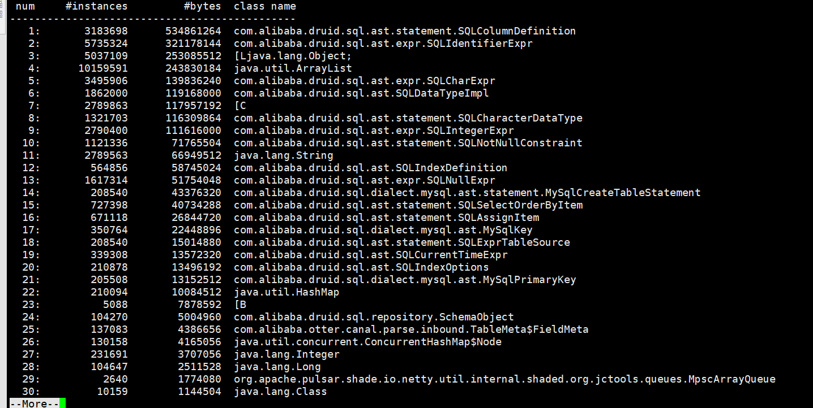
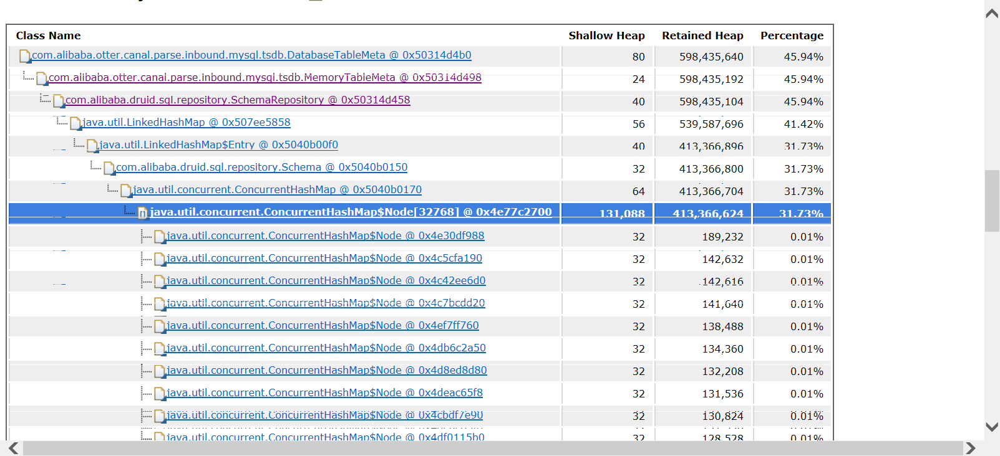
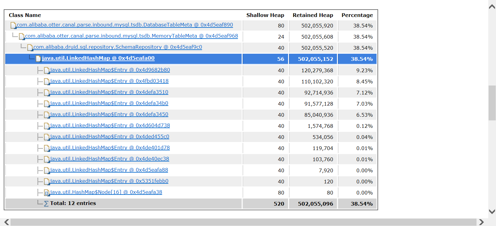
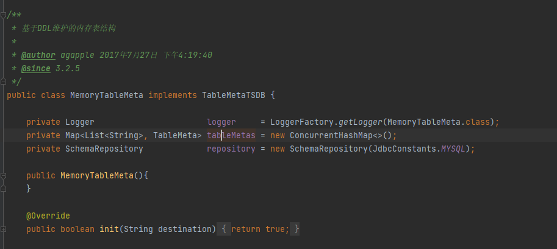

### 内存分析

**jvm gc日志配置：**

```
-XX:+UseG1GC 
-XX:+HeapDumpOnOutOfMemoryError 
-XX:+PrintGCDetails 
-XX:+PrintGCDateStamps 
-Xloggc:../logs/gc.log
```

> HeapDumpOnOutOfMemoryError：会在内存溢出时将内存内容dump出来，会生成一个类似java_pid12052.hprof的文件

**dump文件分析：**

借助Eclipse MAT工具(MemoryAnalyzerTool)，分析dump文件

**jmap命令：**

查看活跃的对象：

```
jmap -histo:live 29527 | more
```

通过以上的方式获得一下信息：







从上面的三张图我们可以看出，导致内存溢出的原因是DatabaseTableMeta下的MemoryTableMate下的SchemaRepository引起的，

对于SchemaRepository官网介绍如下：

> Druid SQL Parser内置了一个SchemaRepository，在内存中缓存SQL Schema信息，用于SQL语义解析中的ColumnResolve等操作。

到这儿就已经明白是怎么回事了，针对100w张表的情况下，全部放入进去，对内存的占用肯定特别大。

### Canal对ddl的缓存



从源码上了解到，canal使用SchemaRepository来缓存所有的ddl，然后通过tableMetas(一个map)，来缓存每一个表的所有字段以及对应的数据类型等，如果要对内存进行优化，这两个是可以优化的点。

存在的问题：

**什么能够代替内存做缓存，并且性能不能有明显下降？**

+ redis：可以做缓存，但是同样是使用内存，成本没有变化
+ rocksdb：存磁盘，性能减少不是很大，灵感来源于flink

具体实现思路：

+ 将ddl存rocksdb，当需要的时候那单个表的ddl，临时创建SchemaRepository对象去解析ddl
+ tableMetas则直接存rocksdb，把rocksdb当做缓存来使用

