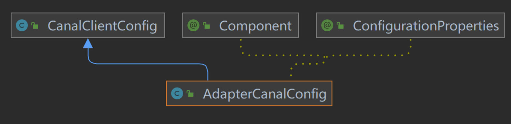

AdapterCanalConfig：



canal.adapter:application.yml

```properties
server:
  port: 8081
spring:
  jackson:
    date-format: yyyy-MM-dd HH:mm:ss
    time-zone: GMT+8
    default-property-inclusion: non_null

canal.conf:
  mode: kafka #tcp kafka rocketMQ rabbitMQ
  flatMessage: true
  zookeeperHosts:
  syncBatchSize: 1000
  retries: 0
  timeout:
  accessKey:
  secretKey:
  consumerProperties:
    # canal tcp consumer
    canal.tcp.server.host: 127.0.0.1:11111
    canal.tcp.zookeeper.hosts:
    canal.tcp.batch.size: 500
    canal.tcp.username:
    canal.tcp.password:
    # kafka consumer
    kafka.bootstrap.servers: 192.168.40.131:9092
    kafka.enable.auto.commit: false
    kafka.auto.commit.interval.ms: 1000
    kafka.auto.offset.reset: latest
    kafka.request.timeout.ms: 40000
    kafka.session.timeout.ms: 30000
    kafka.isolation.level: read_committed
    kafka.max.poll.records: 1000
    # rocketMQ consumer
    rocketmq.namespace:
    rocketmq.namesrv.addr: 127.0.0.1:9876
    rocketmq.batch.size: 1000
    rocketmq.enable.message.trace: false
    rocketmq.customized.trace.topic:
    rocketmq.access.channel:
    rocketmq.subscribe.filter:
    # rabbitMQ consumer
    rabbitmq.host:
    rabbitmq.virtual.host:
    rabbitmq.username:
    rabbitmq.password:
    rabbitmq.resource.ownerId:

  srcDataSources:
    defaultDS:
      url: jdbc:mysql://192.168.40.131:3306/test?serverTimezone=UTC&useUnicode=true&characterEncoding=utf-8&zeroDateTimeBehavior=convertToNull&useSSL=false
      username: root
      password: 123456
  canalAdapters:
  - instance: example # canal instance Name or mq topic name
    groups:
    - groupId: g1
      outerAdapters:
#      - name: logger
      - name: rdb
        key: mysql1
        properties:
          jdbc.driverClassName: com.mysql.jdbc.Driver
          jdbc.url: jdbc:mysql://192.168.40.131:3306/test?useUnicode=true&characterEncoding=utf-8&zeroDateTimeBehavior=convertToNull&useSSL=false
          jdbc.username: root
          jdbc.password: 123456
#      - name: rdb
#        key: oracle1
#        properties:
#          jdbc.driverClassName: oracle.jdbc.OracleDriver
#          jdbc.url: jdbc:oracle:thin:@localhost:49161:XE
#          jdbc.username: mytest
#          jdbc.password: m121212
#      - name: rdb
#        key: postgres1
#        properties:
#          jdbc.driverClassName: org.postgresql.Driver
#          jdbc.url: jdbc:postgresql://localhost:5432/postgres
#          jdbc.username: postgres
#          jdbc.password: 121212
#          threads: 1
#          commitSize: 3000
#      - name: hbase
#        properties:
#          hbase.zookeeper.quorum: 127.0.0.1
#          hbase.zookeeper.property.clientPort: 2181
#          zookeeper.znode.parent: /hbase
#      - name: es
#        hosts: 127.0.0.1:9300 # 127.0.0.1:9200 for rest mode
#        properties:
#          mode: transport # or rest
#          # security.auth: test:123456 #  only used for rest mode
#          cluster.name: elasticsearch
#        - name: kudu
#          key: kudu
#          properties:
#            kudu.master.address: 127.0.0.1 # ',' split multi address
#        - name: phoenix
#            key: phoenix
#            properties:
#              jdbc.driverClassName: org.apache.phoenix.jdbc.PhoenixDriver
#              jdbc.url: jdbc:phoenix:127.0.0.1:2181:/hbase/db
#              jdbc.username:
#              jdbc.password:
```

具体的配置类：

```java
@Component
@ConfigurationProperties(prefix = "canal.conf")
public class AdapterCanalConfig extends CanalClientConfig {
    public final Set<String> DESTINATIONS = new LinkedHashSet<>();
    private Map<String, DatasourceConfig> srcDataSources;
}
```

CanalClientConfig：

```java
public class CanalClientConfig {

    // 单机模式下canal server的ip:port
    private String             canalServerHost;
    // 集群模式下的zk地址,如果配置了单机地址则以单机为准!!
    private String             zookeeperHosts;
    // kafka or rocket mq 地址
    private String             mqServers;
    // 是否已flatMessage模式传输,只适用于mq模式
    private Boolean            flatMessage   = true;
    // 批大小
    private Integer            batchSize;
    // 同步分批提交大小
    private Integer            syncBatchSize = 1000;
    // 重试次数
    private Integer            retries;
    // 消费超时时间
    private Long               timeout       = 500L;
    // 模式 tcp kafka rocketMQ
    private String             mode          = "tcp";
    // aliyun ak/sk
    private String             accessKey;
    private String             secretKey;
    // rabbitmq 账号密码
    private String             username;
    private String             password;
    // rabbitmq vhost
    private String             vhost         = "/";
    private Properties         consumerProperties;
    private Long               resourceOwnerId;
    // 是否启用消息轨迹
    private boolean            enableMessageTrace;
    // 在使用阿里云商业化mq服务时，如果想使用云上消息轨迹功能，请设置此配置为true
    private String             accessChannel;
    // 用于使用开源RocketMQ时，设置自定义的消息轨迹topic
    private String             customizedTraceTopic;
    // 开源RocketMQ命名空间
    private String             namespace;
    // canal adapters 配置
    private List<CanalAdapter> canalAdapters;
    private Boolean terminateOnException = false;
}
```

AdapterCanalConfig：

```java
@Override
public void setCanalAdapters(List<CanalAdapter> canalAdapters) {
    super.setCanalAdapters(canalAdapters);
    if (canalAdapters != null) {
        synchronized (DESTINATIONS) {
            DESTINATIONS.clear();
            for (CanalAdapter canalAdapter : canalAdapters) {
                if (canalAdapter.getInstance() != null) {
                    DESTINATIONS.add(canalAdapter.getInstance());
                }
            }
        }
    }
}
```

重写setCanalAdapters方法，将canalAdapters的内容添加到DESTINATIONS中

```java
@SuppressWarnings("resource")
public void setSrcDataSources(Map<String, DatasourceConfig> srcDataSources) {
    this.srcDataSources = srcDataSources;

    if (srcDataSources != null) {
        for (Map.Entry<String, DatasourceConfig> entry : srcDataSources.entrySet()) {
            DatasourceConfig datasourceConfig = entry.getValue();
            // 加载数据源连接池
            DruidDataSource ds = new DruidDataSource();
            ds.setDriverClassName(datasourceConfig.getDriver());
            ds.setUrl(datasourceConfig.getUrl());
            ds.setUsername(datasourceConfig.getUsername());
            ds.setPassword(datasourceConfig.getPassword());
            ds.setInitialSize(1);
            ds.setMinIdle(1);
            ds.setMaxActive(datasourceConfig.getMaxActive());
            ds.setMaxWait(60000);
            ds.setTimeBetweenEvictionRunsMillis(60000);
            ds.setMinEvictableIdleTimeMillis(300000);
            ds.setValidationQuery("select 1");
            try {
                ds.init();
            } catch (SQLException e) {
                throw new RuntimeException(e.getMessage(), e);
            }
            DatasourceConfig.DATA_SOURCES.put(entry.getKey(), ds);
        }
    }
}
```

初始化数据库连接池

ApplicationConfigMonitor：

初始化文件变动监听器（FileAlterationObserver+FileAlterationListenerAdaptor），如果文件出现变动，就停掉canalAdapterService，然后重新加载配置文件，完了过后通过canalAdapterService.init();重新启动canaladapter

```java
private class FileListener extends FileAlterationListenerAdaptor {

        @Override
        public void onFileChange(File file) {
            super.onFileChange(file);
            try {
                // 检查yml格式
                new Yaml().loadAs(new InputStreamReader(new FileInputStream(file), StandardCharsets.UTF_8), Map.class);

                canalAdapterService.destroy();

                // refresh context
                contextRefresher.refresh();

                try {
                    Thread.sleep(2000);
                } catch (InterruptedException e) {
                    // ignore
                }
                canalAdapterService.init();
                logger.info("## adapter application config reloaded.");
            } catch (Exception e) {
                logger.error(e.getMessage(), e);
            }
        }
    }
```