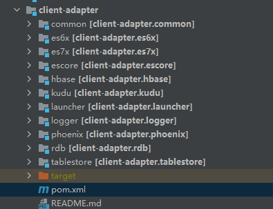
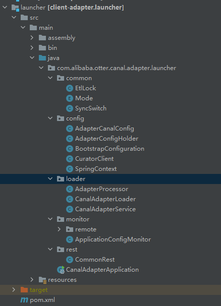
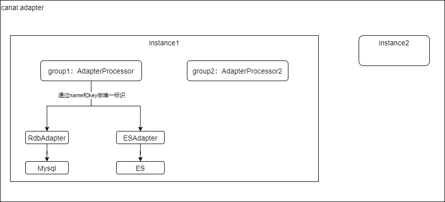
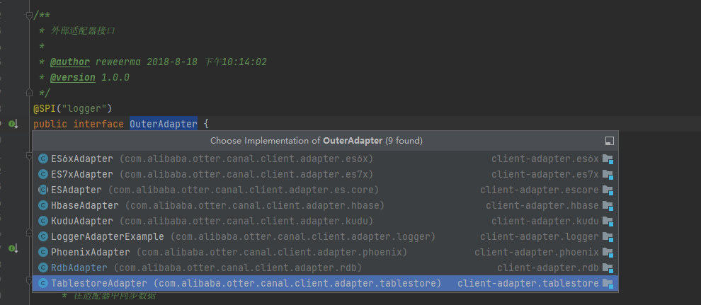
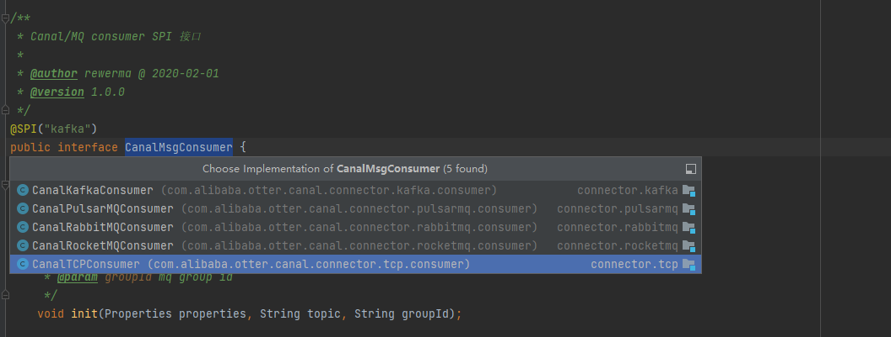

# Adapter

## 前期准备

### 启动canal服务

启动canal和kafka，确保canal能将binlog同步到kafka中

### 源码中修改adapter配置

**adapter主配置: **

adapter的启动程序位于client-adapter下的launcher项目，修改该项目的application.yml

```yml
canal.conf:
  mode: kafka #tcp kafka rocketMQ rabbitMQ
  consumerProperties:
  	kafka.bootstrap.servers: 192.168.40.131:9092
  srcDataSources:
    defaultDS:
      url: jdbc:mysql://192.168.40.131:3306/test?serverTimezone=UTC&useUnicode=true&characterEncoding=utf-8&zeroDateTimeBehavior=convertToNull&useSSL=false
      username: root
      password: 123456
  canalAdapters:
  - instance: example # canal instance Name or mq topic name
    groups:
    - groupId: g1
      outerAdapters:
      - name: rdb
        key: mysql-test
        properties:
          jdbc.driverClassName: com.mysql.jdbc.Driver
          jdbc.url: jdbc:mysql://192.168.40.131:3306/test?serverTimezone=UTC&useUnicode=true&characterEncoding=utf-8&zeroDateTimeBehavior=convertToNull&useSSL=false
          jdbc.username: root
          jdbc.password: 123456
```

配置说明:

canal.conf.mode: 设置消息模式

kafka.bootstrap.servers: 配置kafka地址

srcDataSources：配置数据源

canalAdapters：配置一个canaladapter的instance，下面的jdbc对应的是目标表的数据库配置

**adapter-rdb配置：**

配置位于client-adapter中的rdb项目，resources下的rdb目录下的mytest_user.yml文件

```yml
dataSourceKey: defaultDS
destination: example
groupId: g1
outerAdapterKey: mysql-test
concurrent: true
dbMapping:
  database: test
  table: student
  targetTable: target_student
  targetPk:
    id: id
#  mapAll: true
  targetColumns:
    id: id
    name: name
    age: age
    remark: remark
  etlCondition: "where c_time>={}"
  commitBatch: 3000 # 批量提交的大小
```

### 重新打包编译

应为是源码所以改了都需要打包编译，maven命令如下：

```java
mvn install -Dmaven.test.skip=true
```

出现：[INFO] BUILD SUCCESS，表示编译成功

### 启动adapter

运行client-adapter下的launcher项目下的CanalAdapterApplication

### 测试adapter是否正常

正常情况下在student中插入一条数据会插入到target_student表中

## adapter源码结构



该项目下总共包含大概10个子项目，其中launcher是canal.adapter的启动程序，其他的分别是一些公共包和对目前支持的sink的具体实现。

launcher：



该项目中代码不是很多，整体上应该是比较容易入手的，重点就是config和CanalAdapterService

## adapter启动源码分析

### 加载配置文件

spring.factories：

```properties
# Bootstrap Configuration
org.springframework.cloud.bootstrap.BootstrapConfiguration=\
  com.alibaba.otter.canal.adapter.launcher.config.BootstrapConfiguration
```

```java
@PostConstruct
public void loadRemoteConfig() {
    remoteConfigLoader = RemoteConfigLoaderFactory.getRemoteConfigLoader(env);
    if (remoteConfigLoader != null) {
        remoteConfigLoader.loadRemoteConfig();
        remoteConfigLoader.loadRemoteAdapterConfigs();
        remoteConfigLoader.startMonitor(); // 启动监听
    }
}
```

该类中通过通过从env中获取canal.manager相关的配置，用于判断是否从远程加载canal.adapter的配置，如果是从远程加载配置，加载过来的配置会写入到本地文件中，后续代码中会通过springboot的机制去加载配置文件：@ConfigurationProperties(prefix = "canal.conf")

[加载本地配置文件application.yml](canal.adapter.config源码分析)

### CanalAdapterService源码

从ApplicationConfigMonitor监控文件变更的代码中我们就可以知道，整个CanalAdapter的启动是通过CanalAdapterService中的代码来实现的，如下：

```java
@Component
@RefreshScope
public class CanalAdapterService {

    private static final Logger logger  = LoggerFactory.getLogger(CanalAdapterService.class);

    private CanalAdapterLoader  adapterLoader;

    @Resource
    private ContextRefresher    contextRefresher;

    @Resource
    private AdapterCanalConfig  adapterCanalConfig;
    @Resource
    private Environment         env;

    // 注入bean保证优先注册
    @Resource
    private SpringContext       springContext;
    @Resource
    private SyncSwitch          syncSwitch;

    private volatile boolean    running = false;

    @PostConstruct
    public synchronized void init() {
        if (running) {
            return;
        }
        try {
            // 刷新同步开发，如果没有就创建一个并放入对应的map中，一个instance对应一个同步开发(锁)
            syncSwitch.refresh();
            logger.info("## syncSwitch refreshed.");
            logger.info("## start the canal client adapters.");
            adapterLoader = new CanalAdapterLoader(adapterCanalConfig);
            adapterLoader.init();
            running = true;
            logger.info("## the canal client adapters are running now ......");
        } catch (Exception e) {
            logger.error("## something goes wrong when starting up the canal client adapters:", e);
        }
    }

    @PreDestroy
    public synchronized void destroy() {
        if (!running) {
            return;
        }
        try {
            running = false;
            logger.info("## stop the canal client adapters");

            if (adapterLoader != null) {
                adapterLoader.destroy();
                adapterLoader = null;
            }
            for (DruidDataSource druidDataSource : DatasourceConfig.DATA_SOURCES.values()) {
                try {
                    druidDataSource.close();
                } catch (Exception e) {
                    logger.error(e.getMessage(), e);
                }
            }
            DatasourceConfig.DATA_SOURCES.clear();
        } catch (Throwable e) {
            logger.warn("## something goes wrong when stopping canal client adapters:", e);
        } finally {
            logger.info("## canal client adapters are down.");
        }
    }
}
```

**SpringContext：**

该类中主要提供了init和destroy两个方法，用于初始化和销毁canal.adapter，比较有意思的是注入了一个SpringContext，用于保证该类的初始化是在sping容器启动后完成的

**SyncSwitch：**

同步开关，提供额本地锁和分布式锁，当配置了zookeeperHosts采用分布式锁

**init：**

该方法中的核心代码是：

```java
 adapterLoader = new CanalAdapterLoader(adapterCanalConfig);
 adapterLoader.init();
```

也是整个adapter启动的核心逻辑

### adapterLoader.init具体过程

+ 加载内部ExtensionLoader

  ```java
  loader = ExtensionLoader.getExtensionLoader(OuterAdapter.class);
  ```

  此处获取到的就是ExtensionLoader对象，在ExtensionLoader内部使用的一个ConcurrentHashMap（EXTENSION_LOADERS）来缓存的所有的SPI 类加载器，

  ```java
  public static <T> ExtensionLoader<T> getExtensionLoader(Class<T> type, String classLoaderPolicy) {
      if (type == null) throw new IllegalArgumentException("Extension type == null");
      if (!type.isInterface()) {
          throw new IllegalArgumentException("Extension type(" + type + ") is not interface!");
      }
      if (!withExtensionAnnotation(type)) {
          throw new IllegalArgumentException("Extension type(" + type + ") is not extension, because WITHOUT @"+ SPI.class.getSimpleName() + " Annotation!");
      }
  
      // 从EXTENSION_LOADERS获取，如果不存在就创建并放入EXTENSION_LOADERS中
      ExtensionLoader<T> loader = (ExtensionLoader<T>) EXTENSION_LOADERS.get(type);
      if (loader == null) {
          EXTENSION_LOADERS.putIfAbsent(type, new ExtensionLoader<T>(type, classLoaderPolicy));
          loader = (ExtensionLoader<T>) EXTENSION_LOADERS.get(type);
      }
      return loader;
  }
  ```

  默认的ExtensionLoader是在初始化CommonRest时创建的

  ```java
  @PostConstruct
  public void init() {
      loader = ExtensionLoader.getExtensionLoader(OuterAdapter.class);
  }
  ```

+ 从canalClientConfig中获取所有的CanalAdapters，并按照分组逐步创建AdapterProcessor，并启动

  核心代码:

  ```java
   for (CanalClientConfig.CanalAdapter canalAdapter : canalClientConfig.getCanalAdapters()) {
       for (CanalClientConfig.Group group : canalAdapter.getGroups()) {
           List<List<OuterAdapter>> canalOuterAdapterGroups = new CopyOnWriteArrayList<>();
           List<OuterAdapter> canalOuterAdapters = new CopyOnWriteArrayList<>();
           for (OuterAdapterConfig config : group.getOuterAdapters()) {
               loadAdapter(config, canalOuterAdapters);
           }
           canalOuterAdapterGroups.add(canalOuterAdapters);
           AdapterProcessor adapterProcessor = canalAdapterProcessors.computeIfAbsent(canalAdapter.getInstance()
           + "|" + StringUtils.trimToEmpty(group.getGroupId()),f -> new AdapterProcessor(canalClientConfig,                  				canalAdapter.getInstance(),group.getGroupId(), canalOuterAdapterGroups));
           adapterProcessor.start();
           logger.info("Start adapter for canal-client mq topic: {} succeed", canalAdapter.getInstance() + "-"
                       + group.getGroupId());
       }
   }
  ```

  结合配置文件和源码，canal.adapter体现出来的整体结构是：

  

  一个adapter可以包含多个instance，一个instance下面可以配置多个group,每个group下面又可以配置多个name(通过name和key唯一确定一个适配器)。系统会为每一个group创建一个AdapterProcessor，根据具体的name和key去创建对应的adapter对象，实现同步数据，如果对应到kafka的话，instance名称就是相应的topic名称，一个group下面配置多个name(rds/es7/es6)，最终的效果：可以把一个表的数据同时同步到多个目标库中，比如：mysql、ES、hbase等

+ adapterProcessor.start

  ```java 
  public void start() {
      if (!running) {
          thread = new Thread(this::process);
          thread.setUncaughtExceptionHandler(handler);
          thread.start();
          running = true;
      }
  }
  ```

  通过启动一个线程去执行了adapterProcessor的process方法

+ adapterProcessor.process

  在该方法中是通过canalMsgConsumer去获取数据的，canalMsgConsumer的具体实现后面单独说

  获取到消息通过writeOut方法

  ```java
  public void writeOut(final List<CommonMessage> commonMessages) {
      List<Future<Boolean>> futures = new ArrayList<>();
      // 组间适配器并行运行
      canalOuterAdapters.forEach(outerAdapters -> {
          futures.add(groupInnerExecutorService.submit(() -> {
              try {
                  // 组内适配器穿行运行，尽量不要配置组内适配器
                  outerAdapters.forEach(adapter -> {
                      long begin = System.currentTimeMillis();
                      List<Dml> dmls = MessageUtil.flatMessage2Dml(canalDestination, groupId, commonMessages);
                      batchSync(dmls, adapter);
  
                      if (logger.isDebugEnabled()) {
                          logger.debug("{} elapsed time: {}",
                              adapter.getClass().getName(),
                              (System.currentTimeMillis() - begin));
                      }
                  });
                  return true;
              } catch (Exception e) {
                  logger.error(e.getMessage(), e);
                  return false;
              }
          }));
  
          // 等待所有适配器写入完成
          // 由于是组间并发操作，所以将阻塞直到耗时最久的工作组操作完成
          RuntimeException exception = null;
          for (Future<Boolean> future : futures) {
              try {
                  if (!future.get()) {
                      exception = new RuntimeException("Outer adapter sync failed! ");
                  }
              } catch (Exception e) {
                  exception = new RuntimeException(e);
              }
          }
          if (exception != null) {
              throw exception;
          }
      });
  }
  ```

## adapter对SPI的应用

整个canal体系中对相当于自己开发了一套SPI的机制，没太深入的去看源码，大体上内部是通过扫描指定目录下的jar来加载所有插件的。在canal.adapter中涉及两个地方：OuterAdapter、CanalMsgConsumer

OuterAdapter：



CanalMsgConsumer：



## adapter数据同步源码分析

```mysql
select id from park.t_operation_log as b where  cast(substring(cast(b.created_time as varchar),1,13) as bigint)>=? and cast(substring(cast(b.created_time as varchar),1,13) as bigint) < ?
```

