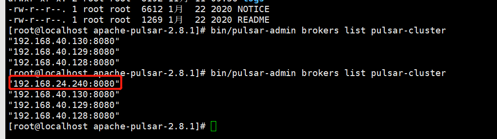

# Pulsar源码编译启动

## 源码下载并导入Idea中

git地址：https://github.com/apache/pulsar

如果通过git下载慢，可以直接下载压缩包，https://github.com/apache/pulsar/releases

## idea环境准备

打包时跳过单元测试：mvn install -DskipTests

如果win10存在权限问题，需要修改注册表：regedit

> HKEY_LOCAL_MACHINE\Software\Microsoft\Windows\CurrentVersion\Policies\System

修改这个路径下的键值: EnableLUA 从1设置为0，然后重启电脑

## standalone模式启动

启动类：PulsarStandaloneStarter.java

添加配置：

在idea中打开Edit Configurations窗口，分别在下面的选项中填上对应的参数，有些文件地址需要改为自己本机地址

VM options：

```properties
-Dlog4j.configurationFile=D:\workspace\pulsar\conf\log4j2.yaml
-Djute.maxbuffer=10485760
-Djava.net.preferIPv4Stack=true
-Dpulsar.allocator.exit_on_oom=true
-Dio.netty.recycler.maxCapacity.default=1000
-Dio.netty.recycler.linkCapacity=1024
-Xms2g
-Xmx2g
-XX:MaxDirectMemorySize=2g
-XX:+UseG1GC
-XX:MaxGCPauseMillis=10
-XX:+ParallelRefProcEnabled
-XX:+UnlockExperimentalVMOptions
-XX:+AggressiveOpts
-XX:+DoEscapeAnalysis
-XX:ParallelGCThreads=2
-XX:ConcGCThreads=2
-XX:G1NewSizePercent=50
-XX:+DisableExplicitGC
-XX:-ResizePLAB
-Dpulsar.log.appender=RoutingAppender
-Dpulsar.log.dir=D:/pulsar-dev/logs
-Dpulsar.log.level=info
-Dpulsar.routing.appender.default=Console
-Dpulsar.functions.process.container.log.dir=D:/pulsar-dev/logs
-Dpulsar.functions.java.instance.jar=D:/workspace/pulsar/pulsar-functions/runtime-all/target/java-instance.jar
-Dpulsar.functions.python.instance.file=D:/workspace/pulsar/pulsar-functions/instance/target/python-instance/python_instance_main.py
-Dpulsar.functions.extra.dependencies.dir=D:/workspace/pulsar/instances/deps
-Dpulsar.functions.instance.classpath=D:/workspace/pulsar/pulsar-broker/target/pulsar-broker.jar
-javaagent:D:/repo/caches/modules-2/files-2.1/org.aspectj/aspectjweaver/1.8.2/4963c0bef4748d5ad039cc26c1ac32a082eb755e/aspectjweaver-1.8.2.jar
-Dzookeeper.4lw.commands.whitelist=*
-Dzookeeper.snapshot.trust.empty=true
-Dpulsar.log.file=pulsar-standalone.log


```

Program arguments:

> --config  D:/workspace/pulsar/conf/standalone.conf

配置好后，直接运行PulsarStandaloneStarter类即可，这是启动了一个单机版的pulsar，成功启动后可以进行测试。


## 集群模式启动

将broker加入到集群中，条件允许可以再搭建三个centos7环境，构建一个pulsar集群，最后将IDEA中启动的broker加入到集群中，操作如下：

启动类：PulsarBrokerStarter

在idea中打开Edit Configurations窗口，分别在下面的选项中填上对应的参数，

VM options：

```properties
-Dlog4j.configurationFile=D:\workspace\pulsar\conf\log4j2.yaml
-Djute.maxbuffer=10485760
-Djava.net.preferIPv4Stack=true
-Dpulsar.allocator.exit_on_oom=true
-Dio.netty.recycler.maxCapacity.default=1000
-Dio.netty.recycler.linkCapacity=1024
-Xms2g
-Xmx2g
-XX:MaxDirectMemorySize=2g
-XX:+UseG1GC
-XX:MaxGCPauseMillis=10
-XX:+ParallelRefProcEnabled
-XX:+UnlockExperimentalVMOptions
-XX:+AggressiveOpts
-XX:+DoEscapeAnalysis
-XX:ParallelGCThreads=2
-XX:ConcGCThreads=2
-XX:G1NewSizePercent=50
-XX:+DisableExplicitGC
-XX:-ResizePLAB
-Dpulsar.log.appender=RoutingAppender
-Dpulsar.log.dir=D:/pulsar-dev/logs
-Dpulsar.log.level=info
-Dpulsar.routing.appender.default=Console
-Dpulsar.functions.process.container.log.dir=D:/pulsar-dev/logs
-Dpulsar.functions.java.instance.jar=D:/workspace/pulsar/pulsar-functions/runtime-all/target/java-instance.jar
-Dpulsar.functions.python.instance.file=D:/workspace/pulsar/pulsar-functions/instance/target/python-instance/python_instance_main.py
-Dpulsar.functions.extra.dependencies.dir=D:/workspace/pulsar/instances/deps
-Dpulsar.functions.instance.classpath=D:/workspace/pulsar/pulsar-broker/target/pulsar-broker.jar
-javaagent:D:/repo/caches/modules-2/files-2.1/org.aspectj/aspectjweaver/1.8.2/4963c0bef4748d5ad039cc26c1ac32a082eb755e/aspectjweaver-1.8.2.jar
-Dpulsar.log.file=pulsar-standalone.log
```

idea中不用再配置broker.conf，启动时会使用项目路径下的broker.conf，我的是D:\workspace\pulsar\conf\broker.conf

broker.conf中主要需要修改的内容如下：

```properties
# Zookeeper quorum connection string
zookeeperServers=192.168.40.128:2181,192.168.40.129:2181,192.168.40.130:2181
# Configuration Store connection string
configurationStoreServers=192.168.40.128:2181,192.168.40.129:2181,192.168.40.130:2181
# 本机IP地址
advertisedAddress=192.168.24.240
clusterName=pulsar-cluster-1
```

其他配置基本不用改变，zookeeperServers和configurationStoreServers配置的是pulsar集群使用的zk地址

然后启动PulsarBrokerStarter，PulsarBrokerStarter启动成功过后可到pulsar集群环境中去通过如下命令查看：

>  bin/pulsar-admin brokers list pulsar-cluster

结果如下图所示，说明本机已经加入到集群中了



