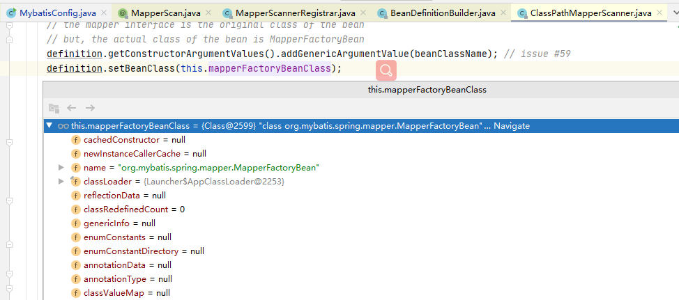
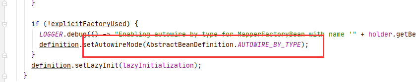

# Mybatis常用知识点梳理总结

Mybatis官网：https://mybatis.org/mybatis-3/zh/index.html
MyBatis-Spring官网：http://mybatis.org/spring/zh/index.html

## Spring整合Mybatis

### 需要导入的三方jar 

```java
<dependency>
    <groupId>org.springframework</groupId>
    <artifactId>spring-jdbc</artifactId>
    <version>5.0.12.RELEASE</version>
</dependency>
<dependency>
    <groupId>org.mybatis</groupId>
    <artifactId>mybatis</artifactId>
    <version>3.5.5</version>
</dependency>
<dependency>
    <groupId>org.mybatis</groupId>
    <artifactId>mybatis-spring</artifactId>
    <version>2.0.5</version>
</dependency>
<dependency>
    <groupId>mysql</groupId>
    <artifactId>mysql-connector-java</artifactId>
    <version>8.0.22</version>
</dependency>
```

以上jar只是mybatis相关的部分，

### 通过注解实现mybatis配置文件

```java
@ComponentScan(value = "com.zjk.hy.mybatis")
@Configuration
@MapperScan("com.zjk.hy.mybatis.dao")
public class MybatisConfig {
    @Bean
    public DataSource dataSource() {
        SimpleDriverDataSource dataSource = new SimpleDriverDataSource();
        dataSource.setDriverClass(com.mysql.cj.jdbc.Driver.class);
        dataSource.setUrl("jdbc:mysql://localhost:3306/s-mybatis?serverTimezone=UTC&characterEncoding=utf8&useUnicode=true&useSSL=false");
        dataSource.setUsername("root");
        dataSource.setPassword("123456");
        return dataSource;
    }

    @Bean
    public SqlSessionFactory sqlSessionFactory() throws Exception {
        SqlSessionFactoryBean factoryBean = new SqlSessionFactoryBean();
        factoryBean.setDataSource(dataSource());
        return factoryBean.getObject();
    }
}
```

#### @MapperScan

指定Mapper(dao)的包路径，Mybatis会去扫描指定的包路径下的类，然后通过动态代理实现相关功能（后面学习源码时具体了解）

#### 配置数据源-DataSource

此处采用的是Spring-jdbc提供的数据库连接池SimpleDriverDataSource

#### 配置SqlSessionFactory

通过SqlSessionFactoryBean创建一个SqlSessionFactory

### Mapper/Dao

```java
import com.zjk.hy.mybatis.dto.User;
import org.apache.ibatis.annotations.Select;

import java.util.List;

public interface UserDao {
    @Select("select * from s_user")
    public List<User> findList();
}
```

对于查询的sql语句，可以通过@Select等注解来写，也可以通过xml文件写

## Mybatis日志实现

具体内容，见同目录下同名文件

## Mybatis一级缓存相关问题

### Spring中为什么会失效

因为Spring和Mybatis的集成包中扩展了一个SqlSessionTemplate(SqlSession接口的动态代理类)，在Spring容器启动时注入给了Mapper，SqlSessionTemplate代替了默认的DefaultSqlSession类，查询时不是直接查询，而是通过代理对象进行了增强，**主要是关闭了session**。

```java
finally {
  if (sqlSession != null) {
    closeSqlSession(sqlSession, SqlSessionTemplate.this.sqlSessionFactory);
  }
}
```

**什么时候SqlSessionTemplate代替了默认的DefaultSqlSession：**

1. 通过@MapperScan中的@Import，导入了一个MapperScannerRegistrar类

2. MapperScannerRegistrar中的registerBeanDefinitions方法中，创建BeanDefinitionBuilder是传入了一个MapperScannerConfigurer

3. MapperScannerConfigurer是一个BeanDefinitionRegistryPostProcessor，Spring加载的过程中会调用它的postProcessBeanDefinitionRegistry方法

4. postProcessBeanDefinitionRegistry方法中new了一个ClassPathMapperScanner scanner

5. 然后会调用scanner.scan()，scan方法中又会调用doScan(basePackages);

6. ClassPathMapperScanner中重写了父类ClassPathBeanDefinitionScanner的doScan方法

   ```java
    @Override
     public Set<BeanDefinitionHolder> doScan(String... basePackages) {
       Set<BeanDefinitionHolder> beanDefinitions = super.doScan(basePackages);
   
       if (beanDefinitions.isEmpty()) {
       } else {
         processBeanDefinitions(beanDefinitions);
       }
   
       return beanDefinitions;
     }
   ```

   在该方法中调用了父类的doScan(basePackages);，然后执行processBeanDefinitions(beanDefinitions);

7. 在processBeanDefinitions对Mapper的beanDefinition进行修改

   7.1 设置beanClass

   

   以上操作，将org.mybatis.spring.mapper.MapperFactoryBean设置给了扫描到的mapper

   7.2 设置autowireMode

   

   此处将扫描到的Mapper的autowireMode设置为通过类型自动装配（AUTOWIRE_BY_TYPE），这个我们在Spring中介绍过，类型是AUTOWIRE_BY_TYPE，类中属性有setter方法就会自动装配。

   上面已经说过了，扫描到的Mapper都是MapperFactoryBean，那么下面主要来看下MapperFactoryBean的内容。

8. MapperFactoryBean

   ```java
   public class MapperFactoryBean<T> extends SqlSessionDaoSupport implements FactoryBean<T> 
   ```

   MapperFactoryBean本身并没有什么内容，但是它继承了SqlSessionDaoSupport，并且实现了FactoryBean

9. SqlSessionDaoSupport中的sqlSessionTemplate

   ```java
   public abstract class SqlSessionDaoSupport extends DaoSupport {
   
     private SqlSessionTemplate sqlSessionTemplate;
   
     public void setSqlSessionFactory(SqlSessionFactory sqlSessionFactory) {
       if (this.sqlSessionTemplate == null || sqlSessionFactory != 
           this.sqlSessionTemplate.getSqlSessionFactory()) {
         this.sqlSessionTemplate = createSqlSessionTemplate(sqlSessionFactory);
       }
     }
   }
   ```

   由于所有Mapper都被设置为AUTOWIRE_BY_TYPE，所以这儿会调用setSqlSessionFactory，就是在这儿SqlSessionTemplate代替了默认的DefaultSqlSession，这儿应该是一个装饰者模式，对设计模式不是很懂。

### Mybatis一级缓存底层实现原理


使用Spring+MyBatis plus后的执行流程是：

JdkDynamicAopProxy.invoke（Spring AOP 实现的动态代理）

PageMapperProxy.invoke（mybatis plus，重写的是mybatis的MapperProxy）

PageMapperMethod.execute (mybatis plus，重写的是mybatis的MapperMethod)

SqlSessionTemplate.selectOne （mybatis.spring提供的通过，一个动态代理实现，最后finally中关闭了session，替代了mybatis默认DefaultSqlSession）

defualtSqlSession.具体的查询方法

从configuration中拿出了一个MappedStatement

MappedStatement.boundSql

CachingExecutor 二级缓存中查询

BaseExecutor.query

simpleExecutor

prepareStatement

resultHandler

## MyBatis三级缓存

### 一级缓存

同一个SqlSession对象，在参数和SQL完全一样的情况下，只要执行一次SQL语句，就会去缓存中取

一级缓存因为只能在同一个SqlSession中共享，所以会存在一个问题，在分布式或者多线程的环境下，不同会话之间对于相同的数据可能会产生不同的结果，因为跨会话修改了数据是不能互相感知的，所以就有可能存在脏数据的问题，正因为一级缓存存在这种不足，所以我们需要一种作用域更大的缓存，这就是二级缓存。

如果使用Spring，一级缓存会失效，上面介绍过了


### 二级缓存

二级缓存存在于SqlSession生命周期中，二级缓存有全局开关，cacheEnable，默认是开启的

CachingExecutor 其实没啥用，需要自己去做缓存


