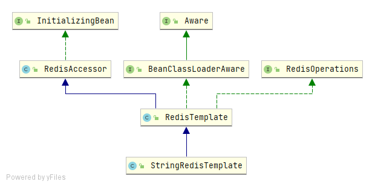

# RedisTemplate

## 简介

RedisTemplate是Spring-data提供的一个操作redis的工具类，老版本使用的连接工具是JedisConnectionFactory，Spring5以后使用的LettuceConnectionFactory，基于NIO的非阻塞的。

RedisTemplate结构如下：



+ RedisOperations --定义了Redis的基本操作，提供可扩展性，由 RedisTemplate 实现。
+ RedisAccessor --定义了RedisTemplate 的一些公有属性
+ InitializingBean --Spring Bean 对象的初始化，其内部仅仅有一个方法：afterPropertiesSet ，只要是实现该接口，均会在Bean对象初始化时调用该方法

StringRedisTemplate继承自RedisTemplate，主要是在构造方法中设置了序列化方式为：StringRedisSerializer，如下所示：

```java
public StringRedisTemplate() {
   setKeySerializer(RedisSerializer.string());
   setValueSerializer(RedisSerializer.string());
   setHashKeySerializer(RedisSerializer.string());
   setHashValueSerializer(RedisSerializer.string());
}
```

## 序列化方式

spring-data-redis提供如下几种选择：

- StringRedisSerializer: 简单的字符串序列化
- GenericToStringSerializer: 可以将任何对象泛化为字符串并序列化
- Jackson2JsonRedisSerializer: 跟JacksonJsonRedisSerializer实际上是一样的
- JacksonJsonRedisSerializer: 序列化object对象为json字符串
- GenericJackson2JsonRedisSerializer
- JdkSerializationRedisSerializer: 序列化java对象

默认K、V的序列化方式都是JdkSerializationRedisSerializer

redis-cli客户端的序列化方式应该是String

可以自定义序列化方式，如下:

```java
import org.springframework.data.redis.serializer.RedisSerializer;
import org.springframework.data.redis.serializer.SerializationException;

public class SelfRedisSerializer implements RedisSerializer<Object> {
    @Override
    public byte[] serialize(Object o) throws SerializationException {
        return new byte[0];
    }

    @Override
    public Object deserialize(byte[] bytes) throws SerializationException {
        return null;
    }
}
```

只需要实现serialize和deserialize两个方法

为RedisTemplate指定序列化方式：

```java
@Bean(name = "redisTemplate")
public RedisTemplate initRedisTemplate(LettuceConnectionFactory connectionFactory) {
    RedisTemplate<String, Object> redisTemplate = new RedisTemplate<>();
    redisTemplate.setKeySerializer(new StringRedisSerializer());
    redisTemplate.setValueSerializer(new StringRedisSerializer());
    redisTemplate.setConnectionFactory(connectionFactory);
    return redisTemplate;
}
```

## RedisTemplate简单使用

直接通过源码看方法吧，都比较简单

## RedisTemplate执行Lua脚本

Lua脚本：

```lua
return tostring((redis.call("get", KEYS[1]) + 100))
```

java代码：

```java
@GetMapping(value = "luascript")
public String luascript(String id){
    // lua脚本对象
    DefaultRedisScript<Integer> redisScript = new DefaultRedisScript<>();
    // 加载lua脚本文件
    redisScript.setScriptSource(new ResourceScriptSource(new ClassPathResource("redis/get.lua")));
    // 指定返回类型
    redisScript.setResultType(Integer.class);
    // 执行lua脚本
    String key = "amount";
    String res = (String) redisTemplate.execute(redisScript,Arrays.asList(key));
    System.out.println(res);
    return res;
}
```

redisTemplate使用的序列化是：

```java
redisTemplate.setKeySerializer(new StringRedisSerializer());
redisTemplate.setValueSerializer(new StringRedisSerializer());
```

以上代码无论是通过redis-cli，set一个值（set amount 100）或是通过redisTemplate.opsForValue().set("amount","100");，都是能够正常放回的。

在整个过程中遇到许多的坑，

+ 如果使用默认的序列化方式-JdkSerializationRedisSerializer，

  通过redisTemplate调用set方法插入redis中，key和value都有变化，不是存文本，就会导致通过lua脚本或者redis-cli客户端找不到这个key对应的值。如果value值是一个数字，那么存在redis中的其实是java对应封装对象的序列化二进制数据，这样没办法通过Lua或者redis-cli客户端对数字进行加减乘除操作

+ 如果使用的是StringRedisSerializer，在使用redisTemplate时，传入的参数必须是字符串，执行Lua脚本时，结算结果得使用tostring，如：`tostring(redis.call("get", KEYS[1]) + 100)`,不然会报错，其实这儿一直没想通
+ 使用StringRedisSerializer，在对数字操作时都要整成字符串，觉得有点尴尬，

总体而言，我们使用Lua脚本的时候还是很少的，或者使用Lua脚本的时候不在脚本里面对数字进行操作，平时使用RedisTemplate时看情况，key可以设置为StringRedisSerializer，value可以使用默认的JdkSerializationRedisSerializer，当确实需要Lua数字操作时我们可以用StringRedisTemplate。

## 通过Lua脚本模拟改造秒杀场景

### 场景

将10000，每次减100，总共100个任务，通过线程池开5个线程，并发的将100个任务完成，看是否有线程安全问题。

### 思路

整个思想是redis执行Lua脚本是一个原子操作，就可以采用CAS的方式来修改数据，Lua脚本中做的事情就是比较、更新，通过java自旋自定的次数，来达到CAS操作。

### 有并发问题的写法

```java
@GetMapping(value = "doTask")
public  String doTask(){
    ExecutorService service = Executors.newFixedThreadPool(6);
    for(int i=0;i<100;i++) {
        service.submit(()->handleAmount());
    }
    return "aaa";
}
```

```java
public void handleAmount() {
    String key = "amount";
    String amount = (String) redisTemplate.opsForValue().get(key);
    redisTemplate.opsForValue().set(key,(Integer.valueOf(amount)-100)+"");
}
```

这样执行的结果最后amount的值是大于0的，

### 通过CAS的方式

Lua脚本：

```java
if redis.call("get",KEYS[1])==ARGV[1] then
    redis.call("set",KEYS[1],ARGV[2])
    return true
else
    return false
end
```

java代码：

```java
@GetMapping(value = "doTaskCas")
public  String doTaskCas(){
    ExecutorService service = Executors.newFixedThreadPool(6);
    for(int i=0;i<100;i++) {
        service.submit(()->handleAmountCAS());
    }
    return "bbbbbbbbbbbbbb";
}
```

```java
public void handleAmountCAS() {
    while (true) {
        String key = "amount";
        // lua脚本对象
        DefaultRedisScript<Boolean> redisScript = new DefaultRedisScript<>();
        // 加载lua脚本文件
        redisScript.setScriptSource(new ResourceScriptSource(new ClassPathResource("redis/handleAmount.lua")));
        // 指定返回类型
        redisScript.setResultType(Boolean.class);
        String amount = (String) redisTemplate.opsForValue().get(key);
        Boolean flag = (Boolean) redisTemplate.execute(redisScript, Arrays.asList(key), amount, (Integer.valueOf(amount) - 100)+"");
        if (flag) break;
    }
}
```

这样执行的结果是正确的，最后amount的值为0，此处使用了while死循环，在实际的场景中可以通过指定自旋次数，

### 场景改造

原场景：

```java
if(maxAmount.subtract(receiveAmount).compareTo(BigDecimal.ZERO) <= 0) {
    throw new MjjException("不好意思，总奖金已被领取完，不能再领取了");
}
//加锁更新
RLock lock = redissonClient.getLock(REDISSON_CLIENT_LOCK_NAME);
lock.lock();
try {
    // 重新验证金额是否足够领取
    receiveAmount = getReceiveAmount();
    if(maxAmount.subtract(receiveAmount).compareTo(BigDecimal.ZERO) <= 0) {
        throw new MjjException("不好意思，总奖金已被领取完，不能再领取了");
    }
    // 验证能够领取的是否已经被领取了
    inviteRecordDao.checkCanReceiveRecord(recordIds);
    cache.put(RECEIVE_AMOUNT_KEY,receiveAmount.add(canReceiveAmount));
    // 更新领取记录
    inviteRecordDao.updateCanReceiveRecord(recordIds);
} catch (Exception e) { //如果出现异常，系统回滚，刷新redis数据
    log.info(e.getMessage(),e);
    handleException(cache, e);
} finally {
    lock.unlock();
}
```

针对以上场景就可以使用Lua脚本结合CAS自旋的方式来替换掉，本身redis的lock在主从情况下存在一定的问题

### 验证哨兵模式下是否有问题

哨兵模式配置：

```yaml
spring:
  redis:
    password: 123456
    database: 0
    sentinel:
      master: mymaster
      nodes: 10.1.2.191:26379,10.1.2.192:26379,10.1.2.193:26379
```

通过并发验证确实是没有问题的，并发量太大了，由于是while(true)会导致执行效率慢，查询redis的数据有延迟，所以一定要限制自旋次数，指定次数内修改不成功的就不在尝试了，直接给前端报错