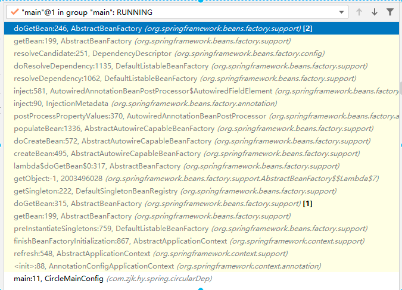
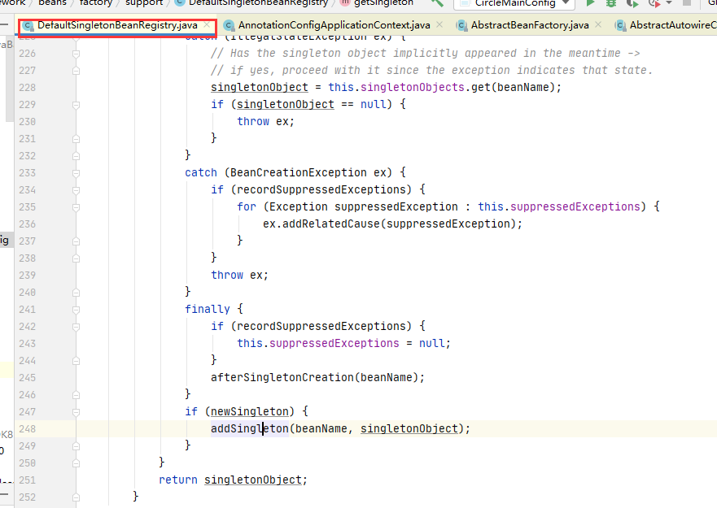

# Spring循环依赖

为了方便理解循环依赖的整个处理流程，需要对Spring的IOC原理和代码有个简单的认识；

## 循环依赖简介

所谓的循环依赖是指，在Spring中两个或者两个以上的组件相互依赖引用。如下示例：

```java
@Component
public class IndexService {

    @Autowired
    UserService userService;

    public void print(){
        System.out.println("IndexService-aaaaaaaaaaaa");
    }

    public IndexService() {
        System.out.println("IndexService-------construct");
    }
}
```

```java
@Component
public class UserService {
    @Autowired
    IndexService indexService;

    public void print(){
        System.out.println("UserService-aaaaaaaa");
    }

    public UserService() {
        System.out.println("UserService------------------start");
    }
}
```

以上的IndexService和UserService就是一种循环依赖的情况，并且这种情况在Spring中是完全正确的。

对于循环依赖的问题，**Spring默认是支持循环依赖的，但是可以通过设置关闭循环依赖**。

## 关闭循环依赖的方式

### 修改属性的默认值

在`AbstractAutowireCapableBeanFactory`类中，定义了allowCircularReferences属性，默认值为true，表示：自动尝试解析bean之间的循环引用，可将其修改为false。

```java
/** Whether to automatically try to resolve circular references between beans */
private boolean allowCircularReferences = true;
```

### 通过set方法修改

通过set方法将allowCircularReferences的值设置为false，这个操作需要在`refresh();`方法之前执行。这种方式的实现方法比较多：

+ 修改源码

  ```java
  public AnnotationConfigApplicationContext(Class<?>... annotatedClasses) {
      this();
      // 在此处添加关闭循环依赖的设置
      setAllowCircularReferences(false);
      register(annotatedClasses);
      refresh();
  }
  ```

+ 调用方法设置

  ```java
  public static void main(String[] args) {
      AnnotationConfigApplicationContext context = new 
          AnnotationConfigApplicationContext();
      context.setAllowCircularReferences(false);
      context.register(CircleMainConfig.class);
      context.refresh();
  }
  ```

## Spring处理循环依赖的原理

### 实例对象和SpringBean的区别

在这儿需要对实例对象和SpringBean进行下区分，方便后面理解Spring通过三级缓存解决循环依赖问题。

+ 实例对象

  一般是通过new或者反射instance处理的对象

+ SpringBean

  对于Spring中的bean，指的是加载到Spring容器中的bean。Spring首先时间一个Class加载为一个BeanDefinition，然后BeanFactory使用BeanDefinition创建一个实例，整个过程中会有许多前置或者后置方法、属性初始化方法等需要执行，最后完成SpringBean的创建并将其注入到Spring容器中。对于默认的单列的Bean最后是存放到singletonObjects（一个Map）中的。

### Spring的三级缓存

+ 一级缓存-singletonObjects（单列池）

  ```java
  /** Cache of singleton objects: bean name --> bean instance */
  private final Map<String, Object> singletonObjects = new ConcurrentHashMap<>(256);
  ```

  单列模式的SpringBean创建完成后，最终存放的位置，map的key为bean的名称，map的value值为SpringBean的实例。

+ 二级缓存-singletonFactories

  ```java
  /** Cache of singleton factories: bean name --> ObjectFactory */
  private final Map<String, ObjectFactory<?>> singletonFactories = new HashMap<>(16);
  ```

  以bean的name作为key，缓存bean的factory

+ 三级缓存-earlySingletonObjects

  ```java
  /** Cache of early singleton objects: bean name --> bean instance */
  private final Map<String, Object> earlySingletonObjects = new HashMap<>(16);
  ```

  缓存已经实例化的bean

以上三个属性都是位于`DefaultSingletonBeanRegistry`类中。

### 判断是个bean是否正在创建中

在解决循环依赖的过程中有个很重要的点就是如何判断一个bean是否正在创建中，

```java
public boolean isSingletonCurrentlyInCreation(String beanName) {
   return this.singletonsCurrentlyInCreation.contains(beanName);
}
```

Spring采用的方式是通过一个set集合缓存正在创建的bean的名字，

```java
/** Names of beans that are currently in creation */
private final Set<String> singletonsCurrentlyInCreation =
      Collections.newSetFromMap(new ConcurrentHashMap<>(16));
```

明白了以上三点后，有助于对Spring处理循环依赖流程的理解。

## 循环依赖下bean(单列)的创建流程

以下只对核心步骤进行说明：

从容器启动到核心方法的调用链如下：refresh()->finishBeanFactoryInitialization(beanFactory)->beanFactory.preInstantiateSingletons()->getBean(beanName)->doGetBean(name, null, null, false);

以上面的IndexService和UserService为列，首先创建IndexService，从doGetBean开始整个bean的核心创建流程如下：

1. 通过getSingleton(beanName)从容器中获取，如果有值，表示已经创建过了，直接返回，getSingleton方法都是围绕着三级缓存来处理的，核心代码如：

   ```java
   @Nullable
   protected Object getSingleton(String beanName, boolean allowEarlyReference) {
       // 从一级缓存中获取
      Object singletonObject = this.singletonObjects.get(beanName);
       // bean 还没有创建并且正在创建中
      if (singletonObject == null && isSingletonCurrentlyInCreation(beanName)) {
         synchronized (this.singletonObjects) {
             // 从三级缓存中获取
            singletonObject = this.earlySingletonObjects.get(beanName);
            if (singletonObject == null && allowEarlyReference) { //三级缓存中没有
                // 从二级缓存中获取singletonFactory
               ObjectFactory<?> singletonFactory = this.singletonFactories.get(beanName);
               if (singletonFactory != null) {
                   // 通过singletonFactory创建对象
                  singletonObject = singletonFactory.getObject();
                   // 创建的对象放入三级缓存中
                  this.earlySingletonObjects.put(beanName, singletonObject);
                   // 删除二级缓存中的singletonFactory
                  this.singletonFactories.remove(beanName);
               }
            }
         }
      }
      return singletonObject;
   }
   ```

   这一步在`if (singletonObject == null && isSingletonCurrentlyInCreation(beanName)) `这个if判读就会返回null，因为Bean没有被创建过，而且也还没有开始创建。

2. 将正在创建的bean的name存入singletonsCurrentlyCreation中

   第二次调用getSingleton的另外一个方法，在该方法中完了了一个关键点，将正在创建的bean的name存入singletonsCurrentlyCreation中。

   ```java
   getSingleton(String beanName, ObjectFactory<?> singletonFactory) 
   ```

   在这个方法中，调用了beforeSingletonCreation(beanName)，这个方法在singletonsCurrentlyCreation这个set集合中加入了beanName，用于标识这个对象正在被创建中。

   ```java
   protected void beforeSingletonCreation(String beanName) {
       if (!this.inCreationCheckExclusions.contains(beanName) && 
           !this.singletonsCurrentlyInCreation.add(beanName)) {
           throw new BeanCurrentlyInCreationException(beanName);
       }
   }
   ```

3. createBean(beanName, mbd, args)

   1. 添加SingletonFactory到二级缓存中

   ```java
   addSingletonFactory(beanName, () -> getEarlyBeanReference(beanName, mbd, bean));
   ```

   2. 属性赋值

   ```java
   populateBean(beanName, mbd, instanceWrapper);
   ```

   在这个方法中会对Bean中一些属性进行初始化，

   ```java
   for (BeanPostProcessor bp : getBeanPostProcessors()) {
      if (bp instanceof InstantiationAwareBeanPostProcessor) {
        InstantiationAwareBeanPostProcessor ibp=(InstantiationAwareBeanPostProcessor) bp;
        pvs=ibp.postProcessPropertyValues(pvs,filteredPds,bw.getWrappedInstance(), 
                                          beanName);
         if (pvs == null) {
            return;
         }
      }
   }
   ```

   以上代码是遍历所有的BeanPostProcessor，有一个是AutowiredAnnotationBeanPostProcessor，专门用于给通过@Autowired注入的属性赋值操作的，IndexService中通过@Autowired注入了UserService，而这个时候UserService还没有创建。

   3. metadata.inject(bean, beanName, pvs);

      在进行属性注入时，遇到没有创建的Bean时会去创建bean，调用链如下：

   可以看到，最终是调用到了doGetBean方法，与IndexService的创建流程一样，UserService的创建也会走到populateBean方法进行属性赋值。而UserService中通过@Autowired注入了IndexService，按照上面的流程同样会执行到doGetBean方法。

   **下面就进入到了循环依赖的关键点了**

   这个时候是给UserService中的IndexService赋值，调用到doGetBean方法，同样会去执行getSingleton(beanName)方法，而此时逻辑就会有所不同，再看一下源码：

   ```java
   @Nullable
   protected Object getSingleton(String beanName, boolean allowEarlyReference) {
       // 从一级缓存中获取
      Object singletonObject = this.singletonObjects.get(beanName);
       // bean 还没有创建并且正在创建中
      if (singletonObject == null && isSingletonCurrentlyInCreation(beanName)) {
         synchronized (this.singletonObjects) {
             // 从三级缓存中获取
            singletonObject = this.earlySingletonObjects.get(beanName);
            if (singletonObject == null && allowEarlyReference) { //三级缓存中没有
                // 从二级缓存中获取singletonFactory
               ObjectFactory<?> singletonFactory = this.singletonFactories.get(beanName);
               if (singletonFactory != null) {
                   // 通过singletonFactory创建对象
                  singletonObject = singletonFactory.getObject();
                   // 创建的对象放入三级缓存中
                  this.earlySingletonObjects.put(beanName, singletonObject);
                   // 删除二级缓存中的singletonFactory
                  this.singletonFactories.remove(beanName);
               }
            }
         }
      }
      return singletonObject;
   }
   ```

    此时通过this.singletonObjects.get(beanName)同样获取不到值，因为IndexService这个时候还没有创建完，但是这个时候isSingletonCurrentlyInCreation(beanName)返回的是true，因为IndexService已经在创建中了，不过这个时候三级缓存中也没有IndexService，即this.earlySingletonObjects.get(beanName)=null，这个时候就会从二级缓存中获取到singletonFactory，通过 singletonFactory.getObject()就能够获取到相应的对象了。

   其他的源码中有相应的备注。

4. 将bean添加到一级缓存中

   当`getSingleton(String beanName, ObjectFactory<?> singletonFactory)`方法执行完后，会将创建并且初始化完成后的bean添加到singletonObjects中，

   

这样UserService就创建完成了，然后依次返回会把IndexService也创建完成。

## 为什么需要三级缓存

使用三级缓存是为了提高效率，避免多次通过singletonFactory去创建对象