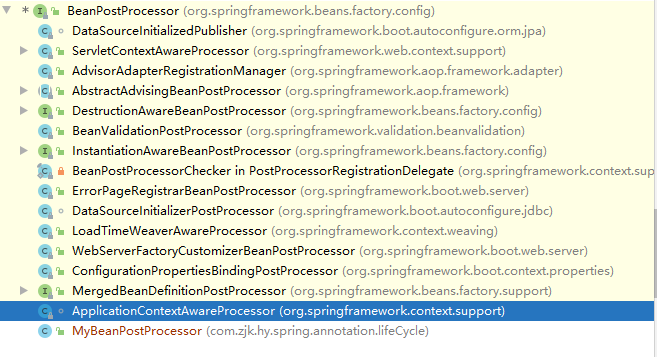

整体上梳理Spring的部分内容，具体的后面看情况分专题整体。

## 基础知识

IOC，是面向对象编程中的一种设计原则，控制反转是目的，依赖注入是手段

### Spring Bean元数据的配置方式

```java
schemal-based-------xml
annotation-based-----annotation
java-based----java Configuration
```

### 自动装配

#### 优点

+ 能减少参数配置
+ 对象修改时能自动更改，不用去修改配置

#### 缺点

+ 自动装配不支持基础属性、Strings、Class、基础属性的数组，Spring设计如此
+ 自动装配没有显示关联精准
+ 自动装配可能无法用于从Spring容器生成文档的工具
+ 通过set方法或者构造器参数自动装配，可能匹配到多个bean

#### 自动装配的方法

```java
no
byName
byType
constructor
自动装配的方式参考文档：
https://docs.spring.io/spring-framework/docs/current/spring-framework-reference/core.html#beans-factory-autowire
```

### SpringBean的作用域

```java
singleton/prototype/request/session/application/websocket
```

#### Singleton Beans with Prototype-bean Dependencies 

意思是在Singleton 当中引用了一个Prototype的bean的时候引发的问题：Prototype模式会失效，具体解决方案参考 **Method Injection：**

https://docs.spring.io/spring-framework/docs/current/reference/html/core.html#beans-factory-method-injection

+ 实现 ApplicationContextAware
+ 使用@Lookup

## Spring组件注册常用注解

### @Configuration

使用在类上，告诉spring这是一个配置类，该配置类等同于以前的xml配置文件

**eg：** 

```java
@Configuration
public class MainConfig {
}
```

### @PropertySource

加载指定的properties配置文件，可通过encoding参数指定字符编码

**eg：**

```java
@PropertySource(value={"classpath:demo.properties"},encoding = "GB2312")
```

配置文件中的内容会被加载到Environment对象中，可通过@Autowired注入Environment对象使用。

```java
@Autowired
Environment env;
..........................
env.getProperty("person.name")
```

### @Bean

给spring容器注入一个bean，类型为方法返回值的类型，id默认为方法名，可通过参数指定。

**eg:** 

```java
@Bean("person")
public Person person(){
    return new Person("大佬",120);
}
```

**@Bean源码:**

```java
@Target({ElementType.METHOD, ElementType.ANNOTATION_TYPE})
@Retention(RetentionPolicy.RUNTIME)
@Documented
public @interface Bean {
    // 设置别名
	@AliasFor("name")
	String[] value() default {};
    // 设置别名
    @AliasFor("value")
	String[] name() default {};
    // 自动装配
    Autowire autowire() default Autowire.NO;
    // 初始化对象时执行的方法
    String initMethod() default "";
    // 对象销毁时执行的方法
    String destroyMethod() default AbstractBeanDefinition.INFER_METHOD;
}
```

**补充说明：**

+ value和name属性不能共存
+ 设置了value或者name属性后，通过方法名从容器中获取对象的方式将失效

**自动装配：**

```java
public enum Autowire {
   /**
    * Constant that indicates no autowiring at all.
    */
   NO(AutowireCapableBeanFactory.AUTOWIRE_NO),
   /**
    * Constant that indicates autowiring bean properties by name.
    */
   BY_NAME(AutowireCapableBeanFactory.AUTOWIRE_BY_NAME),
   /**
    * Constant that indicates autowiring bean properties by type.
    */
   BY_TYPE(AutowireCapableBeanFactory.AUTOWIRE_BY_TYPE);
}
```

如果在@Bean中设置了autowire属性，比如：

```java
@Bean(value = "person",autowire = Autowire.BY_NAME)
```

那么在其他对象中可以通过@Autowired注解，注入该对象，代码如下：

```java
// 需要提供get、set方法
@Autowired
private Person person;
```

### @ComponentScan

@ComponentScan 的作用就是根据定义的扫描路径，把符合扫描规则的类装配到spring容器中.

**value：**指定要扫描的包

**includeFilters：** 指定只扫描哪些内容

```java
@ComponentScan(value = "com.zjk.hy.spring.annotation",useDefaultFilters = false,includeFilters={
        @Filter(type = FilterType.ANNOTATION,classes = {RestController.class}),
        @Filter(type = FilterType.ANNOTATION,classes = {Service.class})
})
```

因为@ComponentScan默认扫描指定包下的所有内容，要指定只扫描的内容需要设置useDefaultFilters为false

**excludeFilters：** 指定要排除哪些内容

```java
@ComponentScan(value = "com.zjk.hy.spring.annotation",excludeFilters={
        @Filter(type = FilterType.ANNOTATION,classes = {RestController.class}),
        @Filter(type = FilterType.ANNOTATION,classes = {Service.class})
})
```

**备注：**

如果使用的是JDK8，那么@ComponentScan是一个重复组件，可以重复设置，`@Repeatable(ComponentScans.class)`,或者通过@ComponentScans来设置多个。

**FilterType：**

```java
public enum FilterType {
	// 注解类型
	ANNOTATION,
	// 指定的类型
	ASSIGNABLE_TYPE,
	// 按照Aspectj的表达式，基本上不会用到
	ASPECTJ,
	// 按照正则表达式
	REGEX,
	// 自定义规则
	CUSTOM
}
```

**自定义过滤规则：**

```java
public class MyFilterType implements TypeFilter {

    /**
     *
     * @param metadataReader 获取当前正在扫描的类的信息
     * @param metadataReaderFactory 能够获取到其他任何类的信息
     * @return
     * @throws IOException
     * @throws IOException
     */
    @Override
    public boolean match(MetadataReader metadataReader, MetadataReaderFactory metadataReaderFactory) throws IOException, IOException {

        if (metadataReader.getClassMetadata().getClassName().contains("Dao")){
            //获取当前类注解的信息
            AnnotationMetadata annotationMetadata = metadataReader.getAnnotationMetadata();
            for (String s : annotationMetadata.getAnnotationTypes()) {
                System.out.println("当前正在被扫描的类注解类型" + s);
            }
            //获取当前正在扫描类的信息
            ClassMetadata classMetadata = metadataReader.getClassMetadata();
            System.out.println("当前正在被扫描的类的类名" + classMetadata.getClassName());
            //获取当前类的资源信息（类存放的路径...）
            Resource resource = metadataReader.getResource();
            System.out.println("当前正在被扫描的类存放的地址" + resource.getURL());
            return true;
        }
        return false;
    }

}
```

### @Scope

设置对象在spring容器中的作用域

+ prototype：多实例的，IOC容器启动时并不会去实例化对象，每次获取对象时才创建
+ singleton：单列模式（默认），IOC容器初始化时就会创建对象并缓存起来，以后获取的都是同一个对象
+ request：同一次请求创建一个对象
+ session：同一个session创建一个对象

```java
@Scope(value = "prototype")
@Bean(value = "person",autowire = Autowire.BY_NAME)
public Person person(){
    return new Person("Tom",120);
}
```

### @Lazy

设置懒加载，针对singleton模式在IOC容器启动时就会实例化对象，设置为懒加载的话会在第一次调用的时候才会实例化

### @Conditional

+ 用于方法上：按照一定的条件进行判断，满足条件的才注册到容器中
+ 用于类上：满足当前条件时，这个类中配置的所有Bean才注册

```java
@Target({ElementType.TYPE, ElementType.METHOD})
@Retention(RetentionPolicy.RUNTIME)
@Documented
public @interface Conditional {
   Class<? extends Condition>[] value();

}
```

参数需要实现Condition接口，

```java
@FunctionalInterface
public interface Condition {
   boolean matches(ConditionContext context, AnnotatedTypeMetadata metadata);

}
```

### @Import

导入组件

### @Lookup

这是一个作用在方法上的注解，被其标注的方法会被重写，然后根据其返回值的类型，容器调用BeanFactory的getBean()方法来返回一个bean。

## Spring Bean生命周期涉及内容

### Bean初始化时添加额外逻辑

1. 在bean中的某个方法上加上@PostConstruct

   ```java
   @PostConstruct
   public void post(){
       System.out.println("car初始化完成--PostConstruct");
   }
   ```

2. 通过@Bean的initMethod参数指定一个方法，该方法会在bean初始化完成之后执行

3. 通过让bean实现InitializingBean接口

   ```java
   public interface InitializingBean {
   	void afterPropertiesSet() throws Exception;
   }
   ```

   eg:	

   ```java
   import org.springframework.beans.factory.InitializingBean;
   public class Car implements InitializingBean {
       private String name;
       @Override
       public void afterPropertiesSet() throws Exception {
           System.out.println("car初始化完成");
       }
   }
   ```

4. bean的后置处理器-BeanPostProcessor接口

   ```java
   public interface BeanPostProcessor {
   	// 初始化之前执行
   	@Nullable
   	default Object postProcessBeforeInitialization(Object bean, String beanName) 		throws BeansException {
   		return bean;
   	}
       // 初始化之后执行
   	@Nullable
   	default Object postProcessAfterInitialization(Object bean, String beanName) throws 		BeansException {
   		return bean;
   	}
   
   }
   ```

**备注：**

以上方式可以共存，执行的顺序为postProcessBeforeInitialization-PostConstruct—InitializingBean—initMethod-postProcessAfterInitialization。

### Bean销毁时添加额外逻辑

+ 通过@PreDestroy注解

  ```java
  @PreDestroy
  public void pre(){
      System.out.println("car销毁----PreDestroy");
  }
  ```

+ 通过@Bean的destroyMethod参数指定一个方法，该方法会在bean销毁时执行

+ 通过让bean实现DisposableBean接口

  ```java
  public interface DisposableBean {
     void destroy() throws Exception;
  
  }
  ```

同样的这三种方式可以共存，执行顺序为：PreDestroy—DisposableBean—destroyMethod

## Bean的后置处理器原理

Spring的后置处理器由BeanPostProcessor接口提供相关的支持，具体流程如下：

### Spring容器调用顺序

容器启动时，applyBeanPostProcessorsBeforeInitialization方法的调用栈：


**initializeBean方法相关代码：**


从调用栈可知，initializeBean方法是在doCreateBean方法中调用的，在调用initializeBean方法之前，调用了`populateBean(beanName, mbd, instanceWrapper);`方法，该方法的作用是给Bean进行属性赋值。

因此，bean的后置处理器-BeanPostProcessor的整个流程是：

1. populateBean(beanName, mbd, instanceWrapper);
2. applyBeanPostProcessorsBeforeInitialization(wrappedBean, beanName);
3. invokeInitMethods(beanName, wrappedBean, mbd);
4. applyBeanPostProcessorsAfterInitialization(wrappedBean, beanName);

### Spring底层对BeanPostProcessor的使用

通过IDEA查看BeanPostProcessor接口的实现情况，如下图：



1. **ApplicationContextAwareProcessor：**

   这个类的作用是可以向组件中注入IOC容器，使用demo如下：

   ```java
   import org.springframework.beans.BeansException;
   import org.springframework.context.ApplicationContext;
   import org.springframework.context.ApplicationContextAware;
   import org.springframework.stereotype.Component;
   
   @Component
   public class ApplicationContextAwareDemoDTO implements ApplicationContextAware {
       private ApplicationContext applicationContext;
       @Override
       public void setApplicationContext(ApplicationContext applicationContext) throws BeansException {
           this.applicationContext = applicationContext;
       }
   }
   ```

   setApplicationContext的调用栈如下：

   

   由调用栈可以看出最后调用的是`ApplicationContextAwareProcessor`的postProcessBeforeInitialization方法中的invokeAwareInterfaces方法，代码如下：

   ```java
   private void invokeAwareInterfaces(Object bean) {
      if (bean instanceof Aware) {
         if (bean instanceof EnvironmentAware) {
            ((EnvironmentAware) bean).setEnvironment(this.applicationContext.getEnvironment());
         }
         if (bean instanceof EmbeddedValueResolverAware) {
            ((EmbeddedValueResolverAware) bean).setEmbeddedValueResolver(this.embeddedValueResolver);
         }
         if (bean instanceof ResourceLoaderAware) {
            ((ResourceLoaderAware) bean).setResourceLoader(this.applicationContext);
         }
         if (bean instanceof ApplicationEventPublisherAware) {
            ((ApplicationEventPublisherAware) bean).setApplicationEventPublisher(this.applicationContext);
         }
         if (bean instanceof MessageSourceAware) {
            ((MessageSourceAware) bean).setMessageSource(this.applicationContext);
         }
         if (bean instanceof ApplicationContextAware) {
            ((ApplicationContextAware) bean).setApplicationContext(this.applicationContext);
         }
      }
   }
   ```

   在该方法中会判断是哪种Aware，然后通过类型强转，调用相应的方法将this.applicationContext设置到组件中。

2. InitDestroyAnnotationBeanPostProcessor

   对应处理Bean生命周期中的@PostConstruct和@PreDestroy

   

3. AdvisorAdapterRegistrationManager

   其主要的作用为容器中管理的Bea 注册一个面向切面编程的通知适配器，以便在 Spring 容器为所管理的 Bean 进行面向切面编 程时提供方便，源码如下：

   ```java
   // 为容器中管理的 Bean 注册一个面向切面编程的通知适配器
   public class AdvisorAdapterRegistrationManager implements BeanPostProcessor {
   	// 容器中负责管理切面通知适配器注册的对象
   	private AdvisorAdapterRegistry advisorAdapterRegistry = 	
           GlobalAdvisorAdapterRegistry.getInstance();
   	
   	public void setAdvisorAdapterRegistry(AdvisorAdapterRegistry 
                                             advisorAdapterRegistry) {
   		this.advisorAdapterRegistry = advisorAdapterRegistry;
   	}
   	// BeanPostProcessor 在 Bean 对象初始化前的操作
   	@Override
   	public Object postProcessBeforeInitialization(Object bean, String beanName) throws 
           BeansException {
   		return bean;
   	}
   
       // BeanPostProcessor 在 Bean 对象初始化后的操作
   	@Override
   	public Object postProcessAfterInitialization(Object bean, String beanName) throws 
           BeansException {
   		if (bean instanceof AdvisorAdapter){
               // 如果容器创建的 Bean 实例对象是一个切面通知适配器，则向容器的注册
   			this.advisorAdapterRegistry.registerAdvisorAdapter((AdvisorAdapter) bean);
   		}
   		return bean;
   	}
   }
   ```

4. BeanValidationPostProcessor

   简单的检查spring管理bean中的JSR-303约束注释，在调用bean的init方法(如果有的话)之前，抛出一个初始化异常，以防止约束违反。

5. ConfigurationPropertiesBindingPostProcessor

   用于解析`bean`组件上的注解`@ConfigurationProperties`，将属性源中的属性设置到`bean`组件。

6. WebApplicationContextServletContextAwareProcessor

   `WebApplicationContextServletContextAwareProcessor`被用于向`bean`注入`ConfigurableWebApplicationContext`应用上下文，它仅仅用在当前应用是一个`Springboot` + `Spring MVC`(也就是`Servlet`)`Web`应用的情况下。如果当前应用是一个非`Spring boot Servlet Web`应用，而是一个非`Servlet`应用，或者非`Web`的命令行应用，则`WebApplicationContextServletContextAwareProcessor`根本不会出现在应用上下文中。

还有一些后面学习中遇到再具体分析。

## Aware相关接口

Spring框架的一个优点是Spring中的bean不会感知到Spring容器的存在，而Aware为Spring的一个根接口，它提供的功能就是让bean能够感知到Spring容器相关的内容，这会造成bean与Spring容器的强耦合不建议这么用。

常用的Awaare：

| 类名                           | 作用                                     |
| ------------------------------ | ---------------------------------------- |
| BeanNameAware                  | 获取容器中bean的名称                     |
| BeanClassLoaderAware           | 获得类加载器                             |
| BeanFactoryAware               | 获得bean的创建工厂                       |
| EnviromentAware                | 获得环境变量                             |
| EnvironmentValueResolverAware  | 获取spring容器加载的properties文件属性值 |
| ResourceLoaderAware            | 获得资源加载器                           |
| ApplicationEventPublisherAware | 获得应用程序发布器                       |
| MessageSourceAware             | 获得文本信息                             |
| ApplicationContextAware        | 获得当前应用上下文                       |

下面以ApplicationContextAware为列，看一下整个的调用链，如下：


整体上都是XXXXAware会有相应的XXXXAwareProcessor相对应

## AOP

### 简介

AOP：面向切面编程，指在程序运行期间动态的将某段代码切入到指定方法的指定位置，进行运行的编程方式。底层采用**动态代理**实现。

### 实现流程

1. 定义业务类
2. 定义切面类，其中涉及一下几种通知：
   + 前置通知（@Before），目标方法执行前调用
   + 后置通知（@After），目标方法执行后调用，无论正常结束还是异常结束
   + 返回通知（@AfterReturning），目标方法返回之后通知
   + 异常通知（@AfterThrowing），目标方法出现异常时调用
   + 环绕通知（@Around），动态代理，手动推动目标方法执行（joinPoint.procced()）
3. 通过注解给切面类中的方法标注通知类型，（何时执行）
4. 将业务类和切面类都注入到Spring容器中
5. 通过@Aspect注解告诉Spring容器当前类是一个切面类
6. 主配置类上加上@EnableAspectJAutoProxy注解，开启基于注解的aop模式

### 示例

**业务类：**

```java
public class MathCalculator {
    public int div(int i,int j){
        return i/j;
    }
}
```

**切面类：**

```java
import org.aspectj.lang.JoinPoint;
import org.aspectj.lang.annotation.*;

import java.util.Arrays;

@Aspect
public class LogAspects {
    @Pointcut("execution(public int com.zjk.hy.spring.aop.MathCalculator.*(..))")
    public void pointCut(){}
    @Before("pointCut()")
    public void logStart(JoinPoint joinPoint){
        Object[] args = joinPoint.getArgs();
        String name = joinPoint.getSignature().getName();
        System.out.println(name+"--除法开始执行,参数为："+ Arrays.toString(args));
    }
    @After("pointCut()")
    public void logEnd(JoinPoint joinPoint){
        System.out.println(joinPoint.getSignature().getName()+"--除法执行完成。。。。");
    }

    @AfterReturning(value = "pointCut()",returning = "result")
    public void logReturn(JoinPoint joinPoint,Object result){
        String name = joinPoint.getSignature().getName();
        System.out.println(name+"--除法正常返回,返回结果为："+result);
    }

    @AfterThrowing(value = "pointCut()",throwing="e")
    public void logError(JoinPoint joinPoint,Exception e){
        String name = joinPoint.getSignature().getName();
        System.out.println(name+"--异常信息为："+e.getMessage());
    }
}
```

**主配置以及测试类：**

```java
import org.springframework.context.annotation.AnnotationConfigApplicationContext;
import org.springframework.context.annotation.Bean;
import org.springframework.context.annotation.Configuration;
import org.springframework.context.annotation.EnableAspectJAutoProxy;

@Configuration
@EnableAspectJAutoProxy
public class AOPMainConfig {
    @Bean
    public MathCalculator mathCalculator(){
        return new MathCalculator();
    }
    @Bean
    public LogAspects logAspects(){
        return new LogAspects();
    }

    public static void main(String[] args) {
        AnnotationConfigApplicationContext context = new 
            AnnotationConfigApplicationContext(AOPMainConfig.class);
        MathCalculator calculator = context.getBean(MathCalculator.class);
        calculator.div(10,1);
        context.close();
    }
}
```

### AOP实现原理

看给容器注册了什么组件，该组件什么时候工作，该组件的功能是什么

#### EnableAspectJAutoProxy

```java
@Target(ElementType.TYPE)
@Retention(RetentionPolicy.RUNTIME)
@Documented
@Import(AspectJAutoProxyRegistrar.class)
public @interface EnableAspectJAutoProxy {
   // 使用哪种方式实现动态代理，true:使用CGLIB false：使用java的Proxy，默认fasle
   boolean proxyTargetClass() default false;
   // 是否通过aop框架暴露该代理对象，aopContext能够访问.
   boolean exposeProxy() default false;
}
```

具体的实现代码在通过@Import导入的`AspectJAutoProxyRegistrar.class`,

```java
class AspectJAutoProxyRegistrar implements ImportBeanDefinitionRegistrar {
   @Override
   public void registerBeanDefinitions(
         AnnotationMetadata importingClassMetadata, BeanDefinitionRegistry registry) {
      AopConfigUtils.registerAspectJAnnotationAutoProxyCreatorIfNecessary(registry);
      AnnotationAttributes enableAspectJAutoProxy =
            AnnotationConfigUtils.attributesFor(importingClassMetadata, 
                                                EnableAspectJAutoProxy.class);
      if (enableAspectJAutoProxy != null) {
         if (enableAspectJAutoProxy.getBoolean("proxyTargetClass")) {
            AopConfigUtils.forceAutoProxyCreatorToUseClassProxying(registry);
         }
         if (enableAspectJAutoProxy.getBoolean("exposeProxy")) {
            AopConfigUtils.forceAutoProxyCreatorToExposeProxy(registry);
         }
      }
   }
}
```

以上代码的核心是`AopConfigUtils.registerAspectJAnnotationAutoProxyCreatorIfNecessary(registry);`

AopConfigUtils是AOP的工具类,`registerAspectJAnnotationAutoProxyCreatorIfNecessary`主要作用是把AnnotationAwareAspectJAutoProxyCreator这个类注册到spring容器中，对应的名称为internalAutoProxyCreator。

#### 自动代理创建器-AnnotationAwareAspectJAutoProxyCreator


由上图可以看出，整个AnnotationAwareAspectJAutoProxyCreator的继承实现结构还是比较复杂，但是我们重点关注三个点：

+ BeanFactoryAware，这个接口的作用是子类（组件）实现setBeanFactory方法，会将BeanFactory注入到组件中
+ BeanPostProcessor，后置处理器，能够在在Bean实例创建完成初始化前后做一些事情（postProcessBeforeInitialization、postProcessAfterInitialization）
+ InstantiationAwareBeanPostProcessor也是一种处理器，在Bean实例创建前先尝试用后置处理器返回对象（postProcessBeforeInstantiation，postProcessAfterInstantiation）

#### AnnotationAwareAspectJAutoProxyCreator实例化流程


1. 传入配置类，创建IOC容器

   ```java
   new AnnotationConfigApplicationContext(AOPMainConfig.class);
   ```

2. 注册配置类,调用refresh();方法，刷新容器

   ```java
   // AnnotationConfigApplicationContext.java
   public AnnotationConfigApplicationContext(Class<?>... annotatedClasses) {
       this();
       register(annotatedClasses);
       refresh();
   }
   ```

3. 注册Bean的后置处理器，来拦截bean的创建

   ```java
   // AbstractApplicationContext.java--refresh方法
   registerBeanPostProcessors(beanFactory);
   ```

   1. 先获取IOC容器中已经定义了需要创建的所有的BeanPostProcessor

   2. 在容器中加入别的BeanPostProcessor后置处理器

   3. 遍历所有的BeanPostProcessor，放入不同的数组中，为了后面能够按照顺序注入

   4. 优先注册实现了PriorityOrdered接口的BeanPostProcessor

   5. 在注册实现了Ordered接口的BeanPostProcessor

   6. 最后注册普通的没有实现优先级接口的BeanPostProcessor

   7. 注册BeanPostProcessor，实际就是创建BeanPostProcessor对象，并保存到容器中

      创建internalAutoProxyCreator的BeanPostProcessor【AnnotationAwareAspectJAutoProxyCreator】

      1. createBeanInstance，创建Bean实例

      2. populateBean，给Bean中的各种属性赋值

      3. initializeBean，初始化Bean
            1. invokeAwareMethods，处理Aware接口的方法回调
            2. applyBeanPostProcessorsBeforeInitialization，拿到所有的后置处理器BeanPostProcessor,执行postProcessBeforeInitialization方法
            3. invokeInitMethods，执行自定义的初始化方法
            4. applyBeanPostProcessorsAfterInitialization，执行后置处理器postProcessAfterInitialization方法
      4. BeanPostProcessor【AnnotationAwareAspectJAutoProxyCreator】创建完成

   8. 把BeanPostProcessor注册到BeanFactory中

      ```java
      registerBeanPostProcessors(beanFactory, priorityOrderedPostProcessors);
      ```
   
   以上就是创建和注册AnnotationAwareAspectJAutoProxyCreator的过程。

4. finishBeanFactoryInitialization(beanFactory);完成BeanFactory的初始化工作，创建剩下的单实例的创建

   1. 遍历获取容器中所有的Bean，依次创建对象，getBean(beanName);

      getBean=>doGetBean=>getSingleton

   2. 创建Bean

      1. 先从缓存中获取Bean，如果能获取到，说明bean之前被创建过，就直接拿来使用，没有获取到再创建（只要被创建的单实例Bean都会被缓存起来）

      2. createBean，创建bean

         【**BeanPostProcessor是在Bean实例创建完成初始化前后调用的**】

         【**InstantiationAwareBeanPostProcessor是在Bean实例创建前先尝试用后置处理器返回对象**】

         1. resolveBeforeInstantiation(beanName, mbdToUse);解析BeforeInstantiation

            希望后置处理器在此能够返回一个代理对象，如果不能返回就继续创建

            1. 后置处理器先尝试返回对象，

               ```java
               // 拿到所有的后置处理器，
               // 判断是否为InstantiationAwareBeanPostProcessor
               // 如果是，就执行postProcessBeforeInstantiation方法
               bean = applyBeanPostProcessorsBeforeInstantiation(targetType, beanName);
               if (bean != null) {
               	bean = applyBeanPostProcessorsAfterInitialization(bean, beanName);
               }
               ```

         2. doCreateBean(beanName, mbdToUse, args);正在的去创建一个bean，和上面的3-7里面的流程一样

 #### AnnotationAwareAspectJAutoProxyCreator【InstantiationAwareBeanPostProcessor】的作用：

接下来接着分析resolveBeforeInstantiation方法的内部逻辑，需要强调的是，resolveBeforeInstantiation方法是在doCreateBean之前调用的，**InstantiationAwareBeanPostProcessor是在Bean实例创建前先尝试用后置处理器返回对象**。

1. 在bean创建之前，调用postProcessBeforeInstantiation()

   关心MathCalculator和LogAspect的创建

   ```java
   Object cacheKey = getCacheKey(beanClass, beanName);
   if (!StringUtils.hasLength(beanName) || !this.targetSourcedBeans.contains(beanName)) {
   	if (this.advisedBeans.containsKey(cacheKey)) {
           return null;
       }
       if (isInfrastructureClass(beanClass) || shouldSkip(beanClass, beanName)) {
           this.advisedBeans.put(cacheKey, Boolean.FALSE);
           return null;
       }
   }
   ```

   1. 判断当前bean是否在advisedBeans中（advisedBeans保存了所有需要增强bean）
   2. isInfrastructureClass(beanClass)，判断当前bean是否是基础类型的Advice、Pointcut、Advisor、AopInfrastructureBean,或者是否是切面（@Aspect）
   3. shouldSkip(beanClass, beanName)，是否需要跳过

2. 创建代理对象，postProcessAfterInitialization

   ```java
   @Override
   public Object postProcessAfterInitialization(@Nullable Object bean, String beanName) 
       throws BeansException {
       if (bean != null) {
           Object cacheKey = getCacheKey(bean.getClass(), beanName);
           if (!this.earlyProxyReferences.contains(cacheKey)) {
               // 包装,如果需要的情况下
               return wrapIfNecessary(bean, beanName, cacheKey);
           }
       }
       return bean;
   }
   ```

   1. 获取当前bean的所有增强器（通知方法）  Object[]  specificInterceptors

      1. 找到候选的所有的增强器（找哪些通知方法是需要切入当前bean方法的）

      2. 获取到能在bean使用的增强器。

      3. 给增强器排序

   2. 保存当前bean在advisedBeans中；this.advisedBeans.put(cacheKey, Boolean.TRUE);

   3. 如果当前bean需要增强，创建当前bean的代理对象；

      ```java
      Object proxy = createProxy(bean.getClass(), beanName, specificInterceptors, new SingletonTargetSource(bean));
      ```

      1. 获取所有增强器（通知方法）
      2. 保存到proxyFactory
      3. 创建代理对象：Spring自动决定

      ```java
      // DefaultAopProxyFactory
      @Override
      public AopProxy createAopProxy(AdvisedSupport config) throws AopConfigException {
          if (config.isOptimize() || config.isProxyTargetClass() || 
              hasNoUserSuppliedProxyInterfaces(config)) {
              Class<?> targetClass = config.getTargetClass();
              if (targetClass == null) {
                  throw new AopConfigException("TargetSource cannot determine target class: " +"Either an interface or a target is required for proxy creation.");
              }
              if (targetClass.isInterface() || Proxy.isProxyClass(targetClass)) {
                  return new JdkDynamicAopProxy(config);
              }
              return new ObjenesisCglibAopProxy(config);
          }
          else {
              return new JdkDynamicAopProxy(config);
          }
      }
      ```

      + JdkDynamicAopProxy(config);jdk动态代理；

      + ObjenesisCglibAopProxy(config);cglib的动态代理；

   4. 给容器中返回当前组件使用cglib增强了的代理对象；

   5. 以后获取到的就是这个组件的代理对象，执行目标方法的时候，代理对象就会执行通知方法的流程；

3. 目标方法执行流程

   容器中保存了组件的代理对象（cglib增强后的对象），这个对象里面保存了详细信息（比如增强器，目标对象，xxx）；

   1. CglibAopProxy->DynamicAdvisedInterceptor.intercept();拦截目标方法的执行

   2. 根据ProxyFactory对象获取将要执行的目标方法拦截器链；

      ```java
      List<Object> chain = this.advised.getInterceptorsAndDynamicInterceptionAdvice(method, targetClass);
      ```

      1. List<Object> interceptorList保存所有拦截器 5个，一个默认的ExposeInvocationInterceptor 和 4个增强器；
      2. 遍历所有的增强器，将其转为Interceptor；registry.getInterceptors(advisor);
      3. 将增强器转为List<MethodInterceptor>；
         + 如果是MethodInterceptor，直接加入到集合中
         + 如果不是，使用AdvisorAdapter将增强器转为MethodInterceptor；
         + 转换完成返回MethodInterceptor数组；

   3. 如果没有拦截器链，直接执行目标方法;

      拦截器链（每一个通知方法又被包装为方法拦截器，利用MethodInterceptor机制）

   4. 如果有拦截器链，把需要执行的目标对象，目标方法，拦截器链等信息传入创建一个 CglibMethodInvocation 对象，并调用 Object retVal =  mi.proceed();

   5. 拦截器链的触发过程;

      1. 如果没有拦截器执行执行目标方法，或者拦截器的索引和拦截器数组-1大小一样（指定到了最后一个拦截器）执行目标方法；
      2. 链式获取每一个拦截器，拦截器执行invoke方法，每一个拦截器等待下一个拦截器执行完成返回以后再来执行；拦截器链的机制，保证通知方法与目标方法的执行顺序；

#### AOP原理总结

1. @EnableAspectJAutoProxy 开启AOP功能
2. @EnableAspectJAutoProxy 会给容器中注册一个后置处理器 AnnotationAwareAspectJAutoProxyCreator()
3. 容器的创建流程：
   1. registerBeanPostProcessors()注册后置处理器；创建AnnotationAwareAspectJAutoProxyCreator对象
   2. finishBeanFactoryInitialization（）初始化剩下的单实例bean
      1. 创建业务逻辑组件和切面组件
      2. AnnotationAwareAspectJAutoProxyCreator拦截组件的创建过程
      3. 组件创建完之后，判断组件是否需要增强,是：切面的通知方法，包装成增强器（Advisor）;给业务逻辑组件创建一个代理对象（cglib）
4. 执行目标方法：
   1. 代理对象执行目标方法
   2. CglibAopProxy.intercept()；
      1. 得到目标方法的拦截器链（增强器包装成拦截器MethodInterceptor）
      2. 利用拦截器的链式机制，依次进入每一个拦截器进行执行；
      3. 效果：
         + 正常执行：前置通知-》目标方法-》后置通知-》返回通知
         + 出现异常：前置通知-》目标方法-》后置通知-》异常通知

## 声明式事务使用

### 配置事务管理器

```java
@Bean
public PlatformTransactionManager transactionManager(){
    // 需要设置数据源对象
}
```

### 开启基于注解的事务管理功能

在主配置类上添加@EnableTransactionManagement注解

### 具体使用

在需要事务管理的方法上标注@Transactional注解

## Spring的扩展原理

### BeanPostProcessor

Bean后置处理器，在Bean创建完成初始化前后执行,前面大体介绍过

### BeanFactoryPostProcessor

BeanFactory的后置处理器，在BeanFactory标注初始化之后（所有Bean的定义已经加载并保存到beanFactory中，但是bean的实例还未创建）调用，来定制和修改BeanFactory的内容。

```java
@FunctionalInterface
public interface BeanFactoryPostProcessor {
   void postProcessBeanFactory(ConfigurableListableBeanFactory beanFactory) throws 、
       BeansException;
}
```

#### 实现原理

1. ioc容器创建对象
2. invokeBeanFactoryPostProcessors(beanFactory);
   1. 直接在BeanFactory中找到所有类型是BeanFactoryPostProcessor的组件，并执行他们的方法
   2. 在初始化创建其他组件前面执行

### BeanDefinitionRegistryPostProcessor

该接口继承自BeanFactoryPostProcessor，在所有bean定义信息将要被加载，bean实例还未创建的时候执行，**优先于BeanFactoryPostProcessor执行**；可以利用BeanDefinitionRegistryPostProcessor给容器中再额外添加一些组件。

```java
public interface BeanDefinitionRegistryPostProcessor extends BeanFactoryPostProcessor {
   void postProcessBeanDefinitionRegistry(BeanDefinitionRegistry registry) throws 
       BeansException;
}
```

#### 使用示例

```java
@Component
public class MyBeanDefinitionRegistryPostProcessor implements 
    BeanDefinitionRegistryPostProcessor {
    @Override
    public void postProcessBeanDefinitionRegistry(BeanDefinitionRegistry registry) throws 
        BeansException {
        System.out.println("+++++postProcessBeanDefinitionRegistry+++");
        System.out.println("registry-count:"+registry.getBeanDefinitionCount());
        RootBeanDefinition definition = new RootBeanDefinition(Dog.class);
        registry.registerBeanDefinition("dog",definition);

        AbstractBeanDefinition carBeanDefinition = 
            BeanDefinitionBuilder.rootBeanDefinition(Car.class).getBeanDefinition();
        registry.registerBeanDefinition("car",carBeanDefinition);
    }

    @Override
    public void postProcessBeanFactory(ConfigurableListableBeanFactory beanFactory) 
        throws BeansException {
        System.out.println("postProcessBeanFactory++++");
        System.out.println("beanFactory:"+beanFactory.getBeanDefinitionCount());
    }
}
```

#### 实现原理

1. ioc创建对象
2. refresh()-》invokeBeanFactoryPostProcessors(beanFactory);
3. 从容器中获取到所有的BeanDefinitionRegistryPostProcessor组件。
   1. 依次触发所有的postProcessBeanDefinitionRegistry()方法
   2. 再来触发postProcessBeanFactory()方法BeanFactoryPostProcessor；
4. 再来从容器中找到BeanFactoryPostProcessor组件；然后依次触发postProcessBeanFactory()方法

### Spring监听器—ApplicationListener

监听容器中发布的事件，事件驱动模型开发，监听 ApplicationEvent 及其下面的子事件

```java
@FunctionalInterface
public interface ApplicationListener<E extends ApplicationEvent> extends EventListener {
   void onApplicationEvent(E event);
}
```

```java
/** 
 * 	 步骤：
 * 		1）、写一个监听器（ApplicationListener实现类）来监听某个事件（ApplicationEvent及其子类）
 * 			@EventListener;
 * 			原理：使用EventListenerMethodProcessor处理器来解析方法上的@EventListener；
 * 
 * 		2）、把监听器加入到容器；
 * 		3）、只要容器中有相关事件的发布，我们就能监听到这个事件；
 * 				ContextRefreshedEvent：容器刷新完成（所有bean都完全创建）会发布这个事件；
 * 				ContextClosedEvent：关闭容器会发布这个事件；
 * 		4）、发布一个事件：
 * 				applicationContext.publishEvent()；
 * 	
 *  原理：
 *  	ContextRefreshedEvent、IOCTest_Ext$1[source=我发布的时间]、ContextClosedEvent；
 *  1）、ContextRefreshedEvent事件：
 *  	1）、容器创建对象：refresh()；
 *  	2）、finishRefresh();容器刷新完成会发布ContextRefreshedEvent事件
 *  2）、自己发布事件；
 *  3）、容器关闭会发布ContextClosedEvent；
 *  
 *  【事件发布流程】：
 *  	3）、publishEvent(new ContextRefreshedEvent(this));
 *  			1）、获取事件的多播器（派发器）：getApplicationEventMulticaster()
 *  			2）、multicastEvent派发事件：
 *  			3）、获取到所有的ApplicationListener；
 *  				for (final ApplicationListener<?> listener : getApplicationListeners(event, type)) {
 *  				1）、如果有Executor，可以支持使用Executor进行异步派发；
 *  					Executor executor = getTaskExecutor();
 *  				2）、否则，同步的方式直接执行listener方法；invokeListener(listener, event);
 *  				 拿到listener回调onApplicationEvent方法；
 *  
 *  【事件多播器（派发器）】
 *  	1）、容器创建对象：refresh();
 *  	2）、initApplicationEventMulticaster();初始化ApplicationEventMulticaster；
 *  		1）、先去容器中找有没有id=“applicationEventMulticaster”的组件；
 *  		2）、如果没有this.applicationEventMulticaster = new SimpleApplicationEventMulticaster(beanFactory);
 *  			并且加入到容器中，我们就可以在其他组件要派发事件，自动注入这个applicationEventMulticaster；
 *  
 *  【容器中有哪些监听器】
 *  	1）、容器创建对象：refresh();
 *  	2）、registerListeners();
 *  		从容器中拿到所有的监听器，把他们注册到applicationEventMulticaster中；
 *  		String[] listenerBeanNames = getBeanNamesForType(ApplicationListener.class, true, false);
 *  		//将listener注册到ApplicationEventMulticaster中
 *  		getApplicationEventMulticaster().addApplicationListenerBean(listenerBeanName);
 *  		
 *   SmartInitializingSingleton 原理：->afterSingletonsInstantiated();
 *   		1）、ioc容器创建对象并refresh()；
 *   		2）、finishBeanFactoryInitialization(beanFactory);初始化剩下的单实例bean；
 *   			1）、先创建所有的单实例bean；getBean();
 *   			2）、获取所有创建好的单实例bean，判断是否是SmartInitializingSingleton类型的；
 *   				如果是就调用afterSingletonsInstantiated();
 * 		
 * 
 *
 */
```

## Spring容器的初始化-refresh

### 刷新前的预处理-prepareRefresh();

+ initPropertySources()

  初始化设置一些属性，子类自定义个性化的属性设置方法（继承AnnotationConfigApplicationContext，覆盖initPropertySources方法）；

  ```java
  import org.springframework.context.annotation.AnnotationConfigApplicationContext;
  
  public class MyAnnotationConfigApplicationContext extends 
      AnnotationConfigApplicationContext {
  
      public MyAnnotationConfigApplicationContext(Class<?>... annotatedClasses) {
          super(annotatedClasses);
      }
      @Override
      protected void initPropertySources() {
          System.out.println("===================================");
          super.initPropertySources();
          System.out.println("===================================");
      }
  }
  ```

+ getEnvironment().validateRequiredProperties()

  完成属性校验等操作

+ earlyApplicationEvents = new LinkedHashSet<>();

  创建一个LinkedHashSet，用于保存容器中早期的一些事件

### 获取BeanFactory：obtainFreshBeanFactory

+ refreshBeanFactory，刷新【创建】BeanFactory

  BeanFactory的创建是在实例化GenericApplicationContext时，创建了一个DefaultListableBeanFactory，在refreshBeanFactory方法中主要设置了BeanFactory的序列号ID。

  ```java
  public GenericApplicationContext() {
     this.beanFactory = new DefaultListableBeanFactory();
  }
  ```

+ getBeanFactory，返回刚才GenericApplicationContext创建的BeanFactory对象；
+ 将创建的BeanFactory【DefaultListableBeanFactory】返回

### BeanFactory的预准备工作-prepareBeanFactory

该方法给BeanFactory做一些预备的工作，对BeanFactory进行一些设置

+ 设置BeanFactory的类加载器，支持表达式解析器...

+ 添加部分BeanPostProcessor(ApplicationContextAwareProcessor)

+ 设置自动装配需要忽略的接口

  EnvironmentAware、EmbeddedValueResolverAware、ResourceLoaderAware、ApplicationEventPublisherAware、MessageSourceAware、ApplicationContextAware

+ 设置自动装配到Spring容器中的组件

  BeanFactory、ResourceLoader、ApplicationEventPublisher、ApplicationContext；以上组件我们能直接在其它组件中注入使用

+ 添加BeanPostProcessor【ApplicationListenerDetector】

  ApplicationListenerDetector的作用是检测那些实现了ApplicationListener的bean，在这些Bean初始化后将他们添加到应用上下文的事件多播器上，在这些bean销毁之前，将他们从应用上下的事件多播器上移除。

+ 添加编译时的AspectJ支持

+ 给BeanFactory中注册一些能用的组件；
  environment【ConfigurableEnvironment】、systemProperties【Map<String, Object>】、systemEnvironment【Map<String, Object>】

### BeanFactory的后置处理

子类通过重写这个方法来在BeanFactory创建并预准备完成以后做进一步的设置，具体的实现方式类使于initPropertySources方法。

------------------------

​												以上是BeanFactory的创建及预准备工作

--------

### invokeBeanFactoryPostProcessors(beanFactory)

在BeanFactory标准初始化之后，执行BeanFactory的后置处理器，执行过程中涉及两个接口BeanFactoryPostProcessor、BeanDefinitionRegistryPostProcessor，即两类BeanFactory的后置处理器。

#### 执行BeanDefinitionRegistryPostProcessor

+ 获取所有的BeanDefinitionRegistryPostProcessor
+ 先执行实现了优先级接口（PriorityOrdered）的BeanDefinitionRegistryPostProcessor
+ 然后执行实现了顺序接口（Ordered）的BeanDefinitionRegistryPostProcessor
+ 最后执行没有实现任何优先级或者是顺序接口的BeanDefinitionRegistryPostProcessors

#### 执行BeanFactoryPostProcessor

+ 获取所有的BeanFactoryPostProcessor
+ 先执行实现了优先级接口（PriorityOrdered）的BeanFactoryPostProcessor
+ 然后执行实现了顺序接口（Ordered）的BeanFactoryPostProcessor
+ 最后执行没有实现任何优先级或者是顺序接口的BeanFactoryPostProcessor

### 注册Bean的后置处理器

```java
registerBeanPostProcessors(beanFactory);
```

不同接口类型的BeanPostProcessor；在Bean创建前后的执行时机是不一样的
		BeanPostProcessor、
		DestructionAwareBeanPostProcessor、
		InstantiationAwareBeanPostProcessor、
		SmartInstantiationAwareBeanPostProcessor、
		MergedBeanDefinitionPostProcessor【internalPostProcessors】

+ 获取所有的 BeanPostProcessor;后置处理器都默认可以通过PriorityOrdered、Ordered接口来执行优先级

+ 先注册PriorityOrdered优先级接口的BeanPostProcessor；把每一个BeanPostProcessor；添加到BeanFactory中

  ```java
  beanFactory.addBeanPostProcessor(postProcessor);
  ```

+ 再注册实现了Ordered接口的BeanPostProcessor
+ 最后注册没有实现任何优先级接口的BeanPostProcessor
+ 最终注册MergedBeanDefinitionPostProcessor
+ 注册一个ApplicationListenerDetector；在Bean创建完成后检查是否是ApplicationListener，如果是，则将其添加到上下文的多播器上
  applicationContext.addApplicationListener((ApplicationListener<?>) bean);

### 初始化MessageSource组件

```java
initMessageSource();
```

做国际化功能，消息绑定，消息解析等

+ 获取BeanFactory

+ 看容器中是否有id为messageSource的，类型是MessageSource的组件

  如果有赋值给messageSource，如果没有就创建一个DelegatingMessageSource；MessageSource：取出国际化配置文件中的某个key的值；能按照区域信息获取；

+ 把创建好的MessageSource注册在容器中

  ```java
  beanFactory.registerSingleton(MESSAGE_SOURCE_BEAN_NAME, this.messageSource);	
  MessageSource.getMessage(String code, Object[] args, String defaultMessage, Locale locale);
  ```

  以后获取国际化配置文件的值的时候，可以自动注入MessageSource；

### 初始化事件派发器-initApplicationEventMulticaster

+ 获取BeanFactory
+ 从BeanFactory中获取applicationEventMulticaster的ApplicationEventMulticaster
+ 如果上一步没有配置；创建一个SimpleApplicationEventMulticaster
+ 将创建的ApplicationEventMulticaster添加到BeanFactory中，以后其他组件直接自动注入

### onRefresh();留给子容器（子类）

子类重写这个方法，在容器刷新的时候可以自定义逻辑；具体的实现方法类使于initPropertySources方法

### 监听器注册-registerListeners

+ 从容器中拿到所有的ApplicationListener

+ 将每个监听器添加到事件派发器中

  ```java
  getApplicationEventMulticaster().addApplicationListenerBean(listenerBeanName);
  ```

+ 派发之前步骤产生的事件

### 初始化所有剩下的单实例bean

```java
finishBeanFactoryInitialization(beanFactory);
...                         ...
beanFactory.preInstantiateSingletons();
```

+ 获取容器中的所有Bean，依次进行初始化和创建对象

+ 获取Bean的定义信息；RootBeanDefinition

+ Bean不是抽象的，是单实例的，是懒加载

  + 判断是否是FactoryBean；是否是实现FactoryBean接口的Bean；

  + 不是工厂Bean,利用getBean(beanName)创建对象

    + getBean(beanName)； ioc.getBean();

    + doGetBean(name, null, null, false);

    + 获取缓存中保存的单实例Bean

      如果能获取到说明这个Bean之前被创建过（所有创建过的单实例Bean都会被缓存起来）,从private final Map<String, Object> singletonObjects = new ConcurrentHashMap<String, Object>(256);获取的.

    + 缓存中获取不到，开始Bean的创建对象流程

    + 标记当前bean已经被创建

    + 获取Bean的定义信息

    + 获取当前Bean依赖的其他Bean;如果有按照getBean()把依赖的Bean先创建出来；

    + 单实例Bean的创建流程

      + createBean(beanName, mbd, args);

      + 执行Bean的后置处理器

        ```java
        Object bean = resolveBeforeInstantiation(beanName, mbdToUse);
        ```

        让BeanPostProcessor先拦截返回代理对象；【InstantiationAwareBeanPostProcessor】：提前执行；先触发：postProcessBeforeInstantiation()；如果有返回值：触发postProcessAfterInitialization()；

      + 如果前面的InstantiationAwareBeanPostProcessor没有返回代理对象，就需要创建

        ```java
        Object beanInstance = doCreateBean(beanName, mbdToUse, args);
        ```

      + 创建Bean

        

      + 将创建的Bean添加到缓存中singletonObjects

    ioc容器就是这些Map；很多的Map里面保存了单实例Bean，环境信息。。。。；
    所有Bean都利用getBean创建完成以后；检查所有的Bean是否是SmartInitializingSingleton接口的；如果是；就执行afterSingletonsInstantiated()；

### 完成BeanFactory的初始化创建工作-finishRefresh

+ initLifecycleProcessor();初始化和生命周期有关的后置处理器；

  LifecycleProcessor默认从容器中找是否有lifecycleProcessor的组件【LifecycleProcessor】；如果没有new DefaultLifecycleProcessor();加入到容器；写一个LifecycleProcessor的实现类，可以在BeanFactory
  		void onRefresh();
  		void onClose();

+ getLifecycleProcessor().onRefresh();
  	拿到前面定义的生命周期处理器（BeanFactory）；回调onRefresh()；

+ publishEvent(new ContextRefreshedEvent(this));发布容器刷新完成事件；

+ liveBeansView.registerApplicationContext(this);		

## 循环依赖

Spring中单列默认支持循环依赖