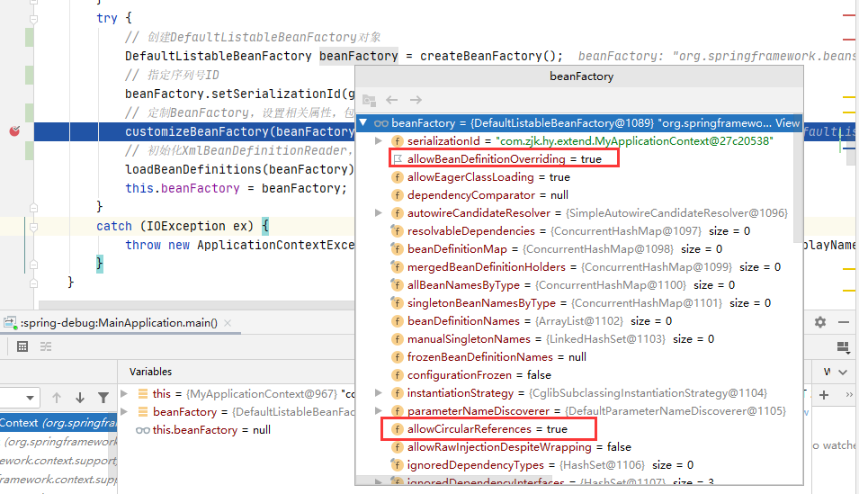

# Spring扩展点

## initPropertySources

初始化设置一些属性，子类自定义个性化的属性设置方法

```java
import org.springframework.context.annotation.AnnotationConfigApplicationContext;

public class MyAnnotationConfigApplicationContext extends 
    AnnotationConfigApplicationContext {

    public MyAnnotationConfigApplicationContext(Class<?>... annotatedClasses) {
        super(annotatedClasses);
    }
    @Override
    protected void initPropertySources() {
        System.out.println("===================================");
        // 设置abc属性是必须的
        getEnvironment().setRequiredProperties("abc")
        System.out.println("===================================");
    }
}
```

## customizeBeanFactor

```java
@Override
protected void customizeBeanFactory(DefaultListableBeanFactory beanFactory) {
    beanFactory.setAllowBeanDefinitionOverriding(false);
    beanFactory.setAllowCircularReferences(false);
    super.customizeBeanFactory(beanFactory);
}
```

以上代码的作用是



BeanFactory刚创建完成，这两个参数都是true，能够通过customizeBeanFactory的重载方法进行扩展。

```java
protected void customizeBeanFactory(DefaultListableBeanFactory beanFactory) {
   if (this.allowBeanDefinitionOverriding != null) {
      beanFactory.setAllowBeanDefinitionOverriding(this.allowBeanDefinitionOverriding);
   }
   if (this.allowCircularReferences != null) {
      beanFactory.setAllowCircularReferences(this.allowCircularReferences);
   }
}
```

## 自定义标签

## 自定义属性编辑器

+ 自定义属性编辑器，继承PropertyEditorSupport，实现`setAsText(String text)`方法

  ```java
  import java.beans.PropertyEditorSupport;
  
  public class AddressPropertyEditor  extends PropertyEditorSupport {
  	@Override
  	public void setAsText(String text) throws IllegalArgumentException {
  		String[] s = text.split("_");
  		Address address = new Address();
  		address.setProvince(s[0]);
  		address.setCity(s[1]);
  		address.setTown(s[2]);
  		this.setValue(address);
  	}
  }
  ```

+ 自定义注册器，实现PropertyEditorRegistrar接口，实现`registerCustomEditors(PropertyEditorRegistry registry) `方法

  ```java
  import org.springframework.beans.PropertyEditorRegistrar;
  import org.springframework.beans.PropertyEditorRegistry;
  
  public class AddressPropertyEditorRegistrar implements PropertyEditorRegistrar {
  	@Override
  	public void registerCustomEditors(PropertyEditorRegistry registry) {
  		registry.registerCustomEditor(Address.class,new AddressPropertyEditor());
  	}
  }
  ```

  作为属性编辑器的注册器，该注册器的目的是为了让Spring识别到上面自定义的编辑器

+ 让Spring能够识别到注册器

  ```xml
  <bean class="org.springframework.beans.factory.config.CustomEditorConfigurer">
      <property name="propertyEditorRegistrars">
          <list>
              <bean class="com.zjk.hy.selfEditor.AddressPropertyEditorRegistrar"></bean>
          </list>
      </property>
  </bean>
  ```

+ 具体配置使用

  ```xml
  <bean id="customer" class="com.zjk.hy.selfEditor.Customer">
      <property name="name" value="zhangsan"></property>
      <property name="address" value="四川_成都_武侯区"></property>
  </bean>
  ```

整理实现依托于CustomEditorConfigurer是个BeanFactoryPostProcessor，如下：

```java
public class CustomEditorConfigurer implements BeanFactoryPostProcessor, Ordered {
   @Nullable
   private PropertyEditorRegistrar[] propertyEditorRegistrars;
}
```

整体感觉这个功能对于基于注解的编程方式，可能用处不大

+ 第二种方式

  ```xml
  <bean class="org.springframework.beans.factory.config.CustomEditorConfigurer">
     <property name="customEditors">
        <map>
           <entry key="com.zjk.hy.selfEditor.Address">
              <value>com.zjk.hy.selfEditor.AddressPropertyEditor</value>
           </entry>
        </map>
     </property>
  </bean>
  ```

  这种方式更简单，只需要定义AddressPropertyEditor，不用定义AddressPropertyEditorRegistrar