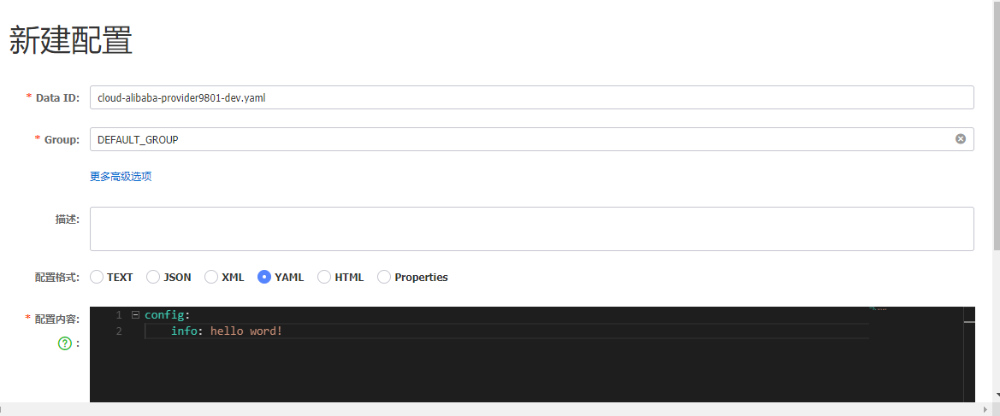
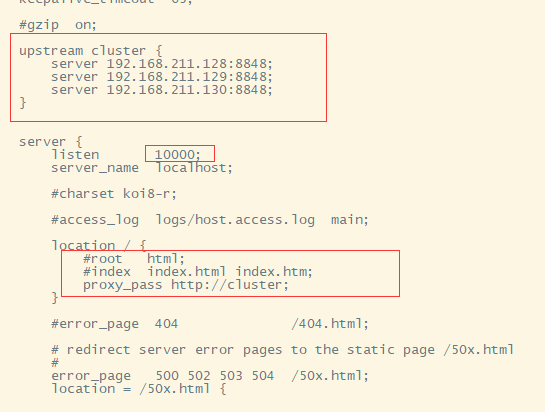

# Nacos简介

一个更易于构建云原生应用的动态服务发现、配置管理和服务管理平台。

> https://nacos.io/zh-cn/

## 安装

### 下载

下载：nacos-server-1.4.1.tar.gz，解压通过startup.sh启动

如果只做测试，需要修改启动命令中的启动模式，export MODE="standalone"

### 配置mysql数据库

数据库脚本： nacos-mysql.sql，位于config目录下

修改application.properties中的数据库连接配置，

都很简单

## 服务注册

POM引入：

```xml
<dependency>
    <groupId>com.alibaba.cloud</groupId>
    <artifactId>spring-cloud-starter-alibaba-nacos-discovery</artifactId>
</dependency>
```

添加配置参数：

```yaml
spring:
  cloud:
    nacos:
      discovery:
        server-addr: 192.168.211.128:8848
```

主启动类上添加注解：

```java
@EnableDiscoveryClient
```

## 配置中心

POM引入：

```java
<dependency>
    <groupId>com.alibaba.cloud</groupId>
    <artifactId>spring-cloud-starter-alibaba-nacos-config</artifactId>
</dependency>
```

参数配置：

添加bootstrap.yml文件，该文件优先级高于application.yml，配置内容如下：

```yaml
server:
  port: 9801
spring:
  application:
    name: cloud-alibaba-provider9801
  cloud:
    nacos:
      discovery:
        server-addr: 192.168.211.128:8848
      config:
        server-addr: ${spring.cloud.nacos.discovery.server-addr}
        file-extension: yaml
```

nacos上添加配置：

dataId规则：${prefix}-${spring.profiles.active}.${file-extension}

+ prefix：spring.application.name的值
+ spring.profiles.active：当前环境对应的 profile
+ file-extension：目前只支持 `properties` 和 `yaml` 类型

eg:



具体使用：

```java
import org.springframework.beans.factory.annotation.Value;
import org.springframework.cloud.context.config.annotation.RefreshScope;
import org.springframework.web.bind.annotation.GetMapping;
import org.springframework.web.bind.annotation.RestController;

@RefreshScope
@RestController
public class ConfigController {
    @Value("${config.info}")
    private String configInfo;

    @GetMapping("info")
    public String findInfo(){
        return configInfo;
    }
}
```

## Nacos集群和持久化

### 持久化

> spring.datasource.platform=mysql
>
> db.num=1
>
> db.url.0=jdbc:mysql://127.0.0.1:3306/nacos_config?characterEncoding=utf8&connectTimeout=1000&socketTimeout=3000&autoReconnect=true&useUnicode=true&useSSL=false&serverTimezone=UTC
>
> db.user.0=root
>
> db.password.0=123456

### nacos集群配置

集群体系：1Nginx（可通过lvs做主备） + 3Nacos + 1Mysql(也可配高可用)

+ 持久化配置

  三台服务器上的nacos指向同一数据库

+ nacos中添加cluster.conf

  ./conf目录下，复制 cluster.conf.example为 cluster.conf，内容修改为：

  > #it is ip
  > #example
  > 192.168.211.128:8848
  > 192.168.211.129:8848
  > 192.168.211.130:8848

  三台机器上的nacos都做同样的操作

+ 分别启动三台nacos，验证是否正常启动

+ Nginx修改(192.168.211.128)

  

+ 相应的修改服务项目中服务注册地址为：192.168.211.128:10000，nacos的访问地址变为：http://192.168.211.128:10000/nacos

这样就完成了nacos的集群部署