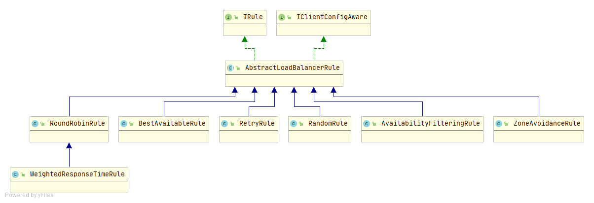
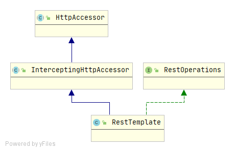

## 服务调用—Ribbon负载均衡

### Ribbon简介

Spring Cloud Ribbon是基于Netflix Ribbon实现的一套**客户端负-负载均衡**的工具。其主要功能时提供客户端的软件负载均衡算法和服务调用。Ribbon客户端组件提供一系列完善的配置项，如：连接超时、重试等。

**Ribbon目前也进入了维护，基本上是不准备更新了。**

### 负载均衡(LB)分类

#### 本地负载均衡

也叫进程内负载均衡，将LB逻辑集成到消费方，消费方从服务注册中心获知哪些地址可用，然后自己再从这些地址中选择出一个合适的服务器。Ribbon就属于进程内LB，它只是一个类库，集成与消费方进程。

#### 服务器端负载均衡

也叫做集中式负载均衡，即在服务消费方和服务提供方之间使用独立的LB设施（可以是硬件，如F5，也可以是软件，如Nginx），由该设施负责把访问请求通过某种策略转发至服务的提供方。

### Ribbon和Rest使用

**引入Ribbon：**

```xml
<dependency>
    <groupId>org.springframework.cloud</groupId>
    <artifactId>spring-cloud-starter-netflix-ribbon</artifactId>
</dependency>
```

如果引入了spring-cloud-starter-netflix-eureka-client会自动引入spring-cloud-starter-netflix-ribbon，


**注入RestTemplate：**

```java
@Bean
@LoadBalanced
public RestTemplate restTemplate(){
    return new RestTemplate();
}
```

需要添加@LoadBalanced注解，使用restTemplate请求时才能实现负载均衡，请求地址需要改为服务名，如下：

```java
@RestController
public class UserController {

    static String USER_SERVICE = "http://CLOUD-PROVIDER-USER";
    @Autowired
    RestTemplate restTemplate;

    @GetMapping(value = "/user/list")
    public String findList() {
        return restTemplate.getForObject(USER_SERVICE + "/user/list", String.class);
    }
}
```

### 实现原理

Ribbon实现的关键点是为Ribbon定制的RestTemplate，Ribbon利用了RestTemplate的拦截器机制，在拦截器中实现Ribbon的负载均衡。负载均衡的基本实现就是通过applicationName从服务注册中心获取可用的服务地址列表，然后通过一定的算法实现计算，决定使用哪一个服务地址进行Http调用。

#### Ribbon常用负载均衡算法

Ribbon使用的负载均衡算法其具体的实现都是实现了IRule接口，IRule接口共有7个实现类。



具体介绍如下：


需要强调的是默认的负载均衡策略是：ZoneAvoidanceRule

**修改默认的算法：**

+ 在非@ComponentScan扫描的路径下定义一个配置类，通过@Bean的方式指定一种策略

  ```java
  @Configuration
  public class MyRule {
      @Bean
      public IRule myselfRule(){
          return new RoundRobinRule();
      }
  }
  ```

+ 启动类上添加@RibbonClient注解

  ```java
  @RibbonClient(name = "CLOUD-PROVIDER-USER",configuration = MyRule.class)
  ```

#### Ribbon的RestTemplate

RestTemplate结构如下：



+ RestOperations是一个接口，申明了Http请求的常用方法

+ InterceptingHttpAccessor官方的说明是：

  > RestTemplate和其他HTTP访问网关帮助程序的基类，向HttpAccessor的公共属性中添加拦截器相关的属性。
  >
  > 不打算直接使用。有关入口点，请参阅RestTemplate。

InterceptingHttpAccessor中有一个属性是`List<ClientHttpRequestInterceptor> interceptors`,如果interceptors里面的拦截器数据不为空，在RestTemplate进行http请求时，这个请求就会被拦截器拦截。在Ribbon中定义了一个LoadBalancerInterceptor,实现了ClientHttpRequestInterceptor接口，ribbon就是通过这个拦截器进行拦截请求，然后实现负载均衡调用。

**LoadBalancerInterceptor如何注入并生效的：**

拦截器定义在org.springframework.cloud.client.loadbalancer.LoadBalancerAutoConfiguration.LoadBalancerInterceptorConfig#ribbonInterceptor

```java
@Configuration(proxyBeanMethods = false)
@ConditionalOnMissingClass("org.springframework.retry.support.RetryTemplate")
static class LoadBalancerInterceptorConfig {

     //定义ribbon的拦截器，添加到Spring容器中
   @Bean
   public LoadBalancerInterceptor loadBalancerInterceptor(
         LoadBalancerClient loadBalancerClient,
         LoadBalancerRequestFactory requestFactory) {
      return new LoadBalancerInterceptor(loadBalancerClient, requestFactory);
   }

   //定义注入器，用来将拦截器注入到RestTemplate中，跟上面配套使用
   @Bean
   @ConditionalOnMissingBean
   public RestTemplateCustomizer restTemplateCustomizer(
         final LoadBalancerInterceptor loadBalancerInterceptor) {
      return restTemplate -> {
         List<ClientHttpRequestInterceptor> list = new ArrayList<>(
               restTemplate.getInterceptors());
         list.add(loadBalancerInterceptor);
         restTemplate.setInterceptors(list);
      };
   }

}
```

**ribbon中的拦截器注入到RestTemplate：**

在org.springframework.cloud.client.loadbalancer.LoadBalancerAutoConfiguration#loadBalancedRestTemplateInitializerDeprecated方法里面，进行注入，代码如下：

```java
@Configuration(proxyBeanMethods = false)
@ConditionalOnClass(RestTemplate.class)
@ConditionalOnBean(LoadBalancerClient.class)
@EnableConfigurationProperties(LoadBalancerRetryProperties.class)
public class LoadBalancerAutoConfiguration {

   @LoadBalanced
   @Autowired(required = false)
   private List<RestTemplate> restTemplates = Collections.emptyList();

   @Autowired(required = false)
   private List<LoadBalancerRequestTransformer> transformers = Collections.emptyList();

   @Bean
   public SmartInitializingSingleton loadBalancedRestTemplateInitializerDeprecated(
         final ObjectProvider<List<RestTemplateCustomizer>> restTemplateCustomizers) {
       // 遍历context中的注入器，调用注入方法。
       return () -> restTemplateCustomizers.ifAvailable(customizers -> {
         for (RestTemplate restTemplate : LoadBalancerAutoConfiguration.this.restTemplates) {
            for (RestTemplateCustomizer customizer : customizers) {
               customizer.customize(restTemplate);
            }
         }
      });
   }
    // ................
}
```

遍历context中的注入器，调用注入方法，为目标RestTemplate注入拦截器，注入器和拦截器都是我们定义好的。

还有关键的一点是：需要注入拦截器的目标restTemplates到底是哪一些？因为RestTemplate实例在context中可能存在多个，不可能所有的都注入拦截器，这里就是@LoadBalanced注解发挥作用的时候了。

**LoadBalancerInterceptor源码如下：**

```java
import java.io.IOException;
import java.net.URI;

import org.springframework.http.HttpRequest;
import org.springframework.http.client.ClientHttpRequestExecution;
import org.springframework.http.client.ClientHttpRequestInterceptor;
import org.springframework.http.client.ClientHttpResponse;
import org.springframework.util.Assert;

/**
 * @author Spencer Gibb
 * @author Dave Syer
 * @author Ryan Baxter
 * @author William Tran
 */
public class LoadBalancerInterceptor implements ClientHttpRequestInterceptor {

   private LoadBalancerClient loadBalancer;

   private LoadBalancerRequestFactory requestFactory;

   public LoadBalancerInterceptor(LoadBalancerClient loadBalancer,
         LoadBalancerRequestFactory requestFactory) {
      this.loadBalancer = loadBalancer;
      this.requestFactory = requestFactory;
   }

   public LoadBalancerInterceptor(LoadBalancerClient loadBalancer) {
      // for backwards compatibility
      this(loadBalancer, new LoadBalancerRequestFactory(loadBalancer));
   }

   @Override
   public ClientHttpResponse intercept(final HttpRequest request, final byte[] body,
         final ClientHttpRequestExecution execution) throws IOException {
      final URI originalUri = request.getURI();
      String serviceName = originalUri.getHost();
      Assert.state(serviceName != null,
            "Request URI does not contain a valid hostname: " + originalUri);
      return this.loadBalancer.execute(serviceName,
            this.requestFactory.createRequest(request, body, execution));
   }

}
```

**拦截请求执行流程：**

对于LoadBalancerInterceptor的intercept方法在我们通过RestTemplate发起请求的过程中何时被调用的，其实ClientHttpRequestInterceptor的intercept方法的调用是通过InterceptingClientHttpRequest类来支持的。

**创建InterceptingClientHttpRequest对象：**

+ RestTemplate中的doExecute方法调用createRequest创建InterceptingClientHttpRequest


+ 调用InterceptingClientHttpRequest的构造方法，将拦截器`List<ClientHttpRequestInterceptor> interceptors`的集合传入


+ InterceptingClientHttpRequest的构造方法如下：

  ```java
  protected InterceptingClientHttpRequest(ClientHttpRequestFactory requestFactory,
        List<ClientHttpRequestInterceptor> interceptors, URI uri, HttpMethod method) {
  
     this.requestFactory = requestFactory;
     this.interceptors = interceptors;
     this.method = method;
     this.uri = uri;
  }
  ```

**调用LoadBalancerInterceptor的intercept方法：**

+ 在RestTemplate的doExecute方法中会调用上面创建的InterceptingClientHttpRequest对象的execute方法，如下：


+ 在InterceptingClientHttpRequest_execute方法中会通过this.iterator迭代器最终执行nextInterceptor拦截器的intercept方法


+ 在intercept方法中通过loadBalancer调用了RibbonLoadBalancerClient的execute方法


其具体方法代码如下：

```java
public <T> T execute(String serviceId, LoadBalancerRequest<T> request, Object hint)
      throws IOException {
    // 拿到负载均衡算法的实现类
   ILoadBalancer loadBalancer = getLoadBalancer(serviceId);
    // 通过算法获取
   Server server = getServer(loadBalancer, hint);
   if (server == null) {
      throw new IllegalStateException("No instances available for " + serviceId);
   }
   RibbonServer ribbonServer = new RibbonServer(serviceId, server,
         isSecure(server, serviceId),
         serverIntrospector(serviceId).getMetadata(server));

   return execute(serviceId, ribbonServer, request);
}
```

+ 对于负载均衡服务器的获取只要实现是`getServer(loadBalancer, hint)`方法服务调用—Ribbon负载均衡

```java
protected Server getServer(ILoadBalancer loadBalancer, Object hint) {
   if (loadBalancer == null) {
      return null;
   }
   // Use 'default' on a null hint, or just pass it on?
   // 调用具体负载均衡算法的chooseServer方法
   return loadBalancer.chooseServer(hint != null ? hint : "default");
}
```

到这一步过后就是调用具体的负载均衡算法了，Ribbon的整个流程就算梳理完成了。