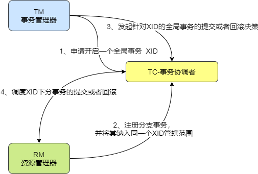

# Seata

## 简介

Seata是一款开源的分布式事务解决方案，致力于在微服务架构下提供高性能和简单易用的分布式事务服务

## 1+3 术语

一：

+ 全局事务ID—XID

三：

+ TC - 事务协调者

  维护全局和分支事务的状态，驱动全局事务提交或回滚

+ TM - 事务管理器，事务发起者

  定义全局事务的范围：开始全局事务，提交或回滚全局事务，也是一种RM

+ RM - 资源管理器，每个事务参与的微服务

  管理分支事务处理的资源，与TC交谈以注册分支事务和报告分支事务的状态，并驱动分支事务的提交或回滚

三者直接流程如下：

## Seata支持的事务模式

### AT

AT是一个类似于两阶段提交的，但是又于2PC有所不同，不同的地方在于，AT第一阶段会提交事务，会释放连接资源，通过记录回滚日志文件的方式来处理执行不成功需要回滚的场景。

AT的前提是：

基于支持本地ACID事务的关系型数据库，同时必须是java应用，通过JDBC访问数据库

两阶段提交过程：

+ 一阶段：业务数据和回滚日志记录在同一个本地事务中提交，释放本地锁和连接资源
+ 二阶段：异步提交，非常快地完成，回滚通过一阶段的回滚日志进行反向补偿

### TCC

### SAGA

### XA

