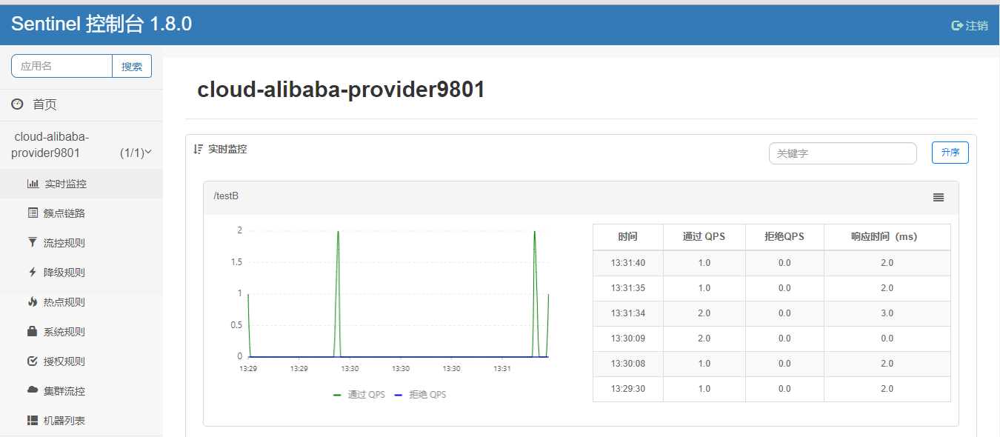
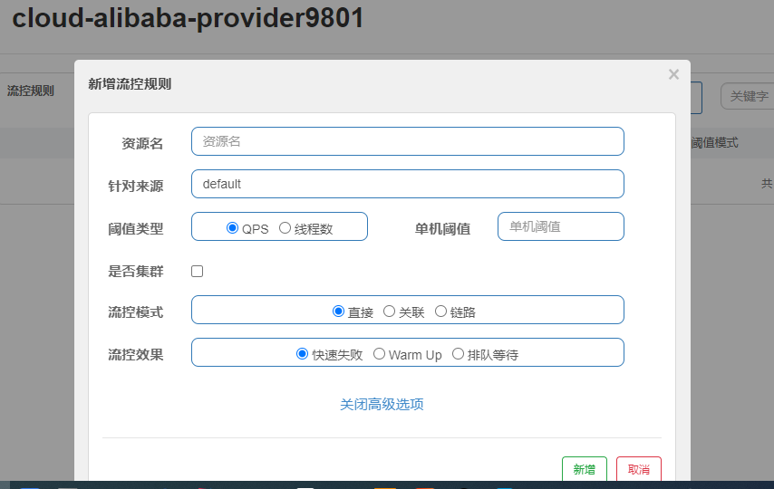
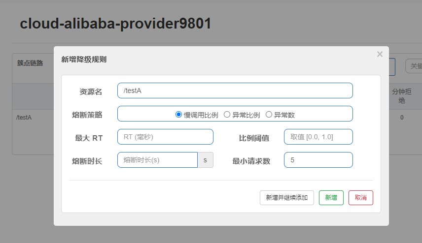

# Sentinel入门简介

项目地址：https://github.com/alibaba/Sentinel

中文文档地址：https://github.com/alibaba/Sentinel/wiki/%E4%BB%8B%E7%BB%8D

>  面向云原生微服务的高可用流控防护组件；Sentinel 以流量为切入点，从流量控制、熔断降级、系统负载保护等多个维度保护服务的稳定性。

## Hystrix的不足

+ 需要程序员自己手工搭建监控平台
+ 没有一套Web管理界面给我们进行更加细粒度化的配置流量控制、速率控制、服务熔断、服务降级等

## Sentinel的优点

+ 单独一个组件，可以独立出来
+ 直接界面化的细粒度统一配置

## Sentinel组成

+ 核心库-java客户端

  不依赖任何框架/库，能够运行于所有java运行时环境，同时堆Dubbo/Spring Cloud等框架有较好的支持。

+ 控制台-Dashboard

  基于SpringBoot开发，打包后可以直接运行，不需要额外的Tomcat等应用容器

  下载地址：https://github.com/alibaba/Sentinel/releases

  java -jar sentinel-dashboard-1.8.0.jar

## Sentinel使用

### 初步使用

+ 引入jar

  ```xml
  <dependency>
      <groupId>com.alibaba.cloud</groupId>
      <artifactId>spring-cloud-starter-alibaba-sentinel</artifactId>
  </dependency>
  <!-- sentinel持久化工具 -->
  <dependency>
      <groupId>com.alibaba.csp</groupId>
      <artifactId>sentinel-datasource-nacos</artifactId>
  </dependency>
  ```

+ 添加配置

  ```yaml
  spring:
    application:
      name: cloud-alibaba-provider9801
    cloud:
      sentinel:
        transport:
          dashboard: 192.168.211.128:8080
          port: 8719
  management:
    endpoints:
      web:
        exposure:
          include: *
  ```

+ 测试限流的controller

  ```java
  import org.springframework.web.bind.annotation.GetMapping;
  import org.springframework.web.bind.annotation.RestController;
  
  @RestController
  public class FlowLimitController {
      @GetMapping("/testA")
      public String testA(){
          return "--------------restA";
      }
      @GetMapping("/testB")
      public String testB(){
          return "--------------restB";
      }
  }
  ```

+ 启动项目，查看监控情况

  

  Sentinel是懒加载的，需要先请求接口，才会注册到Sentinel控制台

### 流量控制

> flow control：
>
> 其原理是监控应用流量的 QPS 或并发线程数等指标，当达到指定的阈值时对流量进行控制，以避免被瞬时的流量高峰冲垮，从而保障应用的高可用性。

配置限流规则：



+ 资源名（resource）：唯一名称，默认请求路径
+ 针对来源：Sentinel可以针对调用者进行限流，填写微服务名，默认default（不区分来源）
+ 阈值类型（grade）/单机阈值
  + QPS，每秒钟的请求数量，当调用该API的QPS达到阈值的时候，进行限流
  + 并发线程数：调用该API的线程数，达到阈值的时候进行限流
+ 流控模式：
  + 直接：Api达到限流条件时，直接限流
  + 关联：当关联的资源达到阈值时，就限流自己
  + 链路：只记录指定链路上的流量（指定资源从入口资源进来的流量，如果达到阈值，就进行限流）
+ 流控效果：
  + 快速失败：直接失败，抛异常
  
    > 抛出异常：Blocked by Sentinel (flow limiting)
  
  + Warm Up：根据code Factor（冷加载因子，默认3）的值，从阈值/codeFactor，经过预热时长，才达到设置的QPS阈值，适用于系统访问量突然飙高的场景
  
  + 排队等待：匀速排队，让请求匀速通过，阈值类型必须设置为QPS，否则无效
  
    > 匀速排队模式暂时不支持 QPS > 1000 的场景。

### 熔断降级

> 对调用链路中不稳定的资源进行熔断降级也是保障高可用的重要措施之一。1.8.0 版本对熔断降级特性进行了全新的改进升级，请使用最新版本以更好地利用熔断降级的能力。

官网地址：

https://github.com/alibaba/Sentinel/wiki/%E7%86%94%E6%96%AD%E9%99%8D%E7%BA%A7

#### 熔断策略

+ 慢调比列（SLOW_REQUEST_RATIO）

  单位时间内请求数目大于设置的最小数目，并且慢调用比列达到阈值

+ 异常比列(`ERROR_RATIO`)

  单位时间内请求数目大于设置的最小数目，并且异常比列达到阈值

+ 异常数（ERROR_COUNT）

  单位统计时长内的异常数目超过阈值之后会自动进行熔断

以上情况，经过熔断时长后熔断器会进入探测恢复状态（HALF-OPEN 状态），若接下来的一个请求在规定时间内成功完成（没有错误）则结束熔断，否则会再次被熔断

注意：

> 异常降级**仅针对业务异常**，对 Sentinel 限流降级本身的异常（`BlockException`）不生效

#### 降级规则



参数说明：

+ 资源名（resource）

  规则的作用对象，唯一值

+ 熔断策略（grade）

  支持慢调用比例、异常比例、异常数策略，默认是慢调用比例

+ 比例阈值

  慢调用比例模式下，该值为慢调用阈值，超过该值就记为慢调优

  异常比列/异常数模式下，该值为对应的异常阈值

+ 熔断时长(timeWindow)

  熔断时长，单位为S

+ 最小请求数（minRequestAmount）

  请求数小于该值时即使异常比率超出阈值也不会熔断（1.7.0引入），默认值为5

+ 最大RT

  最大响应时间，只对慢调用比例有效

### 热点参数限流


### 系统自适应限流

> Sentinel 系统自适应限流从整体维度对应用入口流量进行控制，结合应用的 Load、CPU 使用率、总体平均 RT、入口 QPS 和并发线程数等几个维度的监控指标，通过自适应的流控策略，让系统的入口流量和系统的负载达到一个平衡，让系统尽可能跑在最大吞吐量的同时保证系统整体的稳定性。

目的：

- 保证系统不被拖垮
- 在系统稳定的前提下，保持系统的吞吐量

系统保护规则是应用整体维度的，而不是资源维度的，并且**仅对入口流量生效**。入口流量指的是进入应用的流量（`EntryType.IN`），比如 Web 服务或 Dubbo 服务端接收的请求，都属于入口流量。

系统规则支持的模式：

+ Load 自适应
+ CPU usage
+ 平均RT
+ 并发线程数
+ 入口QPS

### @SentinelResource


