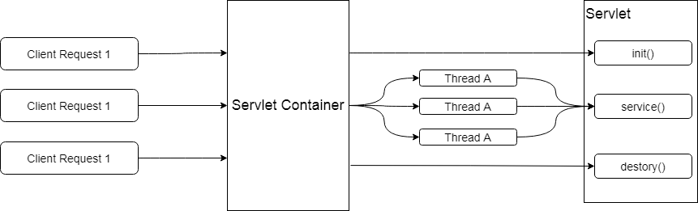

# SpringCloudGateway

## 简介

Gateway是在Spring生态系统之上构建的API网关服务，基于Spring5、Spring Boot2.x和Spring Reactor、Spring Webflux等技术。Gateway的宗旨是提供一种简单而有效的方式来对API进行路由，以及提供一些强大的过滤器功能，例如：熔断、限流、重试等等。

### 底层原理

使用的是Webflux中的reactor-netty响应式编程组件，底层使用了Netty通讯框架

### 功能

+ 反向代理
+ 鉴权
+ 流量控制
+ 熔断
+ 日志监控
+ 。。。。。

### 为什么选择Gateway？

+ Zuul2.0一直跳票

+ Gateway的特性：

  <span style="color:red">基于Spring5、Spring Boot2.x和Spring Reactor、Spring Webflux等技术</span>

  动态路由：能够匹配任何请求属性，可以对路由指定Predicate(断言)、Filter（过滤器），集成Hystrix断路器功能，请求限流、支持路径重写，，支持长连接易于使用等

+ 底层原理区别

  + Zuul 1.x

    <span style="color:red">基于Servlet 2.5，使用的是阻塞架构，不支持长连接</span>；采用的是Tomcat容器，使用的是传统的Servlet IO处理模型，当请求进入servlet container时，servlet container就会为其绑定一个线程，结构如下：

    

  + Spring Cloud GateWay

    <span style="color:red">非阻塞架构</span>，支持WebSocket长连接，与Spring紧密集成拥有更好的开发体验

### 三大核心概念

+ Route-路由

  路由是构建网关的基本模块，由ID，目标URI，和一些列的断言、过滤器组成，如果断言为true，则匹配该路由。

+ Predicate-断言

  参考的是java8的java.util.function.Predicate，开发人员可以匹配HTTP请求中的所有内容，如果请求与断言匹配，则进行路由。

+ Filtere-过滤

  指的是Spring框架中GatewayFilter的实例，使用过滤器，可以在请求被路由之前或者之后对请求进行修改

### Gateway工作流程

核心逻辑：路由转发+执行过滤器链


客户端想Spring Cloud Gateway发送请求，然后在Gateway Handler Mapping中找到与请求相匹配的路由，将其发送到Gateway Web Handler。

Web Handler再通过指定的过滤器来将请求发送到我们实际的服务，执行业务逻辑，然后返回。

Filter在“pre”类型的过滤器可以做参数校验、权限校验、流量监控、日志输出、协议转换等。

在“post”类型的过滤器中可以做响应内容，响应头的修改，日志的输出，流量监控等。

## 入门教程

>  cloud-Gateway

## Gateway实现灰度发布

```yaml
routes:
- id: payment1 #路由的ID，没有固定规则但要求唯一，建议配合服务名
  # uri: http://localhost:8001   #匹配后提供服务的路由地址
  uri: lb://CLOUD-PROVIDER-PAYMENT
  predicates:
    - Path=/payment/**
    - Weight=group1, 8
  filters:
    - StripPrefix=1
- id: payment1 #路由的ID，没有固定规则但要求唯一，建议配合服务名
    # uri: http://localhost:8001   #匹配后提供服务的路由地址
    uri: lb://CLOUD-PROVIDER-PAYMENT_new
    predicates:
      - Path=/payment/**
      - Weight=group1, 2
    filters:
      - StripPrefix=1
```

整体思想就是：同一个path映射到不同的uri（服务名）上，并设置相应的权重，同一个服务名下的多个应用同样使用默认的Ribbon进行负载均衡

## Gateway限流

SpringCloud Gateway提供了RequestRateLimiterGatewayFilterFactory这个类，来<font color=red>实现了基于redis+lua的令牌桶算法的限流模式</font>。

pom文件：

```xml
<dependency>
    <groupId>org.springframework.cloud</groupId>
    <artifactId>spring-cloud-starter-gateway</artifactId>
</dependency>

<dependency>
    <groupId>org.springframework.boot</groupId>
    <artifatId>spring-boot-starter-data-redis-reactive</artifactId>
</dependency>
```

配置：

```yaml
routes:
- id: payment1 #路由的ID，没有固定规则但要求唯一，建议配合服务名
  uri: lb://CLOUD-PROVIDER-PAYMENT
  predicates:
    - Path=/payment/**
    - Weight=group1, 8
  filters:
    - StripPrefix=1
    - name: RequestRateLimiter
      args:
        key-resolver: '#{@hostAddrKeyResolver}'
        redis-rate-limiter.replenishRate: 1
        redis-rate-limiter.burstCapacity: 3
```

- burstCapacity，令牌桶总容量。
- replenishRate，令牌桶每秒填充平均速率。
- key-resolver，用于限流的键的解析器的 Bean 对象的名字。它使用 SpEL 表达式根据#{@beanName}从 Spring 容器中获取 Bean 对象。

```java
public class HostAddrKeyResolver implements KeyResolver {

    @Override
    public Mono<String> resolve(ServerWebExchange exchange) {
        return Mono.just(exchange.getRequest().getRemoteAddress().getAddress().getHostAddress());
    }

}

 	@Bean
    public HostAddrKeyResolver hostAddrKeyResolver() {
        return new HostAddrKeyResolver();
    }
}
```

或者

```java
@Bean
KeyResolver userKeyResolver() {
    return exchange ->Mono
        .just(exchange.getRequest().getQueryParams().getFirst("user"));
}
```

配置中的#{@}其实是读取Spring容器中的bean的

