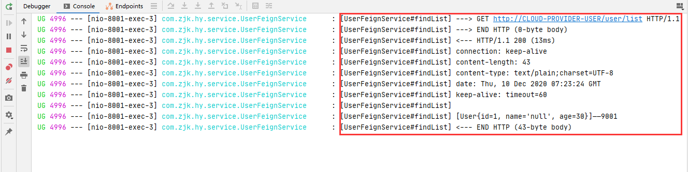
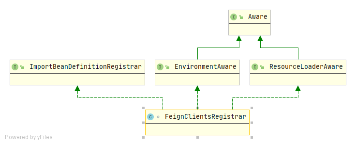

## openfeign服务调用

Feign是一个声明式的web服务客户端，让编写web服务客户端变得非常容易，只需创建一个接口并在接口上添加注解即可。

### 如何使用openfeign

**1.导入相关jar：**

```xml
<dependency>
    <groupId>org.springframework.cloud</groupId>
    <artifactId>spring-cloud-starter-openfeign</artifactId>
</dependency>
```

**2.主启动类上添加@EnableFeignClients注解**

**3.定义接口并添加相关注解**

```java
@FeignClient(value = "CLOUD-PROVIDER-USER")
public interface UserFeignService {
    @GetMapping(value = "/user/list")
    String findList();
}
```

**4.通过定义好的接口调用服务**

```java
@RestController
public class UserController {
    @Autowired
    UserFeignService userFeignService;

    @GetMapping(value = "/feign/user/list")
    public String findListByFeign() {
        return userFeignService.findList();
    }
}
```

**5.定义超时时间**

OpenFeign默认等待一秒钟，超过后报错。可通过如下配置进行设置：

```yaml
ribbon:
  ReadTimeout:  5000
  ConnectTimeout: 5000
```

**6.打印feign调用日志**

添加配置类，指定日志级别：

```java
import feign.Logger;
import org.springframework.context.annotation.Bean;
import org.springframework.context.annotation.Configuration;

@Configuration
public class FeignLoggerLevelConfig {
    @Bean
    Logger.Level feignLoggerLevel() {
        return Logger.Level.FULL;
    }
}
```

配置文件中添加配置：

```yaml
logging:
  level:
    com.zjk.hy.service.UserFeignService: debug
```

日志结果输出如下：



## OpenFeign源码分析

### 注册FeignClient

此处源码分析需要有Spring源码的基础知识，关于Spring相关的源码不做详细分析

#### EnableFeignClients注解

```java
@Retention(RetentionPolicy.RUNTIME)
@Target(ElementType.TYPE)
@Documented
@Import(FeignClientsRegistrar.class)
public @interface EnableFeignClients
```

@EnableFeignClients的作用是开启Feign功能，主要逻辑实在FeignClientsRegistrar类中实现的，该类所做的事情，简单概括起来就是将feign相关的类封装为BeanDefinition，并注册到Spring中。

#### FeignClientsRegistrar源码

首先看下FeignClientsRegistrar的类继承关系，如下图：



由上图可以知道，FeignClientsRegistrar实现了三个接口，ImportBeanDefinitionRegistrar、EnvironmentAware、ResourceLoaderAware，对Aware接口的了解，我们知道实现EnvironmentAware是为了导入Environment，实现ResourceLoaderAware是为了导入ResourceLoader，具体的功能在于ImportBeanDefinitionRegistrar的实现。

#### ImportBeanDefinitionRegistrar的实现

```java
@Override
public void registerBeanDefinitions(AnnotationMetadata metadata,
      BeanDefinitionRegistry registry) {
   registerDefaultConfiguration(metadata, registry);
   registerFeignClients(metadata, registry);
}
```

整个注册Feign的BeanDefinition就是从此处开始的，下面简单说下Spring是怎么调用该方法的。

在Spring容器启动的过程中，执行Bean的后置处理器时（invokeBeanFactoryPostProcessors方法），会先执行BeanDefinitionRegistry的后置处理器，而Spring中默认导入了ConfigurationClassPostProcessor类，该类的postProcessBeanDefinitionRegistry()方法会被调用，在该方法中对@Import注解进行了处理，当导入的是一个ImportBeanDefinitionRegistrar实现类时，会调用其registerBeanDefinitions()方法，这就是怎么调到FeignClientsRegistrar中的registerBeanDefinitions()方法的流程的。

下面具体分析registerBeanDefinitions方法中做了什么。

#### registerDefaultConfiguration方法

该方法的作用是处理在@EnableFeignClients注解中配置的defaultConfiguration参数，将configuration封装成一个FeignClientSpecification然后注册BeanDefinition，源码如下：

```java
private void registerDefaultConfiguration(AnnotationMetadata metadata,
      BeanDefinitionRegistry registry) {
   // 加载元数据
   Map<String, Object> defaultAttrs = metadata
         .getAnnotationAttributes(EnableFeignClients.class.getName(), true);
	// 判断是否加了defaultConfiguration参数
   if (defaultAttrs != null && defaultAttrs.containsKey("defaultConfiguration")) {
      String name;
      if (metadata.hasEnclosingClass()) {
         name = "default." + metadata.getEnclosingClassName();
      }
      else {
         name = "default." + metadata.getClassName();
      }
       // 如果配了就将其注册为BeanDefinition
      registerClientConfiguration(registry, name,
            defaultAttrs.get("defaultConfiguration"));
   }
}
```

```java
private void registerClientConfiguration(BeanDefinitionRegistry registry, Object name,
      Object configuration) {
    // 将configuration封装成一个FeignClientSpecification然后注册BeanDefinition
   BeanDefinitionBuilder builder = BeanDefinitionBuilder
         .genericBeanDefinition(FeignClientSpecification.class);
   builder.addConstructorArgValue(name);
   builder.addConstructorArgValue(configuration);
   registry.registerBeanDefinition(
         name + "." + FeignClientSpecification.class.getSimpleName(),
         builder.getBeanDefinition());
}
```

#### registerFeignClients方法

```java
public void registerFeignClients(AnnotationMetadata metadata,
      BeanDefinitionRegistry registry) {

   LinkedHashSet<BeanDefinition> candidateComponents = new LinkedHashSet<>();
   Map<String, Object> attrs = metadata
         .getAnnotationAttributes(EnableFeignClients.class.getName());
   AnnotationTypeFilter annotationTypeFilter = new AnnotationTypeFilter(
         FeignClient.class);
   final Class<?>[] clients = attrs == null ? null
         : (Class<?>[]) attrs.get("clients");
   if (clients == null || clients.length == 0) {
       // 扫描base package目录下添加有@FeignClient注解接口和类
       // 并将扫描到的添加到candidateComponents集合中
      ClassPathScanningCandidateComponentProvider scanner = getScanner();
      scanner.setResourceLoader(this.resourceLoader);
      scanner.addIncludeFilter(new AnnotationTypeFilter(FeignClient.class));
      Set<String> basePackages = getBasePackages(metadata);
      for (String basePackage : basePackages) {
         candidateComponents.addAll(scanner.findCandidateComponents(basePackage));
      }
   }
   else {
      for (Class<?> clazz : clients) {
          // 如果设置了clients属性的值，将其封装为AnnotatedGenericBeanDefinition
          // 并添加到candidateComponents集合中
         candidateComponents.add(new AnnotatedGenericBeanDefinition(clazz));
      }
   }

    // 遍历candidateComponents集合
   for (BeanDefinition candidateComponent : candidateComponents) {
      if (candidateComponent instanceof AnnotatedBeanDefinition) {
         // verify annotated class is an interface
         AnnotatedBeanDefinition beanDefinition = (AnnotatedBeanDefinition) candidateComponent;
         AnnotationMetadata annotationMetadata = beanDefinition.getMetadata();
          // 判断是不是类，是类就抛出异常
         Assert.isTrue(annotationMetadata.isInterface(),
               "@FeignClient can only be specified on an interface");

         Map<String, Object> attributes = annotationMetadata
               .getAnnotationAttributes(FeignClient.class.getCanonicalName());

         String name = getClientName(attributes);
          // 注册（装载一个类型为FeignClientSpecification的BeanDefinition）
         registerClientConfiguration(registry, name,
               attributes.get("configuration"));
		// 注册（装载一个类型为FeignClientFactoryBean的BeanDefinition）
         registerFeignClient(registry, annotationMetadata, attributes);
      }
   }
}
```

#### 总结

到此，FeignClient装载成BeanDefinition就算完成了，主要有一下几个关键点：

+ 如果配置了defaultConfiguration，会将其装载成一个FeignClientSpecification的BeanDefinition
+ 扫描package下面所有添加了@FeignClient的接口，添加到candidateComponents集合中
+ 如果设置了clients，将其添加到candidateComponents集合中
+ 遍历candidateComponents集合，每一个candidateComponent都是一个AnnotatedBeanDefinition
+ 通过元数据获取其参数
+ 从参数中找到configuration，将其装载成一个FeignClientSpecification的BeanDefinition
+ 通过元数据annotationMetadata，装载一个类型为FeignClientFactoryBean的BeanDefinition，这个应该是用于创建feignclient的

### openFeign的自动配置

在openfeign-core包下找到spring.factories，其配置如下：

```properties
org.springframework.boot.autoconfigure.EnableAutoConfiguration=\
org.springframework.cloud.openfeign.ribbon.FeignRibbonClientAutoConfiguration,\
org.springframework.cloud.openfeign.hateoas.FeignHalAutoConfiguration,\
org.springframework.cloud.openfeign.FeignAutoConfiguration,\
org.springframework.cloud.openfeign.encoding.FeignAcceptGzipEncodingAutoConfiguration,\
org.springframework.cloud.openfeign.encoding.FeignContentGzipEncodingAutoConfiguration,\
org.springframework.cloud.openfeign.loadbalancer.FeignLoadBalancerAutoConfiguration
```

这儿我们主要关注`FeignAutoConfiguration`中，实例化FeignContext的地方：

```java
@Bean
public FeignContext feignContext() {
   FeignContext context = new FeignContext();
   context.setConfigurations(this.configurations);
   return context;
}
```

FeignContext是创建feign的工厂类，为每一个客户端创建一个ApplicationContext容器，FeignContext继承自NamedContextFactory。

NamedContextFactory的作用是创建一组子上下文（子容器），该子上下文（子容器）允许使用一组规范在每个子上下文（子容器）中定义Bean。该类是从 spring-cloud-netflix中的FeignClientFactory和SpringClientFactory移植过来的。

在NamedContextFactory中有两个属性与上面注册FeignClient有关，如下：

```java
private Map<String, AnnotationConfigApplicationContext> contexts = new ConcurrentHashMap<>();

private Map<String, C> configurations = new ConcurrentHashMap<>();
```

contexts: key为@FeignClient的name属性，value为对应的一个Spring子容器

configurations有两种值：

1. key为default.+启动类的全路径类名，value为@EnableFeignClients注解的defaultConfiguration属性的值
2. key为@FeignClient的name属性的值，value值为@FeignClient的configuration属性的值


==================================

目前来看Spring源码理解的还是有些不足，在这儿进行得比较难，就先放一下了。

