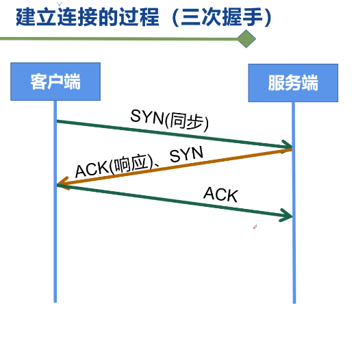

OSI 7层参考模型

应用层，表示层，会话层、传输层、网络层（IP协议）、链路层、物理层

TCP/IP

应用层、传输层，网络层、链路层、物理层

TCP协议：

传输层，面向连接的，可靠的,基于字节流的传输层通信协议

面向连接：三次握手，双方开启资源

三次握手：

+ c->S 发送syn
+ S->C发送syn+ack
+ C->S发送ack

发出去后，接到对方确认，都有一次确认的过程

socket套接字：

ip+port  ip+port

四次分手（断开连接）：

+ C->S：fin
+ S->C：ack
+ S->C：fin
+ C->S：ack

为什么连接是三次握手，断开是四次握手，因为连接时syn和ack合并了，这个时候什么都不做，可以合并，断开连接的ack和fin没法合并，需要服务端处理完成过后才能发送fin

IP协议可能遇到的问题：

+ 封包损坏
+ 丢包
+ 重发
+ 乱序

网络层需要解决的3个问题：

+ 延迟
+ 吞吐量
+ 丢包率

IP协议工作原理：

IPv4有4个8位，共32位，只支持43亿设备，不够用

IPv6有8个16位共128位

+ 分片
+ 增加协议头
+ 延迟、吞吐量、丢包率
+ 寻址
+ 路由

HTTP：

超文本传输协议，一种无状态的，以请求/应答方式运行的协议

+ 起始行
+ 头部字段集合
+ 空行
+ 消息正文

http请求过程：

HTTP层：

摘要算法：

MD5，sha1

对称加密算法：

加密和解密使用的是相同的秘钥，AES，异或

非对称加密算法：

使用公钥加密，使用私钥解密RSA

HTTPS流程：

