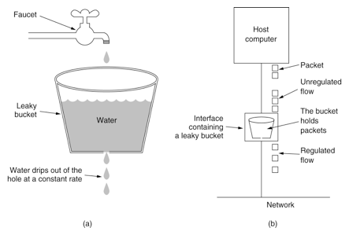
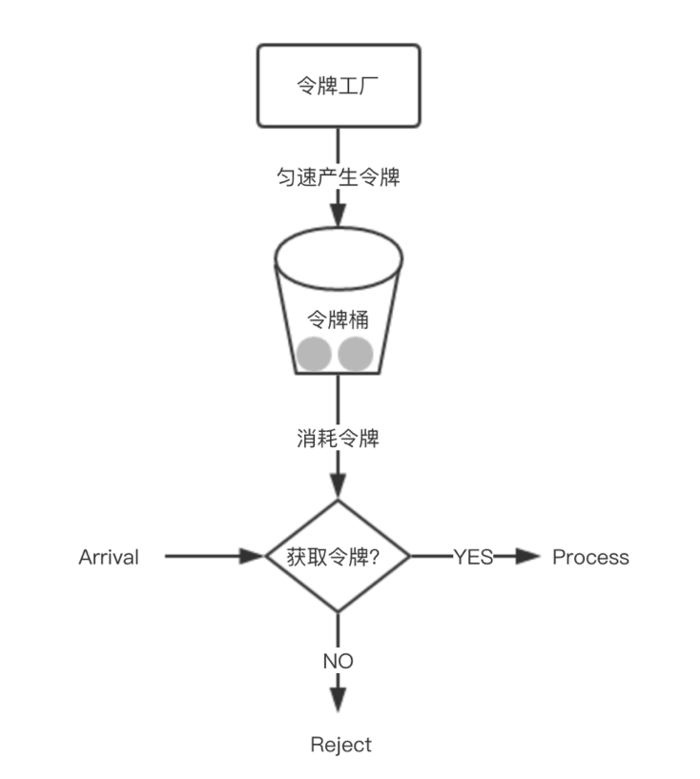

+ 计数器算法

  每来一个请求，计数器就+1，达到限流最大值后，以后的请求都会被拒绝，突刺现象

+ 漏桶算法

  

  通过一个容器存放接受到的请求，容器中的请求通过一定的速度匀速的通过，保证后端服务不会被打垮，

  能够解决突刺现象，但是当容器满了过后，多余的请求会被丢弃掉

+ 令牌桶算法

  

  从某种意义上讲，令牌桶算法是对漏桶算法的一种改进，桶算法能够限制请求调用的速率，而令牌桶算法能够在限制调用的平均速率的同时还允许一定程度的突发调用。在令牌桶算法中，存在一个桶，用来存放固定数量的令牌。算法中存在一种机制，以一定的速率往桶中放令牌。每次请求调用需要先获取令牌，只有拿到令牌，才有机会继续执行，否则选择选择等待可用的令牌、或者直接拒绝。

  实现思路：可以准备一个队列，用来保存令牌，另外通过一个线程池定期生成令牌放到队列中，每来一个请求，就从队列中获取一个令牌，并继续执行

