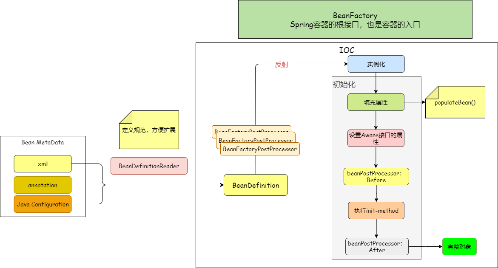

1. Spring框架的优势

   + 生态圈庞大，领域广，其它框架易于集成
   + 低侵入式设计，代码污染低
   + 解耦
   + 高度开发性，可以自由选择使用的组件

2. IOC、DI是什么

   IOC：控制反转，以前我们使用一个对象都是主动去new的，使用Spring的话，是由Spring容器去创建

   ID：依赖注入，当我们需要使用一个对象时，从Spring容器中，动态注入（将对象引用赋值给申明对象）

3. 描述Spring容器的初始化过程

   

   简单划分的话可以分为三个步骤：

   + 资源定位，加载相应的配置文件等（xml、annotation、java Configuration）
   + BeanDefinition载入
   + 通过BeanDefinition实例化Bean对象，并缓存到Spring容器中（SingletonObjects，一个Map，spring默认单列）

4. BeanFactory和FactoryBean的区别

   BeanFactory：Spring Bean容器的根接口，是一个Factory，在Spring中所有的Bean都是由BeanFactory(也就是IOC容器)来进行管理的，提供了实例化对象和获取对象的功能。

   FactoryBean：是一个Bean，是一个能生产或者修饰对象生成的工厂Bean,它的实现与设计模式中的工厂模式和修饰器模式类似。

5. BeanFactory和ApplicationContext的区别

   + ApplicationContext继承于BeanFactory(ApplicationContext继承ListableBeanFactory），

   + BeanFactory提供基本的IOC和DI功能，
   + ApplicationContext提供高级功能，BeanFactory可用于测试和非生产使用，但ApplicationContext是功能更丰富的容器实现，应该优于BeanFactory

6. Spring Bean的生命周期

   + 实例化Bean
   + 设置对象属性（依赖注入）
   + 处理Aware接口
   + 执行Bean的后置处理器（BeanPostProcessor.postProcessBeforeInitialization）
   + 初始化bean（InitializingBean），调用设置的初始化方法（init-method）
   + 执行Bean的后置处理器（BeanPostProcessor.postProcessAfterInitialization）
   + 清理对象（DisposableBean）
   + 销毁对象（destroy-method）

7. Spring AOP的实现原理

   Spring AOP使用的动态代理，有两种方式：

   + JDK动态代：通过反射来接收被代理的类，并且要求被代理的类必须实现一个接口。JDK动态代理的核心是InvocationHandler接口和Proxy类
   + CGLIB动态代理：GLIB是通过继承的方式做的动态代理

8. Spring AOP实现方式

   源码分析

9. Spring是如何管理事务的

   Spring事务管理主要包括3个接口，主要由PlatformTransactionManager、TransactionDefinition、TransactionStatus三个接口完成

   + PlatformTransactionManager：事务管理器-主要用于平台相关事务的管理，主要有三个方法：

     + commit 提交事务
     + rollback 回滚事务
     + getTransaction 获取事务状态

   + TransactionDefinition 定义事务相关的属性，给事务管理器使用

     + getIsolationLevel：获取隔离级别；
     + getPropagationBehavior：获取传播行为；
     + getTimeout：获取超时时间；
     + isReadOnly：是否只读（保存、更新、删除时属性变为false--可读写，查询时为true--只读）

     事务管理器能够根据这个返回值进行优化，这些事务的配置信息，都可以通过配置文件进行配置。

   + TransactionStatus：事务具体运行状态--事务管理过程中，每个时间点事务的状态信息。

     - hasSavepoint()：返回这个事务内部是否包含一个保存点，
     - isCompleted()：返回该事务是否已完成，也就是说，是否已经提交或回滚
     - isNewTransaction()：判断当前事务是否是一个新事务

   **声明式事务的优缺点**：

   - **优点**：不需要在业务逻辑代码中编写事务相关代码，只需要在配置文件配置或使用注解（@Transaction），这种方式没有侵入性。
   - **缺点**：声明式事务的最细粒度作用于方法上，如果像代码块也有事务需求，只能变通下，将代码块变为方法。

10. Spring事务的传播行为

    | 传播属性         | 描述                                                         |
    | ---------------- | ------------------------------------------------------------ |
    | REQUIRED(默认值) | 如果当前没有事务，就创建一个事务，如果当前存在事务，就加入该事务 |
    | SUPPORTS         | 如果当前存在事务就加入该事务，如果当前不存在事务，就以非事务方式运行 |
    | MANDATORY        | 当前事务存在，就加入，如果不存在事务就抛出异常               |
    | REQUIRES_NEW     | 必须开启新事务                                               |
    | NOT_SUPPORTED    | 当前的方法不应该运行在事务中，如果有运行的事务，将它挂起     |
    | NEVER            | 当前的方法不应该运行在事务中，如果当前存在事务，就抛出异常   |
    | NESTED           | 如果有事务在运行，当前的方法就应该在这个事务的嵌套事务内运行，否则，就启动一个新的事务，并在它自己的事务内运行。 |

11. Spring中使用了哪些设计模式

    + 代理模式—在AOP中使用比较多
    + 单列模式—Spring Bean默认为单列模式
    + 模板方法—用来解决代码重复问题，eg：RestTemplate、JmsTempla、JDBCTemplate
    + 工厂模式—BeanFactory，用来创建对象的实例
    + 适配器—Spring AOP
    + 装饰器—Spring Data HashMapper
    + 观察者—Spring事件驱动模型
    + 回调—Spring Aware回调接口

12. Spring如何解决循环依赖

    见同级目录下的文件

13. Spring Bean的作用域

    + singleton：默认值，容器中每个类只有一个实例
    + prototype：每次使用都创建一个实例
    + request：每次网络请求创建一个实例
    + session：同一个session中，使用一个实例

14. Spring框架中有哪些不同类型的事件

    + 上下文更新事件（ContextRefreshedEvent）：在调用ConfigurableApplicationContext 接口中的refresh()方法时被触发。
    + 上下文开始事件（ContextStartedEvent）：当容器调用ConfigurableApplicationContext的Start()方法开始/重新开始容器时触发该事件。
    + 上下文停止事件（ContextStoppedEvent）：当容器调用ConfigurableApplicationContext的Stop()方法停止容器时触发该事件。
    + 上下文关闭事件（ContextClosedEvent）：当ApplicationContext被关闭时触发该事件。容器被关闭时，其管理的所有单例Bean都被销毁。
    + 请求处理事件（RequestHandledEvent）：在Web应用中，当一个http请求（request）结束触发该事件。

15. Spring有哪些通知类型

    +  前置通知
    + 正常返回后通知
    + 抛出异常通知
    + 后置通知（不论正常或者异常）
    + 环绕通知

16. Spring的自动装配

    自动装配类型：

    + NO
    + byName
    + byType
    + constructor
    + autodetect：自动探测，如果有构造方法，通过construct的方式自动装配，否则使用byType

