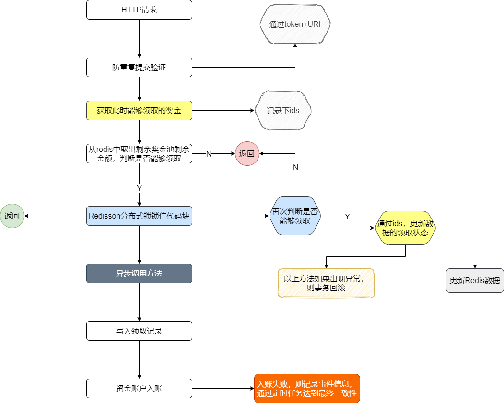

以上流程总结下来就一下几点：

+ 防重复提交判断，确定这个接口一定时间内一个token只能有一个请求进来
+ 确定领取的金额，并判断能否领取
+ 分布式锁锁定，更新领取状态，更新余额
+ 异步调用，写入领取记录和资金账户余额
+ 定时任务保证数据最终一直性

以上流程其实并不能支撑太高的并发，并且在一定情况下有可能会造成一定的数据不一直问题：

+ 确定此处领取金额，是从数据库查询的，
+ 更新领取状态时，也操作了数据库，并且还是在分布式锁中
+ 如果大量请求进来，锁住的代码块只能一个线程执行，其他线程全部等待，对系统的资源和性能开销大
+ 异步调用方法中，如果插入事件信息时报错，就会造成数据不一致性

