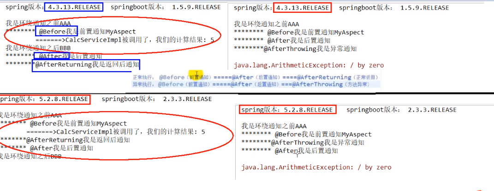

1. redis 

   + 单进程、单线程、单实例，并发大量请求的情况下如何变得很快
   
     linux内核（kernel）与redis之间的交互是通过epoll（IO多路复用）
   
     每个连接内的命令是顺序达到的
   
   + 击穿
   
     前置条件高并发情况下，redis做缓存，key有过期时间或被淘汰（LRU、LFU），过期后，请求该数据时，需要查询数据库，
   
     解决办法：阻止并发达到DB，因为redis是单进程单实例的，如果发现没有数据，就通过setnx()获得一把锁，获取锁的去访问DB,其他的阻塞
   
     解决方案存在的问题：
   
     + 获得锁的线程可能挂了（设置锁的过期时间）
     + 没挂，但是锁超时了，单开一个线程监控，刷新锁超时时间
   
   + 穿透
   
     用户请求查询的数据是数据库不存在的，缓存和数据库都没有数据
   
     解决方案：
   
     布隆过滤器，客户端包含过滤算法，或者bitmap在redis中或者redis集成布隆，布隆过滤器存在的问题是只能新增不能删除
   
   + 雪崩
   
     类似击穿，大量的key同时失效，间接造成大量访问到达DB
   
     解决方案：
   
     + 随机过期时间
     + 强依赖击穿解决方案
     + 业务系统在失效时间做系统延时
   
   + 分布式锁
   
     redis中使用setnx，过期时间，多线程去维护过期时间，redisson
   
     zookeeper做分布式锁

2. volatile:
   Java提供的轻量级同步机制。保证可见性，不支持原子性，禁止指令重排序；需要谈到JMM java内存模型  主内存 工作内存；对于指令重排序可以谈到单列模式，双重检索，需要加volatile

3. CAS:
   比较并交换，自旋+unsafe操作系统原语，存在的问题，自旋时间长消耗CPU资源，ABA问题和解决办法

4. 如何处理bug:
   故障现象，导致原因，解决方案，优化建议

5. 线程安全的list,set,map:
   Verctor,collections,copyonwritearrarylist

6. 锁:
   公平锁，非公平锁，可重入锁，自旋锁，独占锁（写锁)，共享锁（读锁），互斥锁

7. 队列:

8. 线程交替打印A1B2C3

   + sync+wait+notify
   
     wait和notify必须在同步代码块或同步方法中，必须成对使用
   
     必须先wait，然后notify
   
   + lock+await+ signal
   
     await和signal必须与lock配合使用
   
     必须先await，然后signal
   
   + blockQueue
   
9. LockSupport

   park等待-阻塞，unpart唤醒线程

   底层调用的是UNSAFE，permit默认是0，所以是开始调用park时会阻塞，直到其他线程将permit设置为1，park的线程会被唤醒

   可以直接使用不需要与锁配合，可以先unpark，然后park，此时的park相当于啥也没干

   为什么唤醒两次后阻塞两次，最终结果还是线程阻塞？

   因为凭证（permit）的数量最多为1，连续调用两次unpark和调用一次unpark的作用相同，只会产生一个凭证，而调用两次park需要消耗两个凭证，证不够，不能放行

10. AQS

    构建锁和其他同步器的基石，通过内置的FIFO队列来完成资源获取线程的排队工作，并通过一个int类型变量表示持有锁的状态

    锁的状态通过cas、自旋、locksupport来维护

    state状态+CLH双端队列

    聚合队列同步类 （AQS的实现类）

11. AOP

    从spring4到spring5发生的变化？

    + Spring4正常情况：环绕通知之前->before->业务方法->环绕通知之后->after->afterReturning返回后通知

    + Spring4异常情况：环绕通知之前->before->业务方法->after->afterThrowing异常通知

      正常顺序和异常顺序的区别在于没有环绕通知之后的阶段

    + Spring5正常情况：环绕通知前->before->业务方法->afterReturning->after后置通知->环绕通知之后

    + Spring5异常情况：环绕通知前->before->业务方法->afterThrowing->after后置通知

      正常情况和异常情况的区别在于没有环绕通知之后的代码调用

      

      

