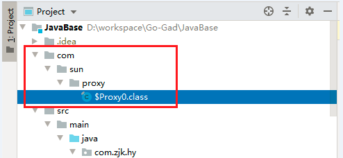

# JDK动态代理

## e.g.

下面简单的记录下一个JDK动态代理的demo，其他的不多说

### 定义一个接口

```java
public interface ProxyService {
   void print(String msg);
}
```

### 定义一个默认实现

```java
public class DefaultProxyServiceImpl implements ProxyService {
    @Override
    public void print(String msg) {
        System.out.println("DefaultProxyService输出内容："+msg);
    }
}
```

### 实现InvocationHandler

```java
class ProxyServiceInvocationHandler implements InvocationHandler {
    private Object target;

    public ProxyServiceInvocationHandler(Object target) {
        this.target = target;
    }

    @Override
    public Object invoke(Object proxy, Method method, Object[] args) throws Throwable {
        System.out.println("==========JDK动态代理打印日志=========");
        method.invoke(target,args);
        System.out.println("==========JDK动态代理打印日志输出完毕=========");
        return null;
    }
}
```

### 编写测试方法

```java
import java.lang.reflect.InvocationHandler;
import java.lang.reflect.Method;
import java.lang.reflect.Proxy;

public class ProxyServiceTest {
    public static void main(String[] args) {
        System.getProperties().put("sun.misc.ProxyGenerator.saveGeneratedFiles", "true");
        ProxyService instance = (ProxyService) Proxy.newProxyInstance(
            ProxyServiceTest.class.getClassLoader(),
                new Class[]{ProxyService.class},
                new ProxyServiceInvocationHandler(new DefaultProxyServiceImpl()));
        instance.print("瞎几把搞");
    }
}
```

### 输出结果如下

```java
Connected to the target VM, address: '127.0.0.1:51907', transport: 'socket'
==========JDK动态代理打印日志=========
DefaultProxyService输出内容：瞎几把搞
==========JDK动态代理打印日志输出完毕=========
```

## 解释如何调用invoke

通过输出的代理对象的class文件，分析是如何调用到ProxyServiceInvocationHandler.invoke方法的，加上如下代码：` System.getProperties().put("sun.misc.ProxyGenerator.saveGeneratedFiles", "true");`的意思是输出代理对象的class文件，如下：



$Proxy0.class文件具体内容如下：

```java
package com.sun.proxy;

import com.zjk.hy.se.proxy.ProxyService;
import java.lang.reflect.InvocationHandler;
import java.lang.reflect.Method;
import java.lang.reflect.Proxy;
import java.lang.reflect.UndeclaredThrowableException;

public final class $Proxy0 extends Proxy implements ProxyService {
    private static Method m1;
    private static Method m2;
    private static Method m0;
    private static Method m3;

    public $Proxy0(InvocationHandler var1) throws  {
        super(var1);
    }

    public final void print(String var1) throws  {
        try {
            super.h.invoke(this, m3, new Object[]{var1});
        } catch (RuntimeException | Error var3) {
            throw var3;
        } catch (Throwable var4) {
            throw new UndeclaredThrowableException(var4);
        }
    }

    static {
        try {
            m1 = Class.forName("java.lang.Object").getMethod("equals", Class.forName("java.lang.Object"));
            m2 = Class.forName("java.lang.Object").getMethod("toString");
            m0 = Class.forName("java.lang.Object").getMethod("hashCode");
            m3 = Class.forName("com.zjk.hy.se.proxy.ProxyService").getMethod("print", Class.forName("java.lang.String"));
        } catch (NoSuchMethodException var2) {
            throw new NoSuchMethodError(var2.getMessage());
        } catch (ClassNotFoundException var3) {
            throw new NoClassDefFoundError(var3.getMessage());
        }
    }
}
```

### 构造方法

以上代码省略掉了部分重写的Object的方法，我们可以看到，通过构造方法传入了一个InvocationHandler，并调用父类的构造方法，如下：

```java
public $Proxy0(InvocationHandler var1) throws  {
    super(var1);
}
```

父类的构造方法如下：

```java
protected Proxy(InvocationHandler h) {
    Objects.requireNonNull(h);
    this.h = h;
}
```

将传入的InvocationHandler赋值给了一个h变量，

```java
protected InvocationHandler h;
```

### 被代理的方法-print

```java
public final void print(String var1) throws  {
    try {
        super.h.invoke(this, m3, new Object[]{var1});
    } catch (RuntimeException | Error var3) {
        throw var3;
    } catch (Throwable var4) {
        throw new UndeclaredThrowableException(var4);
    }
}
```

这个方法很简单就是调用了h（我们传入的InvocationHandler，即ProxyServiceInvocationHandler）的invoke方法，

整个流程就是这样的。

## 为什么目标对象要实现接口

**因为java是单继承的**

我们从代理对象的class文件中能够看出，代理对象继承了Proxy类，就没办法在继承其他的类了

```java
class $Proxy0 extends Proxy implements ProxyService
```

