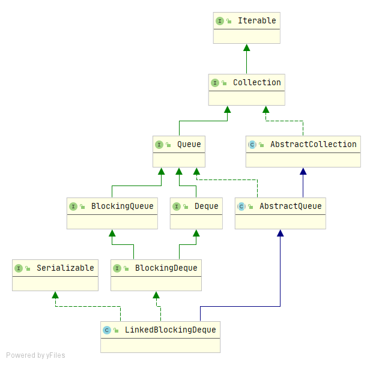
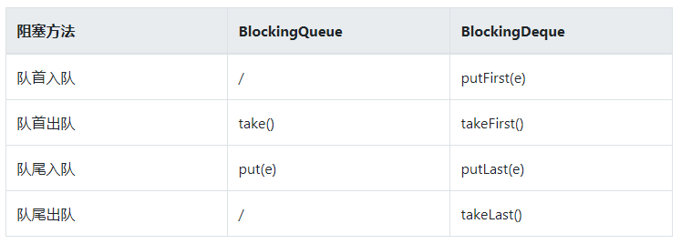

## LinkedBlockingDeque深入理解

### 简介

LinkedBlockingDeque是一种底层基于**双向链表**实现的**双端阻塞队列**，是一种**近似有界**的队列，可以在初始构造时就指定队列的容量，也可以不指定，如果不指定，那么它的容量大小默认为`Integer.MAX_VALUE`。JDK1.6引入的。

**继承结构：**



由上图可以看出，LinkedBlockingDeque实现了`BlockingDeque`接口，BlockingDeque接口继承自`BlockingQueue`和`Deque`，可以想象得出LinkedBlockingDeque一定是一个阻塞的双端队列。

### BlockingDeque接口

BlockingDeque是JUC在JDK1.6提供的一种阻塞的双端队列接口，相对于BlockingQueue其最大的特点就是增加了在**队首入队**和**队尾出队**的阻塞方法，两个接口对比如下：



### 实现原理

**核心参数：**

```java
/**
  * 头结点
  * Invariant: (first == null && last == null) ||
  *            (first.prev == null && first.item != null)
  */
transient Node<E> first;

/**
 * 尾结点
 * Invariant: (first == null && last == null) ||
 *            (last.next == null && last.item != null)
 */
transient Node<E> last;

/** 队列中元素个数 */
private transient int count;

/** 队列容量 */
private final int capacity;

/** 全局锁 */
final ReentrantLock lock = new ReentrantLock();

/** 出队线程等待队列 */
private final Condition notEmpty = lock.newCondition();

/** 入队线程等待队列 */
private final Condition notFull = lock.newCondition();
```

**Node结点：**

```java
// 双向链表结点
static final class Node<E> {
    /**
     * 结点元素，null表示该结点已经移除
     */
    E item;

    /**
     * 前驱结点指针，One of:
     * - the real predecessor Node
     * - this Node, meaning the predecessor is tail
     * - null, meaning there is no predecessor
     */
    Node<E> prev;

    /**
     * 后驱结点指针，One of:
     * - the real successor Node
     * - this Node, meaning the successor is head
     * - null, meaning there is no successor
     */
    Node<E> next;

    Node(E x) {
        item = x;
    }
}
```

**构造器：**

```java
// 默认构造器
public LinkedBlockingDeque() {
    this(Integer.MAX_VALUE);
}
```

```java
// 指定参数构造器
public LinkedBlockingDeque(int capacity) {
    if (capacity <= 0) throw new IllegalArgumentException();
    this.capacity = capacity;
}
```

```java
// 通过已有集合构造
public LinkedBlockingDeque(Collection<? extends E> c) {
    this(Integer.MAX_VALUE);
    final ReentrantLock lock = this.lock;
    lock.lock(); // Never contended, but necessary for visibility
    try {
        for (E e : c) {
            if (e == null) // 不允许null元素
                throw new NullPointerException();
            if (!linkLast(new Node<E>(e)))
                throw new IllegalStateException("Deque full");
        }
    } finally {
        lock.unlock();
    }
}
```

**LinkedBlockingDeque特点如下：**

+ 如果不指定容量，则构造一个容量为`Integer.MAX_VALUE`的队列，等价于无界队列
+ 底层通过`ReentrantLock`全局锁来保证整个队列的入队/出队在并发环境下的线程安全
+ 底层的双向链表是通过Node结点对象实现的

### 方法摘要

**入队：**

```java
// 队尾插入元素，插入成功返回true，队列满了抛出异常
public boolean add(E e);
// 同add，add调用了addLast
public void addLast(E e);
```

```java
// 队首插入元素，队列满了抛出异常
public void addFirst(E e);
// 同上
public void push(E e);
```

```java
// 在队尾插入，插入成功返回true，队列满了返回false
public boolean offer(E e);
// 在队尾插入，插入成功返回true，插入失败等待指定的时间
public boolean offer(E e, long timeout, TimeUnit unit);
// 同offer
public boolean offerLast(E e);
public boolean offerLast(E e, long timeout, TimeUnit unit);
```

```java
// 在队首插入，插入成功返回true，队列满了返回false
public boolean offerFirst(E e);
// 在队首插入，插入成功返回true，插入失败等待指定的时间
public boolean offerFirst(E e, long timeout, TimeUnit unit)
```

```java
// 在队尾插入元素，如果队列满了阻塞等待
public void put(E e) throws InterruptedException;
// 同上
public void putLast(E e) throws InterruptedException;
// 在队首插入，如果队列满了阻塞等待
public void putFirst(E e) throws InterruptedException;
```

**出队：**

```java
// 检索队首元素，但不删除，没有元素抛出异常
public E element();
// 同 element，element调用了getFirst
public E getFirst();
```

```java
// 检索队尾元素，但不删除，没有元素抛出异常
public E getLast();
```

```java
// 检索队首元素，但不删除，没有元素返回null
public E peek();
// 同上
public E peekFirst();
```

```java
// 检索队尾元素，但不删除，没有元素返回null
public E peekLast();
```

```java
// 检索并删除队首元素，如果队列为空，返回null
public E poll();
// 同上
public E pollFirst();
// 检索并删除队首元素，如果队列为空，等待指定的时间
public E poll(long timeout, TimeUnit unit);
```

```java
// 检索并删除队尾元素,如果队列为空，返回null
public E pollLast();
// 检索并删除队尾元素，如果队列为空，等待指定的时间
public E pollLast(long timeout, TimeUnit unit);
```

```java
// 弹出一个元素，如果队列为空抛出异常
public E pop();
// 同上
public E remove();
// 同上
public E removeFirst();
// 从队首开始遍历，删除指定的元素，删除成功返回true，元素不存在返回false
public boolean remove(Object o);
// 同上
public boolean removeFirstOccurrence(Object o);
```

```java
// 删除队尾元素，如果队列为空抛出异常
public E removeLast();
// 从队尾开始遍历，删除指定的元素，删除成功返回true，元素不存在返回false
public boolean removeLastOccurrence(Object o);
```

```java
// 弹出队首元素，如果队列为空则等待
public E take() throws InterruptedException;
// 同上
public E takeFirst() throws InterruptedException;
// 弹出队尾元素，如果队列为空则等待
public E takeLast() throws InterruptedException;
```

方法很多，但是都很类似，简单看了下源码，都很好理解，这儿就不再做具体的源码分析。