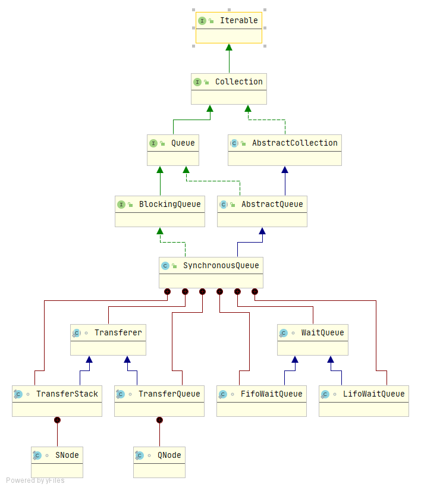

## SynchronousQueue深入理解

SynchronousQueue是一种底层基于**队列**或**栈**实现的，实现了BlockingQueue接口的特殊的阻塞队列，没有容量，用于两个线程间进行数据交换，有如下特点：

+ 队列没有容量，不存储元素，也无法遍历
+ 入队线程和出队线程必须一一匹配，任意先到达的线程会阻塞，反之亦然
+ SynchronousQueue支持公平/非公平两种模式，其中非公平模式内部数据结构采用“栈”实现，公平模式内部数据结构采用“队列”实现
+ SynchronousQueue基于[Nonblocking Concurrent Data Structures with Condition Synchronization](https://www.cs.rochester.edu/research/synchronization/pseudocode/duals.html)无锁算法实现

**继承结构：**



如上图所示，如果我们不看SynchronousQueue的内部类的话，整个SynchronousQueue的结构还是很简单的，与前面介绍的几种BlockingQueue相似，都实现了BlockingQueue接口。

对于SynchronousQueue的公平与非公平模式是通过Transferer接口实现的，TransferStack实现了非公共策略—“栈”，TransferQueue实现了公平策略—“队列”。

### 实现原理

**构造方法：**

```java
// 默认构造器，使用非公平策略
public SynchronousQueue() {
    this(false);
}
```

```java
// 指定策略的构造器
public SynchronousQueue(boolean fair) {
    transferer = fair ? new TransferQueue<E>() : new TransferStack<E>();
}
```

公平策略下创建了一个TransferQueue，非公平策略下创建了一个TransferStack，这两个类都继承自Transferer类，并且分别实现了他的`transfer`方法。SynchronousQueue中的所有方法，其实都是委托调用了TransferQueue/TransferStack的`transfer`方法。

**Transferer：**

```java
abstract static class Transferer<E> {
    /**
     * 执行put或者take方法
     *
     * @param e 非null，表示 生产者->消费者;
     *          null，表示消费者->生产者
     * @param timed if this operation should timeout
     * @param nanos the timeout, in nanoseconds
     * @return 非null，表示传递的数据，null表示传递数据失败（或者超时）
     */
    abstract E transfer(E e, boolean timed, long nanos);
}
```

### 示例

使用SynchronousQueue实现两个线程交替输出：

```java
import java.util.Arrays;
import java.util.List;
import java.util.concurrent.SynchronousQueue;

public class SynchronizedQueueTest {
    public static void main(String[] args) {
        final SynchronousQueue<String> queue = new SynchronousQueue<>();
        new Thread(()->{
            for (int i = 0; i < 5; i++) {
                try {
                    System.out.println(Thread.currentThread().getName()+"-"+queue.take());
                    queue.put(""+(i+1));
                } catch (InterruptedException e) {
                    e.printStackTrace();
                }
            }
        },"t1").start();

        new Thread(()->{
            List<String> list = Arrays.asList("a", "b", "c", "d", "e");
            for (int i = 0; i < list.size(); i++) {
                try {
                    queue.put(list.get(i));
                    System.out.println(Thread.currentThread().getName()+"-"+queue.take());
                } catch (InterruptedException e) {
                    e.printStackTrace();
                }
            }
        },"t2").start();
    }
}

```

