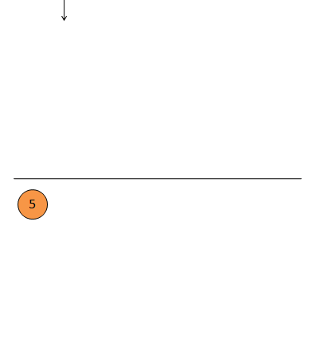
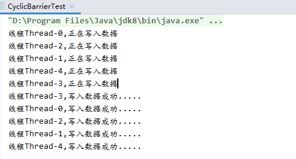

## CyclicBarrier

### 简介

CyclicBarrier是JUC提供的一个同步工具类，利用CyclicBarrier可以实现一组线程相互等待，当所有线程都到达屏障点后再继续后续的操作。



### eg:

```java
import java.util.concurrent.CyclicBarrier;

class Writer extends Thread {
    private CyclicBarrier cyclicBarrier;
    public Writer(CyclicBarrier cyclicBarrier){
        this.cyclicBarrier=cyclicBarrier;
    }
    @Override
    public void run() {
        System.out.println("线程" + Thread.currentThread().getName() + ",正在写入数据");
        try {
            cyclicBarrier.await();
        } catch (Exception e) {
        }
        System.out.println("线程" + Thread.currentThread().getName() + ",写入数据成功.....");
    }
}

public class CyclicBarrierTest {
    public static void main(String[] args) {
        CyclicBarrier cyclicBarrier=new CyclicBarrier(5);
        for (int i = 0; i < 5; i++) {
            Writer writer = new Writer(cyclicBarrier);
            writer.start();
        }
    }
}
```

运行结果：



### 常用接口


### 源码分析

#### 实现原理

CyclicBarrier是由ReentrantLock可重入锁和Condition共同实现的。


#### 构造函数

```java
public CyclicBarrier(int parties) {
    this(parties, null);
}

public CyclicBarrier(int parties, Runnable barrierAction) {
    if (parties <= 0) throw new IllegalArgumentException();
    // parties表示“必须同时到达barrier的线程个数”
    this.parties = parties;
    // count表示“处在等待状态的线程个数”
    this.count = parties;
    // barrierCommand表示“parties个线程到达barrier时，会执行的动作，会在所有等待线程被唤醒前执行”
    this.barrierCommand = barrierAction;
}
```

#### 等待

```java
// 非定时等待
public int await() throws InterruptedException, BrokenBarrierException {
    try {
        return dowait(false, 0L);
    } catch (TimeoutException toe) {
        throw new Error(toe); // cannot happen
    }
}

//定时等待
public int await(long timeout, TimeUnit unit) throws InterruptedException, 				                         BrokenBarrierException, TimeoutException {
    return dowait(true, unit.toNanos(timeout));
}

//等待核心方法
private int dowait(boolean timed, long nanos)
        throws InterruptedException, BrokenBarrierException,
               TimeoutException {
        final ReentrantLock lock = this.lock;
       	// 通过ReentrantLock加锁，进入同步
        lock.lock();
        try {
            final Generation g = generation;
            // 检查当前栅栏是否被打翻
            if (g.broken)
                throw new BrokenBarrierException();
 		   // 检查当前线程是否被中断
            if (Thread.interrupted()) {
                 // 1.打翻当前栅栏
                 // 2.唤醒拦截的所有线程
                 // 3.抛出中断异常
                breakBarrier();
                throw new InterruptedException();
            }
		    // 每次都将计数器的值减1
            int index = --count;
            // 计数器的值减为0则需唤醒所有线程并转换到下一代
            if (index == 0) {  // tripped
                boolean ranAction = false;
                try {
                    // 唤醒所有线程前先执行指定的任务
                    final Runnable command = barrierCommand;
                    if (command != null)
                        command.run();
                    ranAction = true;
                     //唤醒所有线程并转到下一代
                    nextGeneration();
                    return 0;
                } finally {
                    if (!ranAction)
                        //确保在任务未成功执行时能将所有线程唤醒
                        breakBarrier();
                }
            }

            // loop until tripped, broken, interrupted, or timed out
            // 如果计数器不为0则执行此循环
            for (;;) {
                try {
                    //根据传入的参数来决定是定时等待还是非定时等待
                    if (!timed)
                        trip.await();
                    else if (nanos > 0L)
                        nanos = trip.awaitNanos(nanos);
                } catch (InterruptedException ie) {
                    //若当前线程在等待期间被中断则打翻栅栏唤醒其他线程
                    if (g == generation && ! g.broken) {
                        breakBarrier();
                        throw ie;
                    } else {
                         //若在捕获中断异常前已经完成在栅栏上的等待, 
                  		//则直接调用中断操作
                        Thread.currentThread().interrupt();
                    }
                }
			   //如果线程因为打翻栅栏操作而被唤醒则抛出异常
                if (g.broken)
                    throw new BrokenBarrierException();
			   //如果线程因为换代操作而被唤醒则返回计数器的值
                if (g != generation)
                    return index;
  			   //如果线程因为时间到了而被唤醒则打翻栅栏并抛出异常
                if (timed && nanos <= 0L) {
                    breakBarrier();
                    throw new TimeoutException();
                }
            }
        } finally {
            lock.unlock();
        }
    }
```

#### 补充方法介绍

```java
//切换栅栏到下一代
private void nextGeneration() {
   //唤醒条件队列所有线程
   trip.signalAll();
   //设置计数器的值为需要拦截的线程数
   count = parties;
   //重新设置栅栏代次
   generation = new Generation();
}

//打翻当前栅栏
private void breakBarrier() {
   //将当前栅栏状态设置为打翻
   generation.broken = true;
   //设置计数器的值为需要拦截的线程数
   count = parties;
   //唤醒所有线程
   trip.signalAll();
}
```

