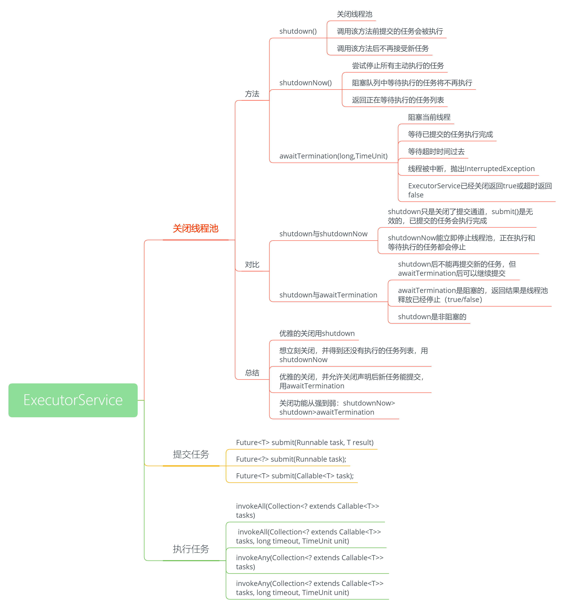
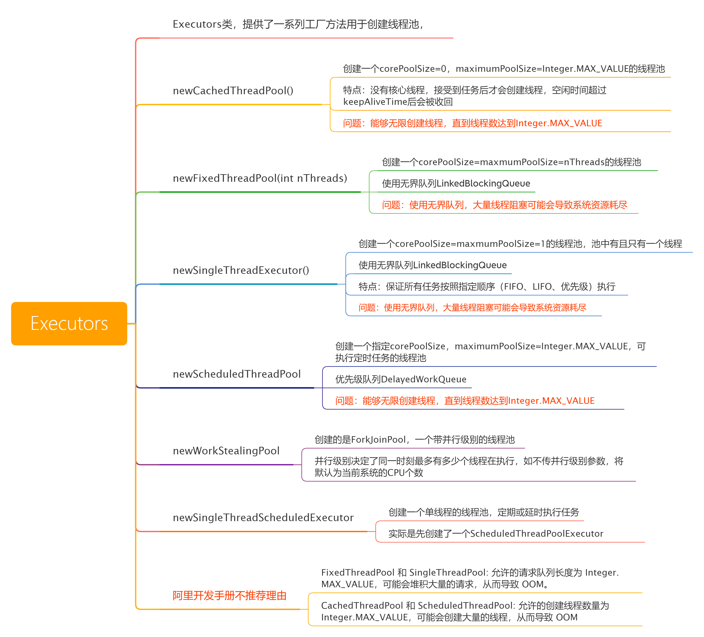
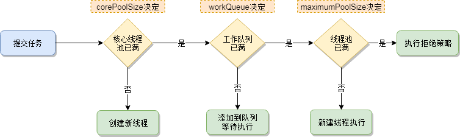
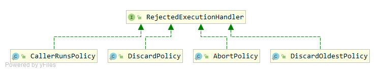
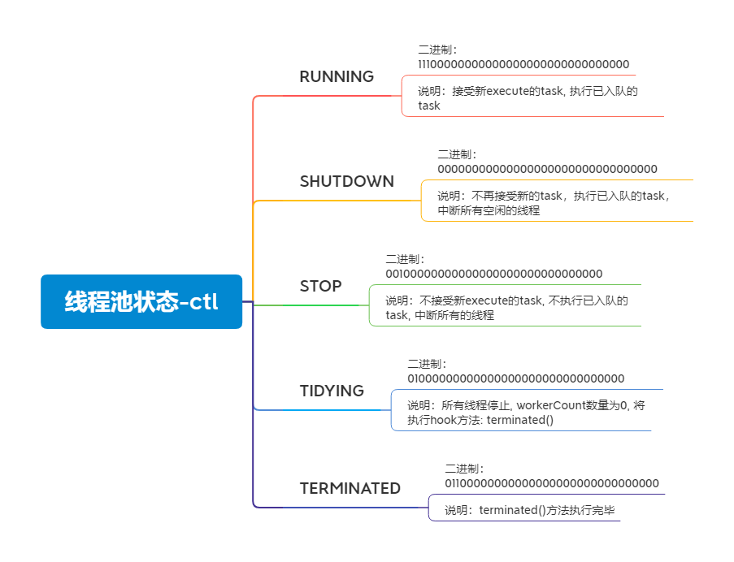
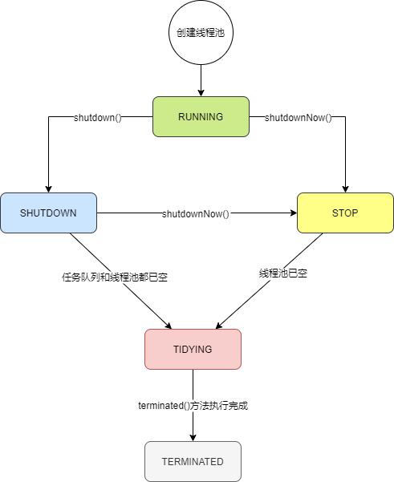
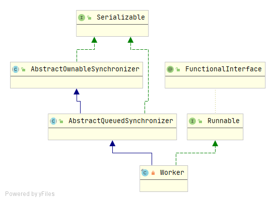

### 线程池简介

#### 优点：

+ **降低资源消耗**  通过重复利用已创建的线程降低线程创建、销毁所造成的消耗
+ **提高响应速度**  当任务到达时，任务可以不需要等待线程创建就能立即执行
+ **提高线程的可管理性**  使用线程池可以进行统一分配、调优、控制，（需要做到合理利用）

#### 线程池适用场合

+ 单个任务处理的时间比较短
+ 需要处理的任务数量大

#### 类结构


**Executor:**

```java
public interface Executor {
    void execute(Runnable command);
}
```

顶层接口，声明了一个方法`execute(Runnable command) `，该方法接受一个Runnable命令，在将来某个时间会执行该命令

**ExecutorService：**


ExecutorService接口继承自Executor，在Executor的基础上提供了一些方法用于线程池管理等，

如下：



**AbstractExecutorService:** 是一个抽象类，在ExecutorService的基础上对submit和invoke等方法有简单的实现

**ThreadPoolExecutor:** 线程池具体的实现

#### 创建线程池核心方法

```java
public ThreadPoolExecutor(int corePoolSize,
                          int maximumPoolSize,
                          long keepAliveTime,
                          TimeUnit unit,
                          BlockingQueue<Runnable> workQueue,
                          ThreadFactory threadFactory,
                          RejectedExecutionHandler handler) 
```

+ corePoolSize：核心线程数，线程池维护线程的最少数量 ；当有任务来之后，就会创建一个线程去执行任务，当线程池中的线程数目达到corePoolSize后，就会把到达的任务放到缓存队列当中 
+ maximumPoolSize：线程池最大线程数，它表示在线程池中最多能创建多少个线程
+ keepAliveTime： 表示线程没有任务执行时最多保持多久时间会终止 
+ unit：参数keepAliveTime的时间单位 
+ workQueue：线程池所使用的缓冲队列  
+ threadFactory：创建线程的工厂对象
+ handler：线程池对拒绝任务的处理策略 

#### 通过Executors 创建

+ Executors.newCachedThreadPool：创建一个可缓存的线程池，线程数可以无限大
+ Executors.newFixedThreadPool：创建一个定长线程池，可控制线程最大并发数，超出的线程会在队列中等待
+ Executors.newScheduledThreadPool：创建一个定时以及周期性任务执行
+ Executors.newSingleThreadExecutor：创建一个单线程的线程池，用唯一的线程来执行任务，保证所有任务按照指定顺序（FIFO、LIFO、优先级）执行
+ Executors.newSingleThreadScheduledExecutor：创建一个单线程的线程池，定期或延时执行任务
+ Executors.newWorkStealingPool：创建一个带并行级别的线程池，并行级别决定了同一时刻最多有多少个线程在执行，如不传并行级别参数，将默认为当前系统的CPU个数

 **不推荐使用这种方式创建线程池，摘自阿里巴巴开发手册：** 

> 【强制】线程池不允许使用 Executors 去创建，而是通过 ThreadPoolExecutor 的方式，这样 的处理方式让写的同学更加明确线程池的运行规则，规避资源耗尽的风险。 说明：Executors 返回的线程池对象的弊端如下： 1）FixedThreadPool 和 SingleThreadPool: 允许的请求队列长度为 Integer.MAX_VALUE，可能会堆积大量的请求，从而导致 OOM。 2）CachedThreadPool 和 ScheduledThreadPool: 允许的创建线程数量为 Integer.MAX_VALUE，可能会创建大量的线程，从而导致 OOM。

**以上内容整理如下：**



#### 线程池工作顺序

corePoolSize -> 任务队列 -> maximumPoolSize -> 拒绝策略 



#### 提交任务的方式


Runnable和Callable的区别：

+ 方法签名不同，`void Runnable.run()`, `V Callable.call() throws Exception` 
+ 是否允许有返回值，`Callable`允许有返回值 
+ 是否允许抛出异常，`Callable`允许抛出异常

#### 拒绝策略




+ AbortPolicy  抛出RejectedExecutionException 
+ DiscardPolicy  什么也不做，直接忽略
+ DiscardOldestPolicy 丢弃执行队列中最老的任务，尝试为当前提交的任务腾出位置 
+ CallerRunsPolicy  直接由提交任务者执行这个任务 
+ 自定义拒绝策略，实现RejectedExecutionHandler接口

### ThreadPoolExecutor简介

#### 线程池运行状态

```java
// 二进制前三位表示线程池状态，后29位表示线程池中有限的线程数量
private final AtomicInteger ctl = new AtomicInteger(ctlOf(RUNNING, 0));
// 有效线程数量的二进制位数
private static final int COUNT_BITS = Integer.SIZE - 3;
// 线程池线程容量(1 << 29)-1
private static final int CAPACITY   = (1 << COUNT_BITS) - 1;

// runState is stored in the high-order bits
private static final int RUNNING    = -1 << COUNT_BITS;
private static final int SHUTDOWN   =  0 << COUNT_BITS;
private static final int STOP       =  1 << COUNT_BITS;
private static final int TIDYING    =  2 << COUNT_BITS;
private static final int TERMINATED =  3 << COUNT_BITS;

// Packing and unpacking ctl
private static int runStateOf(int c)     { return c & ~CAPACITY; }
private static int workerCountOf(int c)  { return c & CAPACITY; }
private static int ctlOf(int rs, int wc) { return rs | wc; }
```

根据上面源码可知, `COUNT_BITS`的值为29, `CAPACITY`的值为2的29次方-1, 二进制表示为: "00011111111111111111111111111111"(明显29个1)，上面的源码中线程池的运行状态的二进制表示：



可以看出, 线程池的状态由整型变量ctl的二进制的**前三位**表示。

**为什么用一个值表示两个状态：**

ctl的前三位表示线程池的状态，后29位表示线程池中线程的数量，具体为什么这么设计，第一肯定是作者

经过测试出来的，第二是因为这两个量的修改都需要加锁。

**线程池状态转换流程：**



#### 其他部分重要变量

+ 任务队列

  ```java
  private final BlockingQueue<Runnable> workQueue;
  ```

  存储任务的阻塞队列，线程池初始化时指定

+ 线程池中的锁

  ```java
  private final ReentrantLock mainLock = new ReentrantLock();
  ```

  ReentrantLock, 在线程池的很多地方会被用到;

  比如要对**workers**(线程池中的线程集合)操作的时候(如添加一个worker到工作中), interrupt所有的 `workers`, 调用[shutdown](https://www.cnblogs.com/theRhyme/p/13056215.html#_lab2_5_5)方法等.

+ 线程集合

  ```java
  private final HashSet<Worker> workers = new HashSet<Worker>();
  ```

  用来保存当前线程池中的所有线程，可通过该集合对线程池中的线程进行**中断**, **遍历**等。创建新的线程时, 要添加到该集合, 移除线程, 也要从该集合中移除对应的线程，对该集合操作都需要`mainLock`锁。

+ Condition对象

  ```java
  private final Condition termination = mainLock.newCondition();
  ```

  主要是为了让tryTerminate方法与awaitTermination方法结合使用，而`tryTerminate`又被`shutdown`、`shutdownNow`、`processWorkerExit`等方法调用;

  Condition对象`termination`的作用就是当线程池中的状态表示的值小于**TERMINATED**的值3时, 当前调用了awaitTermination方法的线程就会wait对应的时间，等到过了指定的wait时间, 或者线程池状态等于或大于TERMINATED, wait的线程被唤醒, 就继续执行。

### 核心方法源码分析

#### execute-提交task到线程池

```java
public void execute(Runnable command) {
    if (command == null) // 任务为null，抛出NullPointerException异常
        throw new NullPointerException();
    // 获取ctl的int值
    int c = ctl.get();
    // 线程池中有效线程数小于核心线程数
    if (workerCountOf(c) < corePoolSize) {
        // 添加一个新的worker, 作为核心线程池的线程
        if (addWorker(command, true))
            // 添加worker作为核心线程成功, execute方法退出
            return;
        // 添加worker作为核心线程失败, 重新获取ctl的int值
        c = ctl.get();
    }
    // 线程池是RUNNING状态并且task入阻塞队列成功
    if (isRunning(c) && workQueue.offer(command)) {
        // double-check, 再次获取ctl的值
        int recheck = ctl.get();
         // 线程池不是RUNNING状态并且当前task从workerQueue被移除成功
        if (! isRunning(recheck) && remove(command))
            // 执行拒绝策略
            reject(command);
        // 线程池中的workerCount为0
        else if (workerCountOf(recheck) == 0)
            // 启动一个非核心线程, 由于这里的task参数为null, 该线程会从workerQueue拉去任务
            addWorker(null, false);
    }
    // 添加一个非核心线程执行提交的task
    else if (!addWorker(command, false))
        // 添加一个非核心线程失败, 执行拒绝策略
        reject(command);
}
```

#### addWorker-创建线程并启动, 执行提交的task

```java
private boolean addWorker(Runnable firstTask, boolean core) {
    retry:
    for (;;) {  // 外层自旋
        int c = ctl.get();
        // 线程池运行状态
        int rs = runStateOf(c);

        // (rs > SHUTDOWN) || 
        // (rs == SHUTDOWN && firstTask != null) || 
        // (rs == SHUTDOWN && workQueue.isEmpty())
        // 1. 线程池状态大于SHUTDOWN时，直接返回false
        // 2. 线程池状态等于SHUTDOWN，且firstTask不为null，直接返回false
        // 3. 线程池状态等于SHUTDOWN，且队列为空，直接返回false
        if (rs >= SHUTDOWN &&
            ! (rs == SHUTDOWN &&
               firstTask == null &&
               ! workQueue.isEmpty()))
            return false;

        for (;;) { // 内层自旋
            int wc = workerCountOf(c);
            // worker数量超过容量，直接返回false
            // 或者想要添加为核心线程但是核心线程池满,返回false
            // 或者想要添加为临时线程, 
            // 但是workerCount等于或大于了最大的线程池线程数maximumPoolSize, 返回false
            if (wc >= CAPACITY ||
                wc >= (core ? corePoolSize : maximumPoolSize))
                return false;
            // CAS的方式让workerCount数量增加1,如果成功, 终止循环
            if (compareAndIncrementWorkerCount(c))
                break retry;
            c = ctl.get();  // Re-read ctl
            // 再次检查runState, 如果被更改, 重头执行retry代码
            if (runStateOf(c) != rs)
                continue retry;
			// 其他的, 上面的CAS如果由于workerCount被其他线程改变而失败, 继续内部的for循环
        }
    }
	// 标志位workerStarted, workerAdded
    boolean workerStarted = false;
    boolean workerAdded = false;
    Worker w = null;
    try {
        // 传入task对象, 创建Worker对象
        w = new Worker(firstTask);
         // 从worker对象中取回Thread对象
        final Thread t = w.thread;
        if (t != null) {
            final ReentrantLock mainLock = this.mainLock;
            // worker的添加必须是串行的，因此需要加锁
            mainLock.lock();
            try {
                // 获取mainLock锁之后, 再次检查runState
                int rs = runStateOf(ctl.get());
				// 如果是RUNNING状态, 
                // 或者是SHUTDOWN状态并且传入的task为null(执行workQueue中的task)
                if (rs < SHUTDOWN ||
                    (rs == SHUTDOWN && firstTask == null)) {
                    // 线程已经被启动, 抛出IllegalThreadStateException
                    if (t.isAlive()) // precheck that t is startable
                        throw new IllegalThreadStateException();
                    // 将worker对象添加到HashSet
                    workers.add(w);
                    int s = workers.size();
                    // 判断是否需要修改线程池中曾经达到的最大线程数
                    if (s > largestPoolSize)
                        largestPoolSize = s;
                    // worker被添加成功
                    workerAdded = true;
                }
            } finally {
                // 释放mainLock锁
                mainLock.unlock();
            }
            // 如果worker被添加成功, 启动线程, 执行对应的task
            if (workerAdded) {
                t.start();
                workerStarted = true;
            }
        }
    } finally {
        // 如果线程启动失败, 执行addWorkerFailed方法
        if (! workerStarted)
            addWorkerFailed(w);
    }
    return workerStarted;
}
```

上面的addWorker方法中, 获得**Worker**对象中的**Thread**对象(`final Thread t = w.thread;`), 并调用线程的**start**方法启动线程执行**Worker中的run**方法.

#### Worker类源码分析

**简介：**

上面的addWorker方法中，创建Worker对象，Worker具体结构如下：



继承了**AQS(AbstractQueuedSynchronizer)**, 重写了部分方法，这里的主要作用主要是通过[tryLock](https://www.cnblogs.com/theRhyme/p/13056215.html#_label3_5_2_6)或[isLocked](https://www.cnblogs.com/theRhyme/p/13056215.html#_label3_5_2_7)方法判断**当前线程是否正在执行Worker中的run方法**，如果返回`false`, 则线程没有正在执行或没有处于active状态。

实现了**Runnable**接口, 是一个线程可执行的任务。

**Worker中的属性：**

```java
/** 线程对象, worker会被提交到该线程 */
final Thread thread;
/** 提交到线程池中的task, 可能为null, 比如方法ThreadPoolExecutor#prestartCoreThread */
Runnable firstTask;
/** 每个线程完成的任务数 */
volatile long completedTasks;
```

**构造方法：**

```java
Worker(Runnable firstTask) {
    // 设置初始状态state为-1, 这里的setState方法是AQS中的方法
    setState(-1); // inhibit interrupts until runWorker
    // 提交的task赋值给firstTask属性
    this.firstTask = firstTask;
    // 利用ThreadFactory, 传入当前Worker对象(为了执行当前Worker中的run方法), 创建Thread对象.
    this.thread = getThreadFactory().newThread(this);
}
```

**run方法：**

```java
public void run() {
    // runWorker方法后面介绍
    runWorker(this);
}
```

#### runWorker方法-线程池中线程被复用的关键

runWorker主要做的是：执行提交的task或死循环从`BlockingQueue`获取task。

```java
final void runWorker(Worker w) {
    Thread wt = Thread.currentThread();
    Runnable task = w.firstTask;
    w.firstTask = null;
    // 调用unlock()是为了让外部可以中断
    w.unlock(); // allow interrupts
    // 这个变量用于判断是否进入过自旋（while循环）
    boolean completedAbruptly = true;
    try {
         // 这儿是自旋
        // 1. 如果firstTask不为null，则执行firstTask；
        // 2. 如果firstTask为null，则调用getTask()从队列获取任务。
        // 3. 阻塞队列的特性就是：当队列为空时，当前线程会被阻塞等待
        while (task != null || (task = getTask()) != null) {
            // 这儿对worker进行加锁，是为了达到下面的目的
            // 1. 降低锁范围，提升性能
            // 2. 保证每个worker执行的任务是串行的
            w.lock();
            // If pool is stopping, ensure thread is interrupted;
            // if not, ensure thread is not interrupted.  This
            // requires a recheck in second case to deal with
            // shutdownNow race while clearing interrupt
            // 线程池状态如果为STOP, 或者当前线程是被中断并且线程池是STOP状态, 或者当前线程不是被中断;
			// 则调用interrupt方法中断当前线程
            // 意思就是如果线程池正在停止，则对当前线程进行中断操作
            if ((runStateAtLeast(ctl.get(), STOP) ||
                 (Thread.interrupted() &&
                  runStateAtLeast(ctl.get(), STOP))) &&
                !wt.isInterrupted())
                wt.interrupt();
            try {
                 // beforeExecute hook方法
                beforeExecute(wt, task);
                Throwable thrown = null;
                try {
                    // 真正执行提交的task的run方法
                    task.run();
                } catch (RuntimeException x) {
                    thrown = x; throw x;
                } catch (Error x) {
                    thrown = x; throw x;
                } catch (Throwable x) {
                    thrown = x; throw new Error(x);
                } finally {
                    // afterExecute hook方法
                    afterExecute(task, thrown);
                }
            } finally {
                 // task赋值为null, 下次从BlockingQueue中获取task，帮助gc
                task = null;
                // 已完成任务数加一 
                w.completedTasks++;
                w.unlock();
            }
        }
        completedAbruptly = false;
    } finally {
        // 自旋操作被退出，说明线程池正在结束
        processWorkerExit(w, completedAbruptly);
    }
}
```

**线程池中的线程如何重复利用的？**

在执行`execute(Runnable command)`方法时，会判断是创建线程来执行接收到的任务还是将任务放到队列，将任务放到队列中就涉及到现有线程的重复利用，具体的实现代码是` while (task != null || (task = getTask()) != null)`，通过自旋不断的从队列中获取任务来执行，如果队列为空，线程会阻塞（getTask()方法中的workQueue.take();队列为空时会阻塞）。

#### getTask-从BlockingQueue中获取task

```java
private Runnable getTask() {
    // BlockingQueue的poll方法是否已经超时
    boolean timedOut = false; // Did the last poll() time out?

    for (;;) {
        int c = ctl.get();
        int rs = runStateOf(c);

        // 如果线程池状态>=SHUTDOWN,并且BlockingQueue为null;
        // 或者线程池状态>=STOP
        // 以上两种情况都减少工作线程的数量, 返回的task为null
        if (rs >= SHUTDOWN && (rs >= STOP || workQueue.isEmpty())) {
            decrementWorkerCount();
            return null;
        }

        int wc = workerCountOf(c);

        // 当前线程是否需要被淘汰
        boolean timed = allowCoreThreadTimeOut || wc > corePoolSize;

        if ((wc > maximumPoolSize || (timed && timedOut))
            && (wc > 1 || workQueue.isEmpty())) {
            if (compareAndDecrementWorkerCount(c))
                return null;
            continue;
        }

        try {
            // BlockingQueue的poll方法超时会直接返回null
            // BlockingQueue的take方法, 如果队列中没有元素, 
            // 当前线程会wait, 直到其他线程提交任务入队唤醒当前线程.
            Runnable r = timed ?
                workQueue.poll(keepAliveTime, TimeUnit.NANOSECONDS) :
                workQueue.take();
            if (r != null)
                return r;
            timedOut = true;
        } catch (InterruptedException retry) {
            timedOut = false;
        }
    }
}
```

#### shutdown-中断所有空闲的线程

```java
public void shutdown() {
    final ReentrantLock mainLock = this.mainLock;
    mainLock.lock();
    try {
        checkShutdownAccess();
        // 死循环将线程池状态设置为SHUTDOWN
        advanceRunState(SHUTDOWN);
        // 中断所有空闲的线程
        interruptIdleWorkers();
        // hook函数, 比如ScheduledThreadPoolExecutor对该方法的重写
        onShutdown();
    } finally {
        mainLock.unlock();
    }
    tryTerminate();
}
```

#### shutdownNow-中断所有的线程, 删除并返回BlockingQueue中所有的task

```java
public List<Runnable> shutdownNow() {
    List<Runnable> tasks;
    final ReentrantLock mainLock = this.mainLock;
    mainLock.lock();
    try {
        checkShutdownAccess();
        // 死循环将线程池状态设置为STOP
        advanceRunState(STOP);
        // 中断所有的线程
        interruptWorkers();
        // 删除并返回BlockingQueue中所有的task
        tasks = drainQueue();
    } finally {
        mainLock.unlock();
    }
    tryTerminate();
    // 返回BlockingQueue中所有的task
    return tasks;
}
```

### 总结

大体上来说线程池基本的内容就梳理完了，整个核心的内容主要以下几方面：

+ ExecutorService中线程关闭相关方法以及对应的线程状态
+ 创建线程池的7个核心参数
+ 线程池工作顺序
+ 核心变量-ctl
+ 线程池的5种状态，以及状态间的流转
+ 程池中的线程如何复用