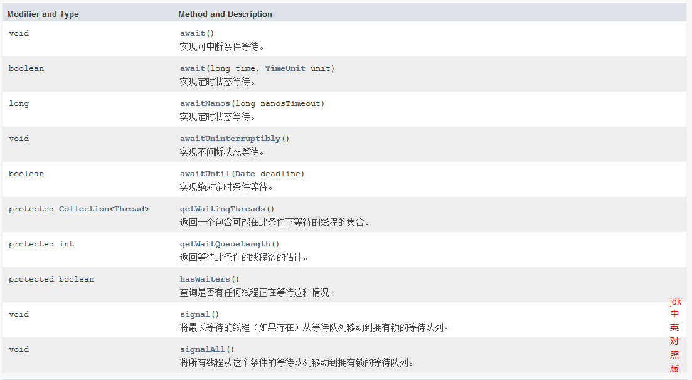
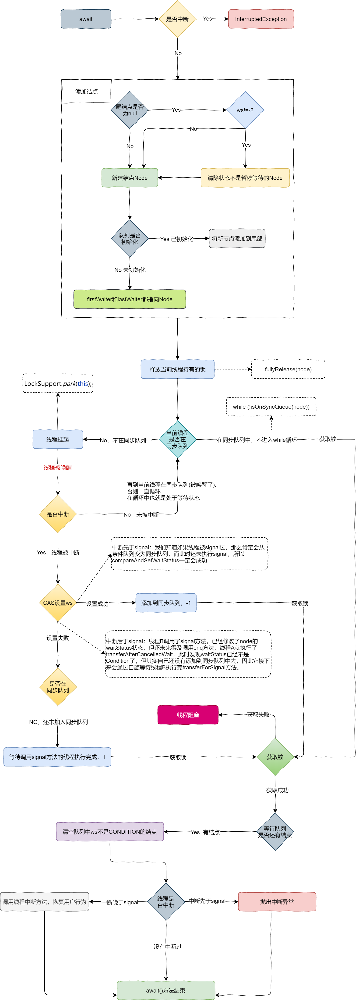

# Lock-Condition

基础需要：[ReentrantLock深入理解](./ReentrantLock深入理解.md)

## 简介

Condition是`java.util.concurrent.locks`包下的一个接口，我们在并发编程中使用Lock来实现加锁和解锁的功能，Condition的作用是我们在使用Lock时，能够实现线程间的通信，就如同使用Synchronized时，是通过Object的wait/notify/notifyAll进行线程间的通信。

一个Condition实例本质上是绑定到一个锁上的，通过具体锁（Lock的实现类）的`newCondition()`可以获得特定的Condition实例。

## Condition源码简介

```java
public interface Condition {
    // 导致当前线程等待，直到发出信号或者中断interrupted，
	void await() throws InterruptedException;
    // 导致当前线程等待直到发出信号或中断、或者指定的等待时间过去
    boolean await(long time, TimeUnit unit) throws InterruptedException;
    // 导致当前线程等待直到发出信号或中断、或者指定的等待时间过去
    // nanosTimeout单位为纳秒
    // awaitNanos(long)>0等同于await(long time, TimeUnit unit)
    long awaitNanos(long nanosTimeout) throws InterruptedException;
    // 使当前线程等待直到发出信号
    void awaitUninterruptibly();
    // 使当前线程等待直到发出信号或中断，或者指定的最后期限过去
    boolean awaitUntil(Date deadline) throws InterruptedException;
    // 唤醒一个等待线程
    void signal();
    // 唤醒所有等待线程
    void signalAll();
}
```

## Lock获取Condition实例

因为`newCondition()`是Lock接口的一个方法声明，具体实现在具体的Lock子类中，下面我们以ReentrantLock为列，在ReentrantLock实例化Condition的代码如下：

```java
public Condition newCondition() {
    return sync.newCondition();
}
```

这个方法中就一行代码`sync.newCondition()`，sync是Sync类的一个实例，Sync是ReentrantLock的内部类，`sync.newCondition();`具体代码如下：

```java
final ConditionObject newCondition() {
    return new ConditionObject();
}
```

创建了一个ConditionObject，到这里涉及的东西就比较多了，我们来看下ReentrantLock的类图，如下：


ReentrantLock的`newCondition`方法调用了其内部类Sync的`newCondition`方法创建了一个ConditionObject，ConditionObject是AQS的内部类，同时实现了Condition接口。

## ConditionObject

```java
public class ConditionObject implements Condition, java.io.Serializable {
    // Condition等待队列头结点
	private transient Node firstWaiter;
    // Condition等待队列尾结点
    private transient Node lastWaiter;
    // 构造方法
    public ConditionObject() { }
}
```

其中firstWaiter和lastWaiter是非常重要的两个属性，类型是AQS内部类Node，这两个属性类似于AQS的head和tail。

**重要方法如下：**



## Condition.await流程



## await源码分析

```java
public final void await() throws InterruptedException {
    // 判断线程是否已经中断
    if (Thread.interrupted())
        throw new InterruptedException();
    // 添加结点到等待队列尾部
    Node node = addConditionWaiter();
    // 当前线程释放锁
    int savedState = fullyRelease(node);
    // 线程是否中断标识，0：未被中断，-1中断先于signal 1中断于signal之后
    int interruptMode = 0;
    // 判断线程是否在同步队列中，其他线程调用signal或者signalAll能够使Node从等待队列移动到同步队列中
    // 在同步队列中就执行后面逻辑
    // 不在同步 队列中就进入while循环阻塞
    while (!isOnSyncQueue(node)) {
        // 当前阻塞，如果线程因中断唤醒会继续while循环
        LockSupport.park(this);
        // 判断线程是否被中断，分三种情况，0：被中断，继续循环，1：中断于signal之后，-1中断于signal之前
        if ((interruptMode = checkInterruptWhileWaiting(node)) != 0)
            break;
    }
    // 尝试获取锁
    if (acquireQueued(node, savedState) && interruptMode != THROW_IE)
        interruptMode = REINTERRUPT;
    // 等待队列是否还有结点
    if (node.nextWaiter != null) // clean up if cancelled
        // 清楚已经删除的结点
        unlinkCancelledWaiters();
    if (interruptMode != 0)
        // 判断线程是否已经中断
        reportInterruptAfterWait(interruptMode);
}


// 添加结点到等待队列
private Node addConditionWaiter() {
    Node t = lastWaiter;
    // If lastWaiter is cancelled, clean out.
    // 如果尾结点不等于null，并且状态不是CONDITION
    if (t != null && t.waitStatus != Node.CONDITION) {
        // 循环遍历清楚已经删除的结点
        unlinkCancelledWaiters();
        // 重新设置尾结点
        t = lastWaiter;
    }
    // 新建Node，指定线程，aitStatus
    Node node = new Node(Thread.currentThread(), Node.CONDITION);
    if (t == null) // 尾结点尾款，队列未初始化，头结点标识指向结点node
        firstWaiter = node;
    else
        // 尾结点存在，当前尾结点的nextWaiter(下一个结点)执行node
        t.nextWaiter = node;
    // 尾结点标识指向新的Node
    lastWaiter = node;
    return node;
}

// 清楚已经从等待队列中删除的结点
private void unlinkCancelledWaiters() {
    // 临时头结点t
    Node t = firstWaiter;
    // 记录最新一个遍历出来没有从等待队列被删除的结点
    Node trail = null;
    while (t != null) { // 头结点不等于null
        // 头结点的下一个结点
        Node next = t.nextWaiter;
        // 判断状态
        if (t.waitStatus != Node.CONDITION) { 
            // 头结点的waitStatus不等于CONDITION
            // 头结点的下一个结点设置为null，断开引用
            t.nextWaiter = null;
            // 前面没有结点还在等待队列中
            if (trail == null)
                // 头结点指向下一个结点
                firstWaiter = next;
            else
                // 前面有结点还在等待队列中，trail的下一个结点指向next结点
                trail.nextWaiter = next;
            // 下一个结点等于null，表示等待结点已经遍历完
            if (next == null)
                // 尾结点指向trail所保存的结点
                lastWaiter = trail;
        }
        else // 头结点未被删除
            // 将头结点赋值给trail
            trail = t;
        // 临时头结点t指向下一个结点
        t = next;
    }
}

// 释放锁
final int fullyRelease(Node node) {
    boolean failed = true;
    try {
        int savedState = getState();
        //尝试释放锁
        if (release(savedState)) {
            failed = false;
            return savedState;
        } else {
            throw new IllegalMonitorStateException();
        }
    } finally {
        if (failed) // 锁释放失败，将Node设置为CANCELLED，表示需要从等待队列中清楚
            node.waitStatus = Node.CANCELLED;
    }
}

// 判断线程是否在同步队列中
final boolean isOnSyncQueue(Node node) {
    // waitStatus等于CONDITION说明在等待队列中
    // node.prev == null 说明不在前置队列中
    if (node.waitStatus == Node.CONDITION || node.prev == null)
        return false;
    // 在同步队列中
    if (node.next != null) // If has successor, it must be on queue
        return true;
    /*
         * node.prev can be non-null, but not yet on queue because
         * the CAS to place it on queue can fail. So we have to
         * traverse from tail to make sure it actually made it.  It
         * will always be near the tail in calls to this method, and
         * unless the CAS failed (which is unlikely), it will be
         * there, so we hardly ever traverse much.
         */
    // 以上情况都不是，就从同步队列尾部开始遍历寻找，因为node.next=null&&node.prev!=null
    return findNodeFromTail(node);
}

// 检查线程是否被中断
private int checkInterruptWhileWaiting(Node node) {
    return Thread.interrupted() ?
        (transferAfterCancelledWait(node) ? THROW_IE : REINTERRUPT) :
    0;
}

//线程被中断执行代码
final boolean transferAfterCancelledWait(Node node) {
    // 通过CAS去设置WaitStatus
    // 中断先于signal：我们知道如果线程被signal过，那么肯定会从条件队列变为同步队列，
    // 而此时还未执行signal，所以compareAndSetWaitStatus一定会成功
    if (compareAndSetWaitStatus(node, Node.CONDITION, 0)) {
        // 添加到同步队列
        enq(node);
        return true;
    }
    // 设置失败
    // 中断后于signal：线程B调用了signal方法，已经修改了node的waitStatus状态，但还未来得及调用enq方法，线程A就执行了transferAfterCancelledWait，此时发现waitStatus已经不是Condition了，但其实自己还没有添加到同步队列中去，因此它接下来会通过自旋等待线程B执行完transferForSignal方法。
    while (!isOnSyncQueue(node))
        Thread.yield();
    return false;
}
// 中断情况处理
private void reportInterruptAfterWait(int interruptMode)
    throws InterruptedException {
    if (interruptMode == THROW_IE)
        // 中断先于signal,抛出异常
        throw new InterruptedException();
    else if (interruptMode == REINTERRUPT)
        // 中断后于signal,这种情况只需要再次设置线程中断恢复用户状态
        selfInterrupt();
}
```

## signal源码分析

```java
public final void signal() {
	// 判断当前调用线程是否是锁被持有的线程
    if (!isHeldExclusively())
        throw new IllegalMonitorStateException();
    Node first = firstWaiter;
    if (first != null) // 头结点不为空，唤醒头结点
        doSignal(first);
}

private void doSignal(Node first) {
    do {
        if ( (firstWaiter = first.nextWaiter) == null) // 如果没有下一个结点
            // 尾结点引用设置为null
            lastWaiter = null;
        // 头结点的nextWaiter引用设置为null
        first.nextWaiter = null;
    /*
     * 调用 transferForSignal 将节点转移到同步队列中，如果失败，且 firstWaiter
     * 不为 null，则再次进行尝试。transferForSignal 成功了，while 循环就结束了。
     */
    } while (!transferForSignal(first) &&
             (first = firstWaiter) != null);
}

final boolean transferForSignal(Node node) {
    if (!compareAndSetWaitStatus(node, Node.CONDITION, 0))
        return false;

    Node p = enq(node);
    int ws = p.waitStatus;
    if (ws > 0 || !compareAndSetWaitStatus(p, ws, Node.SIGNAL))
        LockSupport.unpark(node.thread);
    return true;
}
```

