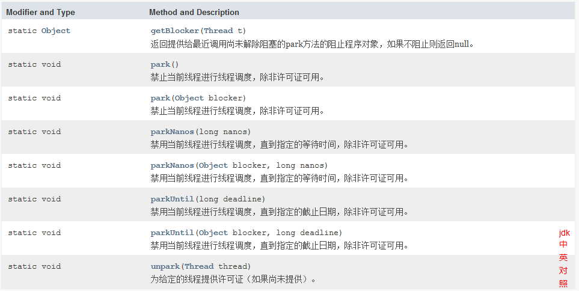

# LockSupport

## 简介

Java JUC中提供的一个工具类，具体位于：` java.util.concurrent.locks`包下，是用于创建锁和其他同步类的基本线程阻塞原语。

LockSupport的核心和常用方法其实就两个：park()和unpark()，方法`park()`和`unpark()`提供了阻止和解除阻塞线程的有效手段，如果调用者的线程被中断， `park()`将返回。

`park()`方法支持超时版本，也可以在任何**其他时间返回，因为“无理由”，因此一般必须在返回之前重新检查条件的循环中被调用**。在这个意义上，`park()`作为一个“忙碌等待”的优化，不浪费时间旋转，但必须与`unpark()`配对才能有效。 

`park()`第三种形式也支持`blocker`对象参数。 线程被阻止时记录此对象，以允许监视和诊断工具识别线程被阻止的原因。（此类工具可以使用方法[`getBlocker(Thread)`](../../../../java/util/concurrent/locks/LockSupport.html#getBlocker-java.lang.Thread-)访问阻止[程序](../../../../java/util/concurrent/locks/LockSupport.html#getBlocker-java.lang.Thread-)  ）强烈鼓励使用这些形式而不是没有此参数的原始形式。  在锁实现中作为`blocker`提供的正常参数是`this` 。

## 实现原理

LockSupport底层是通过`un.misc.Unsafe` 来实现线程的阻塞和唤醒的，源代码如下：

```java
public static void park() {
    UNSAFE.park(false, 0L);
}
public static void unpark(Thread thread) {
    if (thread != null)
        UNSAFE.unpark(thread);
}
```

具体逻辑：

> LockSupoort使用了一种名为Permit(许可)的概率来实现阻塞和唤醒的功能，可以把许可看成是(0,1)信号量(semaphore)，permit许可的上限是1。

> 初始时，Permit为0，当调用`park()`方法时，如果permit为0，则调用线程进入阻塞状态，当调用`unpark()`方法时，线程的Permit+1。

## Demo

```java
public static void main(String[] args) {
    Runnable runnable = ()->{
        System.out.println("第一个线程执行。。。。");
        LockSupport.park();
        System.out.println("第一个线程被唤醒了。。。。");
    };
    Thread thread = new Thread(runnable);
    thread.start();
    LockSupport.unpark(thread);
    System.out.println("aaaaaaa");
}
```

## 具体方法



