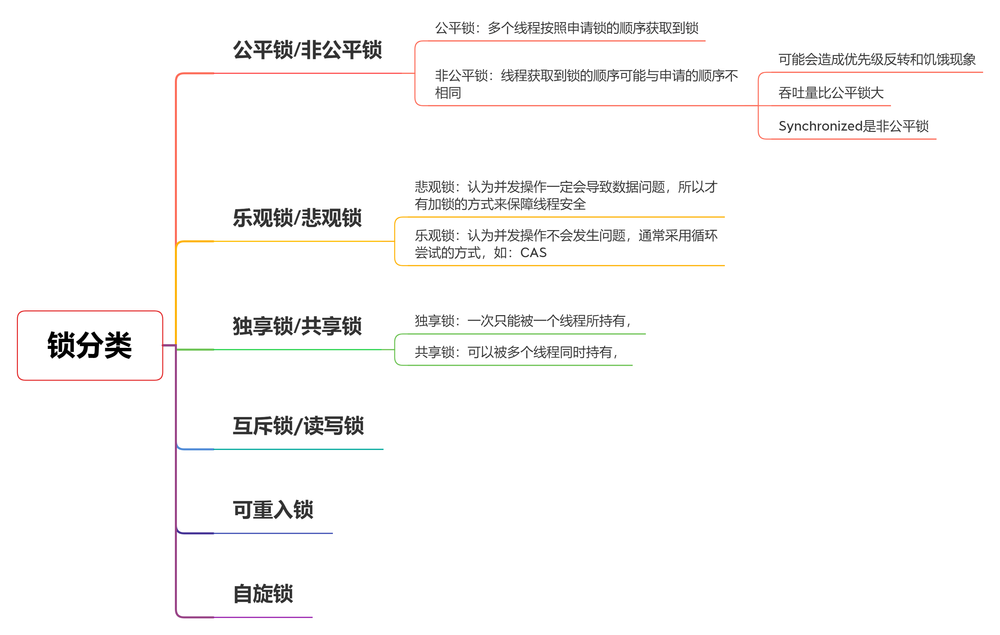
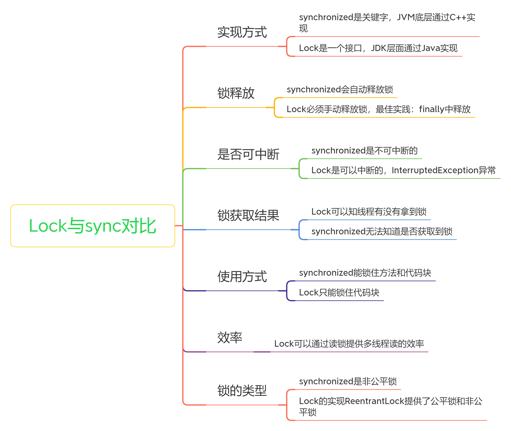
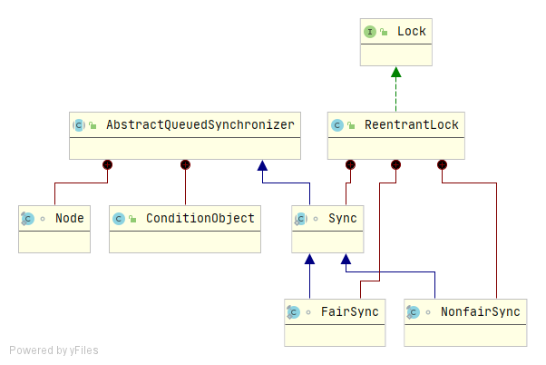
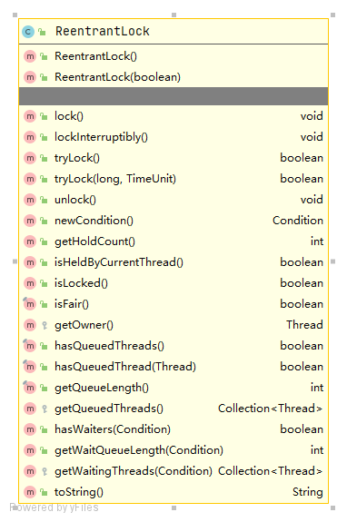
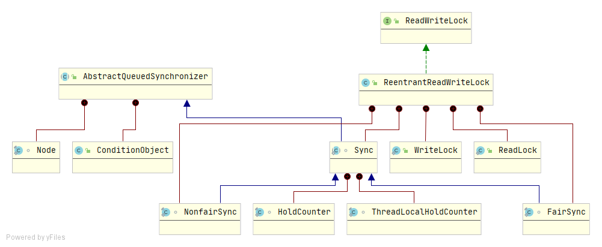

### Lock锁简介

#### 锁分类



#### 锁的开销

锁申请和锁释放所产生的开销，以及锁可能导致的上下文切换的开销。

java的线程是映射到操作系统原生线程之上的，如果要阻塞或唤醒一个线程就需要操作系统介入，需要在**户态与核心态之间切换**，这种切换会消耗大量的系统资源，因为用户态与内核态都有各自专用的内存空间，专用的寄存器等，用户态切换至内核态需要传递给许多变量、参数给内核，内核也需要保护好用户态在切换时的一些寄存器值、变量等，以便内核态调用结束后切换回用户态继续工作。

#### 锁优化提高并发性能

+ **减少锁持有的时间**：有助于降低锁冲突的可能性
+ **减小锁粒度**：指缩小锁定对象的范围（缩小同步代码块），从而降低锁冲突的可能性
+ **读写分离锁代替独占锁**：一种特殊的减小锁粒度的方式，适合读多写少的场景
+ **锁分离**：LinkedBlockingQueue，take和put使用两把锁
+ **锁粗化**：减少请求锁的次数
+ 避免人为制造"热点"（过多使用共享变量，导致必须加锁）
+ 锁尽量不要再包含锁，避免造成死锁
+ 选择合适的锁类型或者合适的工具类

#### Lock接口

```java
public interface Lock {
    // 获取锁，如果锁被别的线程持有，则阻塞
    void lock();
    // 获取锁，可被中断
    void lockInterruptibly() throws InterruptedException;
    // 尝试获取锁
    // 如果锁可用，则获取锁定，并立即返回值为true 。 如果锁不可用，则此方法将立即返回值为false 
    boolean tryLock();
    // 在指定的时间内尝试获取锁
    boolean tryLock(long time, TimeUnit unit) throws InterruptedException;
    // 解锁
    void unlock();
    // 返回一个新Condition绑定到该实例Lock实例。 
    Condition newCondition();
}
```

#### Lock与synchronized对比



#### 为什么synchronized不够用

+ **效率低：** 锁的释放情况少，试图获取锁时不能设置超时时间，不能中断一个正在尝试获取锁的线程
+ **不够灵活：** 加锁与释放锁的时机单一，读写锁更灵活
+ 无法知道是否**成功获取到锁**

**备注：** 不过自从JDK1.6对Synchronized优化过后，Synchronized的效率与ReentrantLock的效率以及差不多了，建议在能使用Synchronized的地方都采用Synchronized的，因为其简单、简洁，不需要手动释放锁。

****

### ReentrantLock简介

#### 类结构：



一个可重入互斥的`Lock`，具有与使用`synchronized`隐式监视锁相同的基本行为和语义，同时ReentrantLock功能更加强大，使用更加灵活，具有公平锁、非公平锁、等待可中断、绑定多个条件等Synchronized不具备的功能。

ReentrantLock实现了Lock，同时通过内部类FairSync和NonFairSync实现了公平锁和非公平锁的扩展功能。

#### 构造方法

```java
// 默认创建一个非公平锁
public ReentrantLock() {
    sync = new NonfairSync();
}
// 接收一个参数fair，指定创建公平锁（true）或非公平锁（false）
public ReentrantLock(boolean fair) {
    sync = fair ? new FairSync() : new NonfairSync();
}
```

#### 具体方法



其中`lock`、`lockInterruptibly`、`tryLock`、`unlock`、`newcondition`几个方法是ReentranLock实现的Lock接口中的方法，上面已经介绍过了。其他方法介绍如下：

```java
// 获取当前线程对此锁持有的次数（重入的次数）
public int getHoldCount();
// 如果当前线程持有该锁返回true，否则返回false
public boolean isHeldByCurrentThread();
// 如果有线程持有该锁返回true，否则返回false
public boolean isLocked();
// 判断该锁是否为公平锁（true），非公平锁返回false
public final boolean isFair();
// 查询是否有线程在等待该锁，有返回true，否则返回false
public final boolean hasQueuedThreads();
// 查询给定的线程是否在等待该锁，
public final boolean hasQueuedThread(Thread thread);
// 获取正在等待该锁的线程数量——是个预估值
public final int getQueueLength();
// 查询任何线程是否等待与此锁相关联的给定条件
public boolean hasWaiters(Condition condition);
// 返回与此锁相关联的给定条件等待的线程数的估计
public int getWaitQueueLength(Condition condition);
```

### ReentrantReadWriteLock简介



实现了ReadWritLock接口，实现了读写锁，整体结构与ReentrantLock相似，通过FairSync和NonfairSync实现了公平锁与非公平锁，通过WriteLock和ReadLock实现了读写锁。

#### ReadWriteLock接口

```java
public interface ReadWriteLock {
    // 获取一个读锁
    Lock readLock();
	// 获取一个写锁
    Lock writeLock();
}
```

#### 锁插队策略

+ 公平锁：不允许插队
+ 非公平锁
  + 写锁可以随时插队
  + 读锁仅在等待队列头结点不是想要获取写锁的线程的时候才可以插队

#### 锁的升降级

+ 支持锁的降级，不支持锁的升级