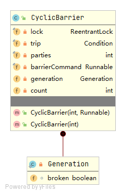

## 简介

CyclicBarrier，允许一组线程全部等待彼此达到共同屏障点的同步辅助，可以认为是个栅栏，让线程到达栅栏时被阻塞(调用await方法)，直到到达栅栏的线程数满足指定数量要求时，栅栏才会打开放行。

CyclicBarrier支持一个可选的`Runnable`命令，在最后一个线程到达之后，任何线程唤醒之前，由最后一个到达的线程执行。

## 实现原理

### 整体结构



### 变量

```java
/** 保护屏障进入的锁 */
private final ReentrantLock lock = new ReentrantLock();
/** 等待队列 */
private final Condition trip = lock.newCondition();
/** 栅栏开启需要的到达线程总数 */
private final int parties;
/*最后一个线程到达后执行的任务 */
private final Runnable barrierCommand;
// 当前轮次的运行状态
private Generation generation = new Generation();
// 剩余未到达的线程总数
private int count;
```

### 构造方法

```java
public CyclicBarrier(int parties) {
    this(parties, null);
}
public CyclicBarrier(int parties, Runnable barrierAction) {
    if (parties <= 0) throw new IllegalArgumentException();
    this.parties = parties;
    this.count = parties;
    this.barrierCommand = barrierAction;
}
```

### 整体原理

CyclicBarrier并没有自己去实现AQS的API，而是借助ReentrantLock和Condition来实现的，主体流程如下：

+ 判断当前线程是否损坏或者是否中断，是的话就抛出异常
+ 如果当前线程是最后一个到达的线程，并且创建时传入了barrierCommand任务，最后一个线程就会执行该任务，执行成功就返回，执行失败会破坏栅栏
+ 对于不是最后一个到达的线程会在Condition上等待，同时通过自旋防止意外唤醒

**CyclicBarrier对于异常的处理：**

只要正在Barrier上等待的任一线程抛出了异常，那么Barrier就会认为肯定是凑不齐所有线程了，就会将栅栏置为损坏（Broken）状态，并传播**BrokenBarrierException**给其它所有正在等待（await）的线程。

### Demo

```java
public class CyclicBarrierTest {
    public static ExecutorService executorService = Executors.newScheduledThreadPool(5);
    public static void main(String[] args) {
        CyclicBarrier cyclicBarrier = new CyclicBarrier(5,()-> 			   System.out.println(Thread.currentThread().getName() +"Fuck 就这???"));
        for (int i = 0; i < 5; i++) {
            executorService.submit(()->{
                System.out.println(Thread.currentThread().getName()+"----bbbbbbbbbbbbbbbbb");
                try {
                    cyclicBarrier.await();
                } catch (InterruptedException e) {
                    e.printStackTrace();
                } catch (BrokenBarrierException e) {
                    e.printStackTrace();
                }
                System.out.println(Thread.currentThread().getName()+"----执行任务中");
            });
        }
        System.out.println("aaaaaaaaaaaaaaa");
        executorService.shutdown();
    }
}
```

**运行结果如下：**

```java
aaaaaaaaaaaaaaa
pool-1-thread-1----bbbbbbbbbbbbbbbbb
pool-1-thread-2----bbbbbbbbbbbbbbbbb
pool-1-thread-3----bbbbbbbbbbbbbbbbb
pool-1-thread-4----bbbbbbbbbbbbbbbbb
pool-1-thread-5----bbbbbbbbbbbbbbbbb
pool-1-thread-5Fuck 就这???
pool-1-thread-1----执行任务中
pool-1-thread-2----执行任务中
pool-1-thread-3----执行任务中
pool-1-thread-5----执行任务中
pool-1-thread-4----执行任务中
```

## await源码分析

```java
public int await() throws InterruptedException, BrokenBarrierException {
    try {
        return dowait(false, 0L);
    } catch (TimeoutException toe) {
        throw new Error(toe); // cannot happen
    }
}

private int dowait(boolean timed, long nanos)
    throws InterruptedException, BrokenBarrierException,
TimeoutException {
    // 创建一个锁
    final ReentrantLock lock = this.lock;
    // 加锁
    lock.lock();
    try {
        final Generation g = generation;
		// 判断是否损坏
        if (g.broken)
            throw new BrokenBarrierException();
		
        // 判断是否中断
        if (Thread.interrupted()) {
            // 把当前线程设置为已损坏
            breakBarrier();
            // 抛出中断异常
            throw new InterruptedException();
        }
		// 还未到达的线程数减一
        int index = --count;
        if (index == 0) {  // 所有线程都已经到达等待点
            boolean ranAction = false;
            try {
                final Runnable command = barrierCommand;
                if (command != null)
                    // 执行构造时传入的任务
                    command.run();
                ranAction = true;
                // 创建一个新的Generation，唤醒所有线程，重置内部参数
                nextGeneration();
                return 0;
            } finally {
                if (!ranAction) // 如果传入的任务执行报错，则将线程标记为损坏
                    breakBarrier();
            }
        }

        // loop until tripped, broken, interrupted, or timed out
        // 自旋 防止线程意外唤醒
        for (;;) {
            try {
                if (!timed) // 不需要限时等待，
                    trip.await(); // 直接在Condition上等待
                else if (nanos > 0L) // 需要限时等待
                    nanos = trip.awaitNanos(nanos);
            } catch (InterruptedException ie) { // 等待过程被中断
                // 当前这轮还没有结束，还没有线程执行过breakBarrier方法
                if (g == generation && ! g.broken) { 
                    breakBarrier();
                    throw ie;
                } else { // 当前这轮已经结束，或者其他线程执行了breakBarrier方法
                    // We're about to finish waiting even if we had not
                    // been interrupted, so this interrupt is deemed to
                    // "belong" to subsequent execution.
                    Thread.currentThread().interrupt(); // 自我中断
                }
            }

            if (g.broken)
                throw new BrokenBarrierException();

            if (g != generation)
                return index;

            if (timed && nanos <= 0L) { // 等待超时
                breakBarrier();
                throw new TimeoutException();
            }
        }
    } finally { // 是否锁
        lock.unlock();
    }
}
// 创建新的Generation
private void nextGeneration() {
    // 唤醒所有线程
    trip.signalAll();
    // 重置还未到达等待点的线程数量
    count = parties;
    generation = new Generation();
}

// 破坏栅栏
private void breakBarrier() {
    // 
    generation.broken = true;
    // 重置还没到达的线程数
    count = parties;
    // 唤醒其他线程
    trip.signalAll();
}

// 重置
public void reset() {
    final ReentrantLock lock = this.lock;
    lock.lock();
    try {
        breakBarrier();   // break the current generation
        nextGeneration(); // start a new generation
    } finally {
        lock.unlock();
    }
}
```


